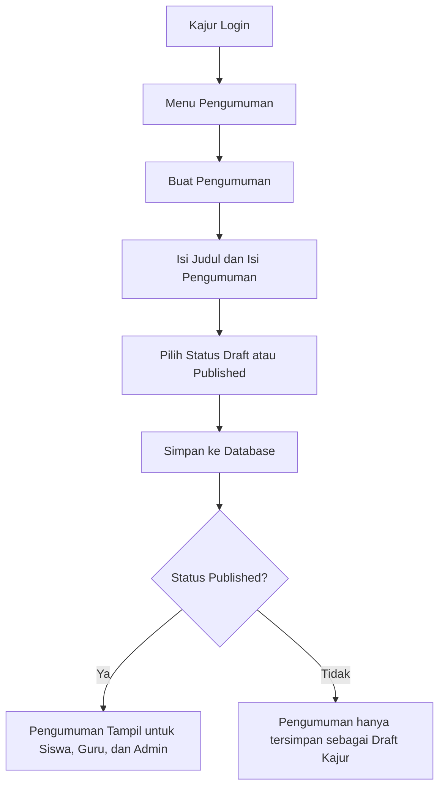
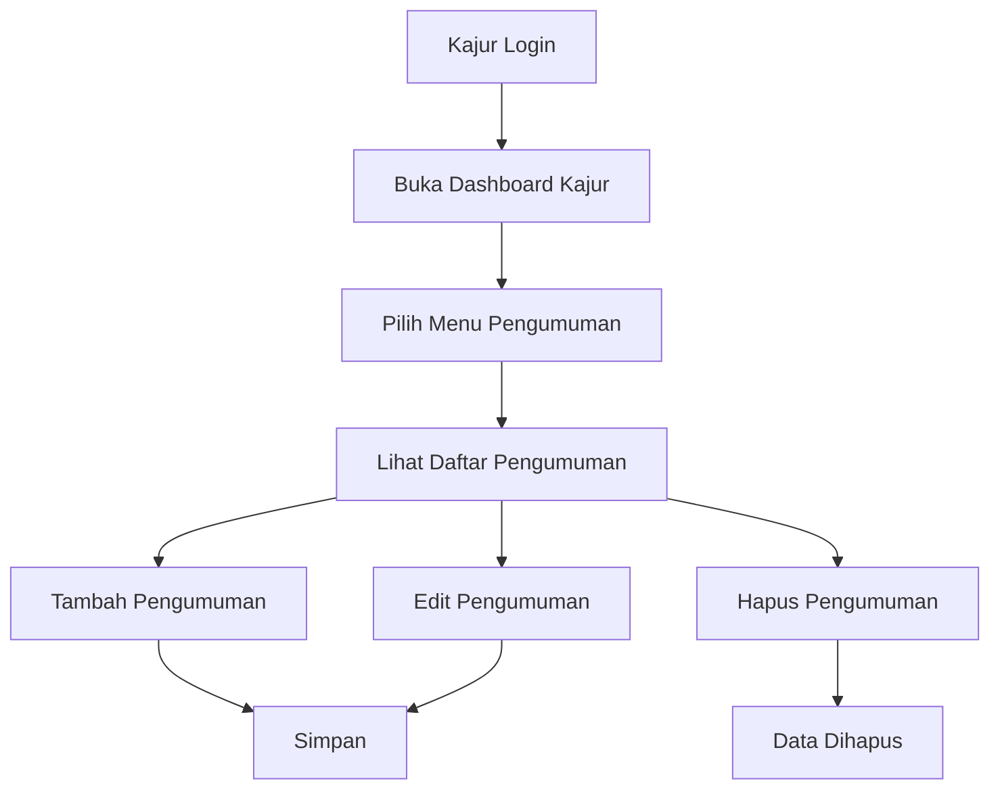
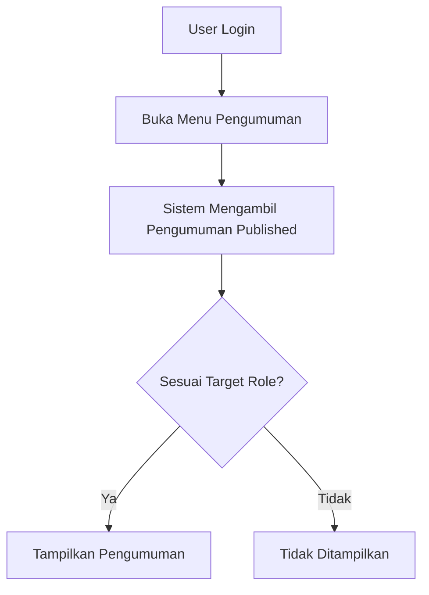

# Implementasi Fitur Pengumuman pada Sistem E-Learning

## 1. Gambaran Umum Fitur

Fitur **Pengumuman** adalah fitur informasi resmi di dalam sistem e-learning yang memungkinkan **Kajur** membuat, mengubah, mempublikasikan, dan menghapus pengumuman. Pengumuman yang sudah berstatus **published** dapat dilihat oleh pengguna lain, yaitu **siswa**, **guru**, dan **admin sistem**.

Fitur ini cocok ditempatkan pada Kajur karena Kajur di dalam sistem berperan sebagai pengelola akademik jurusan. Kajur sudah mengatur kelas, mata pelajaran, pengampu, anggota kelas, dan monitoring akademik. Oleh sebab itu, pengumuman yang bersifat akademik seperti jadwal kegiatan, informasi jurusan, arahan pembelajaran, pemberitahuan tugas umum, atau informasi perubahan akademik lebih tepat dibuat oleh Kajur, bukan oleh Admin Sistem.

Admin Sistem tetap dapat melihat pengumuman karena admin perlu mengetahui informasi yang berjalan di sistem. Namun, Admin Sistem tidak menjadi pembuat utama pengumuman karena perannya lebih fokus pada akun, role, konfigurasi, reset password, semester aktif, dan monitoring teknis.

---

## 2. Tujuan Fitur

Fitur Pengumuman dibuat dengan tujuan:

1. Menyediakan media informasi resmi dari Kajur kepada pengguna sistem.
2. Memudahkan siswa, guru, dan admin melihat informasi penting tanpa harus keluar dari sistem e-learning.
3. Memisahkan informasi akademik dari proses pembelajaran harian seperti materi, tugas, submission, dan nilai.
4. Menjaga pembagian role tetap jelas: Kajur membuat pengumuman, pengguna lain membaca pengumuman.
5. Membuat sistem lebih realistis karena aplikasi e-learning biasanya membutuhkan kanal informasi umum.

---

## 3. Alasan Desain Role

### 3.1 Kenapa Kajur yang Membuat Pengumuman?

Kajur adalah pengelola akademik pada level jurusan. Dalam sistem ini, Kajur sudah bertanggung jawab terhadap struktur akademik seperti kelas, mata pelajaran, pengampu, siswa, guru, dan monitoring. Karena itu, pengumuman yang berkaitan dengan kegiatan akademik lebih tepat berasal dari Kajur.

Contoh pengumuman yang cocok dibuat Kajur:

- informasi jadwal ujian;
- informasi pergantian jadwal pembelajaran;
- pemberitahuan kegiatan jurusan;
- informasi teknis akademik untuk siswa;
- arahan kepada guru terkait pembelajaran;
- pemberitahuan umum untuk seluruh pengguna.

### 3.2 Kenapa Bukan Admin Sistem?

Admin Sistem dalam flow ini lebih tepat berfungsi sebagai pengelola teknis aplikasi. Admin mengurus akun, role, password, konfigurasi sistem, tahun ajaran, semester aktif, dan log aktivitas. Jika Admin juga diberi tugas membuat pengumuman akademik, maka batas antara pengelolaan teknis dan pengelolaan akademik menjadi kabur.

Dengan pemisahan ini, sistem menjadi lebih bersih:

| Role | Fungsi Utama | Hak pada Pengumuman |
|---|---|---|
| Kajur | Pengelola akademik jurusan | Membuat, mengedit, menghapus, dan mempublikasikan pengumuman |
| Guru | Pelaksana pembelajaran | Melihat pengumuman |
| Siswa | Pengguna pembelajaran | Melihat pengumuman |
| Admin Sistem | Pengelola teknis sistem | Melihat pengumuman |

---

## 4. Alur Fitur Pengumuman

### 4.1 Alur Umum



### 4.2 Alur Kajur



### 4.3 Alur Siswa/Guru/Admin



---

## 5. Rancangan Database

### 5.1 Nama Tabel

```text
announcements
```

### 5.2 Struktur Tabel

| Kolom | Tipe Data | Keterangan |
|---|---|---|
| id | uuid | Primary key |
| title | string | Judul pengumuman |
| body | longText | Isi pengumuman |
| target_role | string nullable | Target penerima. Bisa `all`, `siswa`, `guru`, `admin-sistem`, atau `kajur` |
| status | string | Status pengumuman: `draft` atau `published` |
| start_at | timestamp nullable | Waktu mulai tampil |
| end_at | timestamp nullable | Waktu selesai tampil |
| created_by | uuid | ID user Kajur pembuat pengumuman |
| timestamps | timestamp | created_at dan updated_at |

### 5.3 Penjelasan Kolom Penting

#### `target_role`

Kolom ini dibuat agar fitur fleksibel. Meskipun kebutuhan awal adalah pengumuman dilihat oleh semua siswa, guru, dan admin, fitur ini bisa dikembangkan agar Kajur dapat menentukan target tertentu.

Nilai yang disarankan:

```text
all
siswa
guru
admin-sistem
kajur
```

Jika `target_role = all`, maka pengumuman dapat dilihat oleh semua role yang memiliki akses ke halaman pengumuman.

#### `status`

Kolom ini berguna untuk membedakan pengumuman yang masih disimpan sebagai draft dan pengumuman yang sudah dipublikasikan.

```text
draft       = belum tampil ke pengguna
published   = sudah tampil ke pengguna sesuai target role
```

#### `start_at` dan `end_at`

Dua kolom ini berguna untuk mengatur periode tampil pengumuman.

Contoh:

```text
start_at = 2026-04-27 07:00:00
end_at   = 2026-05-01 23:59:00
```

Jika `start_at` kosong, pengumuman bisa langsung tampil ketika statusnya `published`. Jika `end_at` kosong, pengumuman tetap tampil selama statusnya masih `published`.

---

## 6. File yang Perlu Ditambahkan

Struktur file implementasi yang disarankan:

```text
app/
├── Http/
│   ├── Controllers/
│   │   ├── Kajur/
│   │   │   └── AnnouncementController.php
│   │   └── Shared/
│   │       └── AnnouncementController.php
│   └── Requests/
│       └── Kajur/
│           ├── StoreAnnouncementRequest.php
│           └── UpdateAnnouncementRequest.php
├── Models/
│   └── Announcement.php
└── Services/
    └── Kajur/
        └── AnnouncementService.php

database/
└── migrations/
    └── 2026_04_27_000001_create_announcements_table.php

resources/js/
├── Pages/
│   ├── Kajur/
│   │   └── Announcements/
│   │       ├── Index.vue
│   │       ├── Create.vue
│   │       └── Edit.vue
│   └── Shared/
│       └── Announcements/
│           └── Index.vue
└── Layouts/
    ├── AdminLayout.vue
    ├── GuruLayout.vue
    ├── KajurLayout.vue
    └── SiswaLayout.vue
```

---

## 7. Implementasi Backend Laravel

## 7.1 Migration

Buat file migration:

```bash
php artisan make:migration create_announcements_table
```

Isi file:

```php
<?php

use Illuminate\Database\Migrations\Migration;
use Illuminate\Database\Schema\Blueprint;
use Illuminate\Support\Facades\Schema;

return new class extends Migration
{
    public function up(): void
    {
        Schema::create('announcements', function (Blueprint $table) {
            $table->uuid('id')->primary();
            $table->string('title', 200);
            $table->longText('body');
            $table->string('target_role', 50)->default('all');
            $table->string('status', 30)->default('draft');
            $table->timestamp('start_at')->nullable();
            $table->timestamp('end_at')->nullable();
            $table->foreignUuid('created_by')->constrained('users')->cascadeOnDelete();
            $table->timestamps();

            $table->index(['status', 'target_role']);
            $table->index(['start_at', 'end_at']);
        });
    }

    public function down(): void
    {
        Schema::dropIfExists('announcements');
    }
};
```

Jalankan migration:

```bash
php artisan migrate
```

---

## 7.2 Model Announcement

Buat file:

```text
app/Models/Announcement.php
```

Isi file:

```php
<?php

namespace App\Models;

use Illuminate\Database\Eloquent\Concerns\HasUuids;
use Illuminate\Database\Eloquent\Factories\HasFactory;
use Illuminate\Database\Eloquent\Model;
use Illuminate\Database\Eloquent\Builder;

class Announcement extends Model
{
    use HasFactory, HasUuids;

    protected $fillable = [
        'title',
        'body',
        'target_role',
        'status',
        'start_at',
        'end_at',
        'created_by',
    ];

    protected function casts(): array
    {
        return [
            'start_at' => 'datetime',
            'end_at' => 'datetime',
        ];
    }

    public function creator()
    {
        return $this->belongsTo(User::class, 'created_by');
    }

    public function scopePublished(Builder $query): Builder
    {
        return $query->where('status', 'published');
    }

    public function scopeActivePeriod(Builder $query): Builder
    {
        return $query
            ->where(function ($q) {
                $q->whereNull('start_at')
                    ->orWhere('start_at', '<=', now());
            })
            ->where(function ($q) {
                $q->whereNull('end_at')
                    ->orWhere('end_at', '>=', now());
            });
    }

    public function scopeForRole(Builder $query, string $role): Builder
    {
        return $query->where(function ($q) use ($role) {
            $q->where('target_role', 'all')
                ->orWhere('target_role', $role);
        });
    }
}
```

### Penjelasan

Model ini memakai `HasUuids` karena tabel `users` pada project menggunakan UUID. Relasi `creator()` dipakai untuk mengetahui siapa Kajur yang membuat pengumuman.

Scope yang dibuat:

| Scope | Fungsi |
|---|---|
| `published()` | Mengambil pengumuman yang sudah dipublikasikan |
| `activePeriod()` | Mengambil pengumuman yang sedang aktif berdasarkan waktu tampil |
| `forRole()` | Mengambil pengumuman sesuai role user |

---

## 7.3 Service Announcement

Buat file:

```text
app/Services/Kajur/AnnouncementService.php
```

Isi file:

```php
<?php

namespace App\Services\Kajur;

use App\Models\Announcement;
use Illuminate\Contracts\Pagination\LengthAwarePaginator;

class AnnouncementService
{
    public function getAllAnnouncements(?string $search = null): LengthAwarePaginator
    {
        return Announcement::with('creator')
            ->when($search, function ($query, $search) {
                $query->where(function ($q) use ($search) {
                    $q->where('title', 'like', "%{$search}%")
                        ->orWhere('body', 'like', "%{$search}%");
                });
            })
            ->latest()
            ->paginate(10)
            ->withQueryString();
    }

    public function createAnnouncement(array $data): Announcement
    {
        $data['created_by'] = auth()->id();

        return Announcement::create($data);
    }

    public function updateAnnouncement(Announcement $announcement, array $data): bool
    {
        return $announcement->update($data);
    }

    public function deleteAnnouncement(Announcement $announcement): bool
    {
        return $announcement->delete();
    }
}
```

### Penjelasan

Service ini menjaga controller tetap ringkas. Pola ini sesuai dengan struktur project yang sudah memiliki service seperti `SubjectService`, `ClassGroupService`, dan `TeachingAssignmentService`.

---

## 7.4 Form Request Store

Buat file:

```text
app/Http/Requests/Kajur/StoreAnnouncementRequest.php
```

Isi file:

```php
<?php

namespace App\Http\Requests\Kajur;

use Illuminate\Foundation\Http\FormRequest;
use Illuminate\Validation\Rule;

class StoreAnnouncementRequest extends FormRequest
{
    public function authorize(): bool
    {
        return $this->user()->hasRole('kajur');
    }

    public function rules(): array
    {
        return [
            'title' => ['required', 'string', 'max:200'],
            'body' => ['required', 'string'],
            'target_role' => [
                'required',
                'string',
                Rule::in(['all', 'siswa', 'guru', 'admin-sistem', 'kajur']),
            ],
            'status' => ['required', 'string', Rule::in(['draft', 'published'])],
            'start_at' => ['nullable', 'date'],
            'end_at' => ['nullable', 'date', 'after_or_equal:start_at'],
        ];
    }
}
```

---

## 7.5 Form Request Update

Buat file:

```text
app/Http/Requests/Kajur/UpdateAnnouncementRequest.php
```

Isi file:

```php
<?php

namespace App\Http\Requests\Kajur;

use Illuminate\Foundation\Http\FormRequest;
use Illuminate\Validation\Rule;

class UpdateAnnouncementRequest extends FormRequest
{
    public function authorize(): bool
    {
        return $this->user()->hasRole('kajur');
    }

    public function rules(): array
    {
        return [
            'title' => ['required', 'string', 'max:200'],
            'body' => ['required', 'string'],
            'target_role' => [
                'required',
                'string',
                Rule::in(['all', 'siswa', 'guru', 'admin-sistem', 'kajur']),
            ],
            'status' => ['required', 'string', Rule::in(['draft', 'published'])],
            'start_at' => ['nullable', 'date'],
            'end_at' => ['nullable', 'date', 'after_or_equal:start_at'],
        ];
    }
}
```

### Penjelasan Validasi

| Field | Validasi | Makna |
|---|---|---|
| title | required, max 200 | Judul wajib diisi |
| body | required | Isi pengumuman wajib diisi |
| target_role | harus sesuai daftar role | Mencegah role palsu masuk ke database |
| status | draft/published | Status hanya boleh dua pilihan |
| start_at | nullable date | Waktu mulai boleh kosong |
| end_at | setelah/sama dengan start_at | Mencegah tanggal selesai lebih awal dari tanggal mulai |

---

## 7.6 Controller Kajur untuk CRUD

Buat file:

```text
app/Http/Controllers/Kajur/AnnouncementController.php
```

Isi file:

```php
<?php

namespace App\Http\Controllers\Kajur;

use App\Http\Controllers\Controller;
use App\Http\Requests\Kajur\StoreAnnouncementRequest;
use App\Http\Requests\Kajur\UpdateAnnouncementRequest;
use App\Models\Announcement;
use App\Services\Kajur\AnnouncementService;
use Illuminate\Http\Request;
use Inertia\Inertia;

class AnnouncementController extends Controller
{
    protected AnnouncementService $announcementService;

    public function __construct(AnnouncementService $announcementService)
    {
        $this->announcementService = $announcementService;
    }

    public function index(Request $request)
    {
        return Inertia::render('Kajur/Announcements/Index', [
            'announcements' => $this->announcementService->getAllAnnouncements($request->input('search')),
            'filters' => $request->only(['search']),
        ]);
    }

    public function create()
    {
        return Inertia::render('Kajur/Announcements/Create');
    }

    public function store(StoreAnnouncementRequest $request)
    {
        $this->announcementService->createAnnouncement($request->validated());

        return redirect()->route('kajur.announcements.index')
            ->with('success', 'Pengumuman berhasil dibuat.');
    }

    public function edit(Announcement $announcement)
    {
        return Inertia::render('Kajur/Announcements/Edit', [
            'announcement' => $announcement,
        ]);
    }

    public function update(UpdateAnnouncementRequest $request, Announcement $announcement)
    {
        $this->announcementService->updateAnnouncement($announcement, $request->validated());

        return redirect()->route('kajur.announcements.index')
            ->with('success', 'Pengumuman berhasil diperbarui.');
    }

    public function destroy(Announcement $announcement)
    {
        $this->announcementService->deleteAnnouncement($announcement);

        return redirect()->route('kajur.announcements.index')
            ->with('success', 'Pengumuman berhasil dihapus.');
    }
}
```

### Penjelasan

Controller ini hanya bisa diakses oleh role `kajur` karena route-nya akan diletakkan di dalam group middleware:

```php
Route::middleware(['auth', 'role:kajur'])
```

Dengan begitu, siswa, guru, dan admin tidak bisa masuk ke halaman tambah/edit/hapus pengumuman.

---

## 7.7 Controller Shared untuk Membaca Pengumuman

Buat file:

```text
app/Http/Controllers/Shared/AnnouncementController.php
```

Isi file:

```php
<?php

namespace App\Http\Controllers\Shared;

use App\Http\Controllers\Controller;
use App\Models\Announcement;
use Illuminate\Http\Request;
use Inertia\Inertia;

class AnnouncementController extends Controller
{
    public function index(Request $request)
    {
        $user = $request->user();
        $role = $user->roles->first()?->name ?? '';

        $announcements = Announcement::with('creator')
            ->published()
            ->activePeriod()
            ->forRole($role)
            ->latest()
            ->paginate(10)
            ->withQueryString();

        return Inertia::render('Shared/Announcements/Index', [
            'announcements' => $announcements,
        ]);
    }
}
```

### Penjelasan

Controller ini bersifat shared karena halaman baca pengumuman digunakan oleh beberapa role sekaligus. Selama user sudah login, dia dapat membuka halaman pengumuman.

Namun, data yang ditampilkan tetap disaring:

1. hanya status `published`;
2. hanya yang masih dalam periode aktif;
3. hanya yang sesuai dengan role user atau target `all`.

---

## 8. Implementasi Route

## 8.1 Route Kajur

Edit file:

```text
routes/kajur.php
```

Tambahkan import controller:

```php
use App\Http\Controllers\Kajur\AnnouncementController;
```

Tambahkan route di dalam group Kajur:

```php
Route::resource('announcements', AnnouncementController::class);
```

Contoh posisi lengkap:

```php
Route::middleware(['auth', 'role:kajur'])->prefix('kajur')->name('kajur.')->group(function () {
    Route::get('/dashboard', DashboardController::class)->name('dashboard');

    Route::resource('subjects', SubjectController::class);
    Route::resource('class-groups', ClassGroupController::class);
    Route::resource('teaching-assignments', TeachingAssignmentController::class);
    Route::resource('announcements', AnnouncementController::class);

    // route lainnya tetap seperti semula
});
```

Route yang terbentuk:

| Method | URL | Name | Fungsi |
|---|---|---|---|
| GET | `/kajur/announcements` | kajur.announcements.index | daftar pengumuman |
| GET | `/kajur/announcements/create` | kajur.announcements.create | form tambah |
| POST | `/kajur/announcements` | kajur.announcements.store | simpan pengumuman |
| GET | `/kajur/announcements/{announcement}/edit` | kajur.announcements.edit | form edit |
| PUT/PATCH | `/kajur/announcements/{announcement}` | kajur.announcements.update | update pengumuman |
| DELETE | `/kajur/announcements/{announcement}` | kajur.announcements.destroy | hapus pengumuman |

---

## 8.2 Route Shared

Edit file:

```text
routes/shared.php
```

Tambahkan import:

```php
use App\Http\Controllers\Shared\AnnouncementController;
```

Tambahkan route di dalam group `auth`:

```php
Route::get('/announcements', [AnnouncementController::class, 'index'])->name('announcements.index');
```

Contoh lengkap:

```php
<?php

use App\Http\Controllers\Shared\ProfileController;
use App\Http\Controllers\Shared\AnnouncementController;
use Illuminate\Support\Facades\Route;

Route::middleware('auth')->group(function () {
    Route::get('/profile', [ProfileController::class, 'edit'])->name('profile.edit');
    Route::patch('/profile', [ProfileController::class, 'update'])->name('profile.update');
    Route::put('/profile/password', [ProfileController::class, 'updatePassword'])->name('password.update');

    Route::get('/announcements', [AnnouncementController::class, 'index'])->name('announcements.index');
});
```

---

## 9. Implementasi Frontend Vue/Inertia

## 9.1 Halaman Daftar Pengumuman Kajur

Buat file:

```text
resources/js/Pages/Kajur/Announcements/Index.vue
```

Isi file:

```vue
<script setup>
import KajurLayout from '@/Layouts/KajurLayout.vue';
import Pagination from '@/Components/ui/Pagination.vue';
import { Link, router } from '@inertiajs/vue3';
import { ref, watch } from 'vue';
import { Plus, Pencil, Trash2 } from 'lucide-vue-next';

const props = defineProps({
    announcements: Object,
    filters: Object,
});

const search = ref(props.filters?.search || '');

watch(search, (value) => {
    router.get(route('kajur.announcements.index'), { search: value }, {
        preserveState: true,
        replace: true,
    });
});

const destroyAnnouncement = (announcement) => {
    if (confirm(`Hapus pengumuman "${announcement.title}"?`)) {
        router.delete(route('kajur.announcements.destroy', announcement.id));
    }
};
</script>

<template>
    <KajurLayout>
        <div class="space-y-6">
            <div class="flex flex-col md:flex-row md:items-center md:justify-between gap-4">
                <div>
                    <h1 class="text-2xl font-black">Pengumuman</h1>
                    <p class="text-sm opacity-60">Kelola pengumuman akademik untuk pengguna sistem.</p>
                </div>
                <Link :href="route('kajur.announcements.create')" class="btn btn-primary">
                    <Plus class="w-4 h-4" /> Tambah Pengumuman
                </Link>
            </div>

            <div class="card bg-base-100 shadow-sm border border-base-200">
                <div class="card-body">
                    <input
                        v-model="search"
                        type="text"
                        placeholder="Cari pengumuman..."
                        class="input input-bordered w-full md:w-80"
                    />

                    <div class="overflow-x-auto mt-4">
                        <table class="table">
                            <thead>
                                <tr>
                                    <th>Judul</th>
                                    <th>Target</th>
                                    <th>Status</th>
                                    <th>Periode</th>
                                    <th>Pembuat</th>
                                    <th class="text-right">Aksi</th>
                                </tr>
                            </thead>
                            <tbody>
                                <tr v-for="announcement in announcements.data" :key="announcement.id">
                                    <td>
                                        <div class="font-bold">{{ announcement.title }}</div>
                                        <div class="text-xs opacity-60 line-clamp-1">{{ announcement.body }}</div>
                                    </td>
                                    <td>
                                        <span class="badge badge-outline">{{ announcement.target_role }}</span>
                                    </td>
                                    <td>
                                        <span
                                            class="badge"
                                            :class="announcement.status === 'published' ? 'badge-success' : 'badge-warning'"
                                        >
                                            {{ announcement.status }}
                                        </span>
                                    </td>
                                    <td class="text-xs">
                                        <div>Mulai: {{ announcement.start_at || '-' }}</div>
                                        <div>Selesai: {{ announcement.end_at || '-' }}</div>
                                    </td>
                                    <td>{{ announcement.creator?.full_name || '-' }}</td>
                                    <td class="text-right">
                                        <div class="flex justify-end gap-2">
                                            <Link
                                                :href="route('kajur.announcements.edit', announcement.id)"
                                                class="btn btn-sm btn-ghost"
                                            >
                                                <Pencil class="w-4 h-4" />
                                            </Link>
                                            <button
                                                @click="destroyAnnouncement(announcement)"
                                                class="btn btn-sm btn-ghost text-error"
                                            >
                                                <Trash2 class="w-4 h-4" />
                                            </button>
                                        </div>
                                    </td>
                                </tr>
                                <tr v-if="announcements.data.length === 0">
                                    <td colspan="6" class="text-center opacity-60 py-8">
                                        Belum ada pengumuman.
                                    </td>
                                </tr>
                            </tbody>
                        </table>
                    </div>

                    <Pagination v-if="announcements.links" :links="announcements.links" />
                </div>
            </div>
        </div>
    </KajurLayout>
</template>
```

---

## 9.2 Halaman Tambah Pengumuman

Buat file:

```text
resources/js/Pages/Kajur/Announcements/Create.vue
```

Isi file:

```vue
<script setup>
import KajurLayout from '@/Layouts/KajurLayout.vue';
import { Link, useForm } from '@inertiajs/vue3';

const form = useForm({
    title: '',
    body: '',
    target_role: 'all',
    status: 'draft',
    start_at: '',
    end_at: '',
});

const submit = () => {
    form.post(route('kajur.announcements.store'));
};
</script>

<template>
    <KajurLayout>
        <div class="max-w-3xl mx-auto space-y-6">
            <div>
                <h1 class="text-2xl font-black">Tambah Pengumuman</h1>
                <p class="text-sm opacity-60">Buat pengumuman baru untuk pengguna sistem.</p>
            </div>

            <form @submit.prevent="submit" class="card bg-base-100 shadow-sm border border-base-200">
                <div class="card-body space-y-4">
                    <div class="form-control">
                        <label class="label font-bold">Judul</label>
                        <input v-model="form.title" type="text" class="input input-bordered" />
                        <div v-if="form.errors.title" class="text-error text-sm mt-1">{{ form.errors.title }}</div>
                    </div>

                    <div class="form-control">
                        <label class="label font-bold">Isi Pengumuman</label>
                        <textarea v-model="form.body" class="textarea textarea-bordered min-h-40"></textarea>
                        <div v-if="form.errors.body" class="text-error text-sm mt-1">{{ form.errors.body }}</div>
                    </div>

                    <div class="grid md:grid-cols-2 gap-4">
                        <div class="form-control">
                            <label class="label font-bold">Target Penerima</label>
                            <select v-model="form.target_role" class="select select-bordered">
                                <option value="all">Semua Role</option>
                                <option value="siswa">Siswa</option>
                                <option value="guru">Guru</option>
                                <option value="admin-sistem">Admin Sistem</option>
                                <option value="kajur">Kajur</option>
                            </select>
                            <div v-if="form.errors.target_role" class="text-error text-sm mt-1">{{ form.errors.target_role }}</div>
                        </div>

                        <div class="form-control">
                            <label class="label font-bold">Status</label>
                            <select v-model="form.status" class="select select-bordered">
                                <option value="draft">Draft</option>
                                <option value="published">Published</option>
                            </select>
                            <div v-if="form.errors.status" class="text-error text-sm mt-1">{{ form.errors.status }}</div>
                        </div>
                    </div>

                    <div class="grid md:grid-cols-2 gap-4">
                        <div class="form-control">
                            <label class="label font-bold">Mulai Tampil</label>
                            <input v-model="form.start_at" type="datetime-local" class="input input-bordered" />
                            <div v-if="form.errors.start_at" class="text-error text-sm mt-1">{{ form.errors.start_at }}</div>
                        </div>

                        <div class="form-control">
                            <label class="label font-bold">Selesai Tampil</label>
                            <input v-model="form.end_at" type="datetime-local" class="input input-bordered" />
                            <div v-if="form.errors.end_at" class="text-error text-sm mt-1">{{ form.errors.end_at }}</div>
                        </div>
                    </div>

                    <div class="flex justify-end gap-2 pt-4">
                        <Link :href="route('kajur.announcements.index')" class="btn btn-ghost">Batal</Link>
                        <button type="submit" class="btn btn-primary" :disabled="form.processing">
                            Simpan Pengumuman
                        </button>
                    </div>
                </div>
            </form>
        </div>
    </KajurLayout>
</template>
```

---

## 9.3 Halaman Edit Pengumuman

Buat file:

```text
resources/js/Pages/Kajur/Announcements/Edit.vue
```

Isi file:

```vue
<script setup>
import KajurLayout from '@/Layouts/KajurLayout.vue';
import { Link, useForm } from '@inertiajs/vue3';

const props = defineProps({
    announcement: Object,
});

const formatDateTimeLocal = (value) => {
    if (!value) return '';
    return value.substring(0, 16);
};

const form = useForm({
    title: props.announcement.title || '',
    body: props.announcement.body || '',
    target_role: props.announcement.target_role || 'all',
    status: props.announcement.status || 'draft',
    start_at: formatDateTimeLocal(props.announcement.start_at),
    end_at: formatDateTimeLocal(props.announcement.end_at),
});

const submit = () => {
    form.put(route('kajur.announcements.update', props.announcement.id));
};
</script>

<template>
    <KajurLayout>
        <div class="max-w-3xl mx-auto space-y-6">
            <div>
                <h1 class="text-2xl font-black">Edit Pengumuman</h1>
                <p class="text-sm opacity-60">Perbarui isi dan status pengumuman.</p>
            </div>

            <form @submit.prevent="submit" class="card bg-base-100 shadow-sm border border-base-200">
                <div class="card-body space-y-4">
                    <div class="form-control">
                        <label class="label font-bold">Judul</label>
                        <input v-model="form.title" type="text" class="input input-bordered" />
                        <div v-if="form.errors.title" class="text-error text-sm mt-1">{{ form.errors.title }}</div>
                    </div>

                    <div class="form-control">
                        <label class="label font-bold">Isi Pengumuman</label>
                        <textarea v-model="form.body" class="textarea textarea-bordered min-h-40"></textarea>
                        <div v-if="form.errors.body" class="text-error text-sm mt-1">{{ form.errors.body }}</div>
                    </div>

                    <div class="grid md:grid-cols-2 gap-4">
                        <div class="form-control">
                            <label class="label font-bold">Target Penerima</label>
                            <select v-model="form.target_role" class="select select-bordered">
                                <option value="all">Semua Role</option>
                                <option value="siswa">Siswa</option>
                                <option value="guru">Guru</option>
                                <option value="admin-sistem">Admin Sistem</option>
                                <option value="kajur">Kajur</option>
                            </select>
                            <div v-if="form.errors.target_role" class="text-error text-sm mt-1">{{ form.errors.target_role }}</div>
                        </div>

                        <div class="form-control">
                            <label class="label font-bold">Status</label>
                            <select v-model="form.status" class="select select-bordered">
                                <option value="draft">Draft</option>
                                <option value="published">Published</option>
                            </select>
                            <div v-if="form.errors.status" class="text-error text-sm mt-1">{{ form.errors.status }}</div>
                        </div>
                    </div>

                    <div class="grid md:grid-cols-2 gap-4">
                        <div class="form-control">
                            <label class="label font-bold">Mulai Tampil</label>
                            <input v-model="form.start_at" type="datetime-local" class="input input-bordered" />
                            <div v-if="form.errors.start_at" class="text-error text-sm mt-1">{{ form.errors.start_at }}</div>
                        </div>

                        <div class="form-control">
                            <label class="label font-bold">Selesai Tampil</label>
                            <input v-model="form.end_at" type="datetime-local" class="input input-bordered" />
                            <div v-if="form.errors.end_at" class="text-error text-sm mt-1">{{ form.errors.end_at }}</div>
                        </div>
                    </div>

                    <div class="flex justify-end gap-2 pt-4">
                        <Link :href="route('kajur.announcements.index')" class="btn btn-ghost">Batal</Link>
                        <button type="submit" class="btn btn-primary" :disabled="form.processing">
                            Update Pengumuman
                        </button>
                    </div>
                </div>
            </form>
        </div>
    </KajurLayout>
</template>
```

---

## 9.4 Halaman Baca Pengumuman untuk Semua Role

Buat file:

```text
resources/js/Pages/Shared/Announcements/Index.vue
```

Isi file:

```vue
<script setup>
import AdminLayout from '@/Layouts/AdminLayout.vue';
import GuruLayout from '@/Layouts/GuruLayout.vue';
import KajurLayout from '@/Layouts/KajurLayout.vue';
import SiswaLayout from '@/Layouts/SiswaLayout.vue';
import Pagination from '@/Components/ui/Pagination.vue';
import { usePage } from '@inertiajs/vue3';
import { computed } from 'vue';
import { Bell } from 'lucide-vue-next';

const props = defineProps({
    announcements: Object,
});

const page = usePage();

const role = computed(() => page.props.auth.user.roles[0]?.name || '');

const SelectedLayout = computed(() => {
    if (role.value === 'admin-sistem') return AdminLayout;
    if (role.value === 'guru') return GuruLayout;
    if (role.value === 'kajur') return KajurLayout;
    return SiswaLayout;
});
</script>

<template>
    <component :is="SelectedLayout">
        <div class="space-y-6">
            <div>
                <h1 class="text-2xl font-black">Pengumuman</h1>
                <p class="text-sm opacity-60">Informasi terbaru dari jurusan atau pengelola akademik.</p>
            </div>

            <div v-if="announcements.data.length === 0" class="card bg-base-100 shadow-sm border border-base-200">
                <div class="card-body text-center py-12">
                    <Bell class="w-12 h-12 mx-auto opacity-30" />
                    <h2 class="font-bold text-lg">Belum ada pengumuman</h2>
                    <p class="text-sm opacity-60">Pengumuman yang aktif akan tampil di halaman ini.</p>
                </div>
            </div>

            <div v-else class="space-y-4">
                <div
                    v-for="announcement in announcements.data"
                    :key="announcement.id"
                    class="card bg-base-100 shadow-sm border border-base-200"
                >
                    <div class="card-body">
                        <div class="flex flex-col md:flex-row md:items-start md:justify-between gap-2">
                            <div>
                                <h2 class="card-title text-xl font-black">{{ announcement.title }}</h2>
                                <p class="text-xs opacity-50 mt-1">
                                    Dibuat oleh {{ announcement.creator?.full_name || 'Kajur' }}
                                </p>
                            </div>
                            <span class="badge badge-primary badge-outline">{{ announcement.target_role }}</span>
                        </div>

                        <div class="prose max-w-none mt-4 whitespace-pre-line">
                            {{ announcement.body }}
                        </div>
                    </div>
                </div>
            </div>

            <Pagination v-if="announcements.links" :links="announcements.links" />
        </div>
    </component>
</template>
```

### Catatan

Halaman ini menggunakan layout dinamis. Artinya, ketika admin membuka halaman pengumuman, layout yang dipakai adalah `AdminLayout`. Ketika siswa membuka halaman yang sama, layout yang dipakai adalah `SiswaLayout`.

---

## 10. Menambahkan Menu Pengumuman ke Sidebar

## 10.1 KajurLayout.vue

Edit file:

```text
resources/js/Layouts/KajurLayout.vue
```

Tambahkan icon `Bell` di import:

```js
import {
    LayoutDashboard,
    School,
    Book,
    UserPlus,
    Users,
    MonitorCheck,
    FileText,
    GraduationCap,
    UsersRound,
    UserCheck,
    Bell
} from 'lucide-vue-next';
```

Tambahkan menu di sidebar, misalnya setelah Dashboard:

```vue
<li>
    <Link :href="route('kajur.announcements.index')" :class="{ 'active bg-primary/10 text-primary font-bold': $page.url.startsWith('/kajur/announcements') }">
        <Bell class="w-5 h-5"/> Kelola Pengumuman
    </Link>
</li>
<li>
    <Link :href="route('announcements.index')" :class="{ 'active bg-primary/10 text-primary font-bold': $page.url === '/announcements' }">
        <Bell class="w-5 h-5"/> Lihat Pengumuman
    </Link>
</li>
```

### Catatan

Untuk Kajur, ada dua kemungkinan menu:

1. **Kelola Pengumuman** untuk CRUD.
2. **Lihat Pengumuman** untuk melihat tampilan seperti user lain.

Jika ingin sidebar lebih ringkas, cukup tampilkan **Kelola Pengumuman** saja.

---

## 10.2 AdminLayout.vue

Edit file:

```text
resources/js/Layouts/AdminLayout.vue
```

Tambahkan icon `Bell` di import:

```js
import {
    LayoutDashboard,
    Users,
    ShieldCheck,
    Calendar,
    BookOpen,
    RotateCcw,
    History,
    Settings,
    Building2,
    Camera,
    Bell
} from 'lucide-vue-next';
```

Tambahkan menu:

```vue
<li>
    <Link :href="route('announcements.index')" :class="{ 'active bg-primary/10 text-primary font-bold': $page.url === '/announcements' }">
        <Bell class="w-5 h-5"/> Pengumuman
    </Link>
</li>
```

---

## 10.3 GuruLayout.vue

Edit file:

```text
resources/js/Layouts/GuruLayout.vue
```

Tambahkan icon `Bell`:

```js
import {
    LayoutDashboard,
    BookOpen,
    Presentation,
    FileUp,
    ClipboardList,
    Inbox,
    GraduationCap,
    BarChart3,
    Users,
    Bell
} from 'lucide-vue-next';
```

Tambahkan menu:

```vue
<li>
    <Link :href="route('announcements.index')" :class="{ 'active bg-primary/10 text-primary font-bold': $page.url === '/announcements' }">
        <Bell class="w-5 h-5"/> Pengumuman
    </Link>
</li>
```

---

## 10.4 SiswaLayout.vue

Edit file:

```text
resources/js/Layouts/SiswaLayout.vue
```

Tambahkan icon `Bell`:

```js
import {
    LayoutDashboard,
    School,
    Book,
    Presentation,
    FileText,
    ClipboardCheck,
    Award,
    User,
    Bell
} from 'lucide-vue-next';
```

Tambahkan menu:

```vue
<li>
    <Link :href="route('announcements.index')" :class="{ 'active bg-primary/10 text-primary font-bold': $page.url === '/announcements' }">
        <Bell class="w-5 h-5"/> Pengumuman
    </Link>
</li>
```

---

## 11. Alur Data dari Database ke Tampilan

### 11.1 Saat Kajur Membuat Pengumuman

```text
Form Create.vue
↓
POST /kajur/announcements
↓
StoreAnnouncementRequest melakukan validasi
↓
AnnouncementController@store
↓
AnnouncementService@createAnnouncement
↓
Data masuk ke tabel announcements
↓
Redirect ke daftar pengumuman Kajur
```

### 11.2 Saat Pengguna Melihat Pengumuman

```text
User membuka /announcements
↓
Shared\AnnouncementController@index
↓
Sistem membaca role user login
↓
Query mengambil pengumuman published + aktif + sesuai role
↓
Data dikirim ke Shared/Announcements/Index.vue
↓
Pengumuman tampil sesuai layout role user
```

---

## 12. Aturan Bisnis Fitur Pengumuman

Aturan bisnis yang disarankan:

1. Hanya Kajur yang dapat membuat pengumuman.
2. Hanya Kajur yang dapat mengubah pengumuman.
3. Hanya Kajur yang dapat menghapus pengumuman.
4. Siswa hanya dapat melihat pengumuman yang sudah published.
5. Guru hanya dapat melihat pengumuman yang sudah published.
6. Admin hanya dapat melihat pengumuman yang sudah published.
7. Pengumuman draft tidak tampil di halaman pembaca.
8. Pengumuman yang melewati `end_at` tidak tampil lagi.
9. Pengumuman dengan `start_at` di masa depan belum tampil.
10. Pengumuman dengan target `all` tampil untuk semua role.
11. Pengumuman dengan target role tertentu hanya tampil untuk role tersebut.

---

## 13. Skenario Pengujian Manual

### 13.1 Test sebagai Kajur

1. Login sebagai Kajur.
2. Buka menu **Kelola Pengumuman**.
3. Klik **Tambah Pengumuman**.
4. Isi judul dan isi pengumuman.
5. Pilih target `all`.
6. Pilih status `published`.
7. Simpan.
8. Pastikan data muncul di daftar pengumuman Kajur.

Hasil yang diharapkan:

```text
Pengumuman berhasil dibuat dan muncul di daftar pengumuman.
```

---

### 13.2 Test sebagai Siswa

1. Login sebagai siswa.
2. Buka menu **Pengumuman**.
3. Pastikan pengumuman yang dibuat Kajur terlihat.

Hasil yang diharapkan:

```text
Siswa dapat membaca pengumuman yang statusnya published dan targetnya all/siswa.
```

---

### 13.3 Test sebagai Guru

1. Login sebagai guru.
2. Buka menu **Pengumuman**.
3. Pastikan pengumuman yang dibuat Kajur terlihat.

Hasil yang diharapkan:

```text
Guru dapat membaca pengumuman yang statusnya published dan targetnya all/guru.
```

---

### 13.4 Test sebagai Admin

1. Login sebagai admin sistem.
2. Buka menu **Pengumuman**.
3. Pastikan pengumuman yang dibuat Kajur terlihat.

Hasil yang diharapkan:

```text
Admin dapat membaca pengumuman yang statusnya published dan targetnya all/admin-sistem.
```

---

### 13.5 Test Status Draft

1. Login sebagai Kajur.
2. Buat pengumuman dengan status `draft`.
3. Login sebagai siswa/guru/admin.
4. Buka halaman pengumuman.

Hasil yang diharapkan:

```text
Pengumuman draft tidak tampil untuk siswa, guru, dan admin.
```

---

### 13.6 Test Periode Tampil

1. Buat pengumuman dengan `start_at` besok.
2. Set status `published`.
3. Login sebagai siswa/guru/admin.
4. Buka halaman pengumuman.

Hasil yang diharapkan:

```text
Pengumuman belum tampil karena periode tampil belum dimulai.
```

---

## 14. Perintah yang Perlu Dijalankan

Setelah menambahkan semua file, jalankan perintah berikut:

```bash
composer dump-autoload
php artisan migrate
php artisan route:clear
php artisan config:clear
php artisan cache:clear
npm run dev
```

Untuk mengecek route:

```bash
php artisan route:list | grep announcement
```

Route yang seharusnya muncul:

```text
GET|HEAD  kajur/announcements
POST      kajur/announcements
GET|HEAD  kajur/announcements/create
GET|HEAD  kajur/announcements/{announcement}/edit
PUT|PATCH kajur/announcements/{announcement}
DELETE    kajur/announcements/{announcement}
GET|HEAD  announcements
```

---

## 15. Kemungkinan Error dan Solusinya

### 15.1 Error: Route Not Defined

Contoh error:

```text
Route [kajur.announcements.index] not defined.
```

Penyebab:

- route belum ditambahkan di `routes/kajur.php`;
- route cache masih menyimpan route lama.

Solusi:

```bash
php artisan route:clear
php artisan optimize:clear
```

---

### 15.2 Error: Component Not Found

Contoh error:

```text
Page not found: Kajur/Announcements/Index
```

Penyebab:

- file Vue belum dibuat;
- nama folder salah;
- huruf besar/kecil tidak sesuai.

Solusi:

Pastikan file berada di:

```text
resources/js/Pages/Kajur/Announcements/Index.vue
```

---

### 15.3 Error: Column Not Found

Contoh error:

```text
SQLSTATE[42S22]: Column not found: 1054 Unknown column 'target_role'
```

Penyebab:

- migration belum dijalankan;
- struktur tabel belum sesuai.

Solusi:

```bash
php artisan migrate
```

Jika database masih development dan boleh di-reset:

```bash
php artisan migrate:fresh --seed
```

---

### 15.4 Error: Foreign Key Gagal

Contoh error:

```text
Cannot add foreign key constraint
```

Penyebab:

- tipe `created_by` tidak sama dengan `users.id`;
- `users.id` menggunakan UUID, tetapi migration menggunakan integer.

Solusi:

Pastikan migration memakai:

```php
$table->foreignUuid('created_by')->constrained('users')->cascadeOnDelete();
```

---

## 16. Pengembangan Lanjutan yang Bisa Ditambahkan

Setelah fitur dasar berjalan, fitur ini masih bisa dikembangkan menjadi lebih kuat.

### 16.1 Pengumuman Prioritas

Tambahkan kolom:

```php
$table->string('priority')->default('normal');
```

Nilai:

```text
normal
important
urgent
```

Fungsinya untuk membedakan pengumuman biasa dan pengumuman penting.

---

### 16.2 Lampiran Pengumuman

Tambahkan fitur upload file agar Kajur dapat melampirkan dokumen.

Contoh field:

```php
$table->string('attachment_path')->nullable();
```

---

### 16.3 Pengumuman per Kelas

Jika nanti pengumuman tidak selalu untuk semua siswa, bisa dibuat target berdasarkan kelas.

Tambahkan kolom:

```php
$table->foreignUuid('class_group_id')->nullable()->constrained('class_groups')->nullOnDelete();
```

Dengan begitu, pengumuman bisa diarahkan hanya ke kelas tertentu.

---

### 16.4 Status Dibaca

Jika ingin mengetahui siapa saja yang sudah membaca pengumuman, buat tabel baru:

```text
announcement_reads
```

Struktur:

```text
id
announcement_id
user_id
read_at
created_at
updated_at
```

Fitur ini berguna untuk monitoring.

---

## 17. Kesimpulan Implementasi

Fitur Pengumuman sebaiknya ditempatkan sebagai modul akademik yang dikelola oleh Kajur. Kajur memiliki hak untuk membuat, mengedit, menghapus, dan mempublikasikan pengumuman. Siswa, guru, dan admin sistem hanya membaca pengumuman yang sudah dipublikasikan.

Secara teknis, fitur ini membutuhkan:

1. tabel `announcements`;
2. model `Announcement`;
3. service `AnnouncementService`;
4. request validation untuk store dan update;
5. controller Kajur untuk CRUD;
6. controller Shared untuk halaman baca;
7. route Kajur dan route Shared;
8. halaman Vue untuk CRUD Kajur;
9. halaman Vue untuk baca pengumuman;
10. penambahan menu pada layout setiap role.

Dengan desain ini, fitur Pengumuman tidak mengganggu flow utama e-learning yang sudah ada. Fitur ini justru melengkapi sistem karena menyediakan kanal informasi resmi yang bisa dibaca oleh semua pengguna sesuai hak aksesnya.
