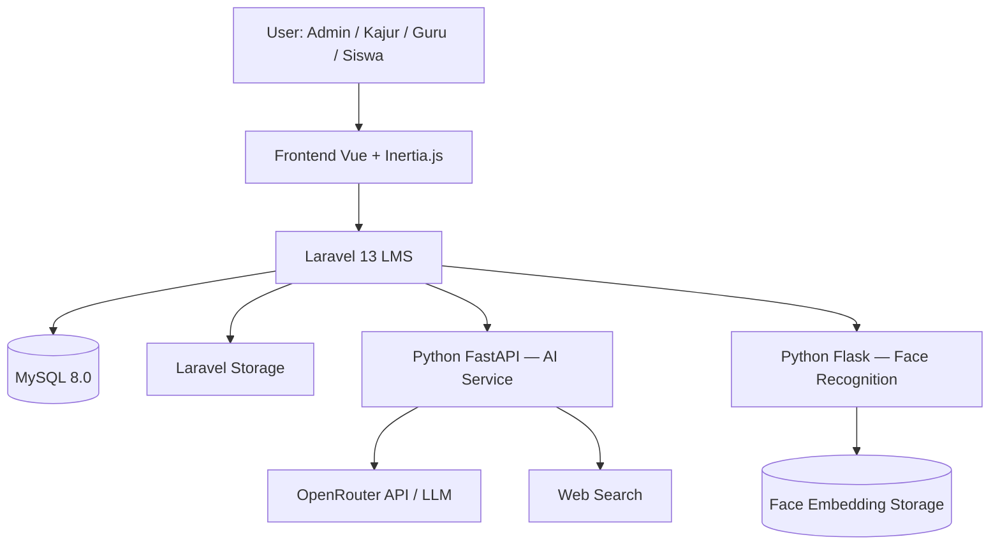

# 📚 Dokumentasi Project E-Learning Berbasis AI dan Face Recognition

> **Sistem LMS (Learning Management System)** untuk sekolah berbasis **Laravel + Vue + Inertia**, dilengkapi **AI Learning Assistant** (Python FastAPI + OpenRouter) dan **Absensi Face Recognition** (Python Flask), seluruhnya diorkestrasikan melalui **Docker Compose**.

---

## 🗺️ Peta Dokumen

Dokumentasi project ini disusun dalam **5 bagian berurutan** yang saling terhubung. Baca secara berurutan untuk pemahaman sistem yang utuh.

```
Part 1 ──► Part 2 ──► Part 3 ──► Part 4 ──► Part 5
Analisis    PRD         ERD         UML         UML
Awal        Awal        Lengkap     Use Case    Sequence &
                                    & Activity  Class Diagram
```

| # | Dokumen | Fokus | Link |
|:-:|---------|-------|------|
| 1 | **Analisis Awal & Fondasi PRD** | Audit struktur project, stack teknologi, aktor sistem, identifikasi modul, dan catatan ketidaksesuaian dokumen lama dengan kode aktual | [📄 Part 1](./analisis_awal_prd_elearning_part_1.md) |
| 2 | **PRD Awal** | Product Requirement Document versi awal: tujuan produk, ruang lingkup, kebutuhan fungsional per modul, acceptance criteria, dan kebutuhan nonfungsional | [📄 Part 2](./prd_awal_elearning_ai_face_recognition_part_2.md) |
| 3 | **ERD Lengkap** | Entity Relationship Diagram berbasis migration aktual Laravel: 40 tabel, relasi, kardinalitas, atribut inti, dan aturan database per domain | [📄 Part 3](./erd_lengkap_elearning_ai_face_recognition_part_3.md) |
| 4 | **UML Use Case & Activity Diagram** | Use case diagram global dan per role, serta 15+ activity diagram mencakup seluruh alur kerja utama sistem | [📄 Part 4](./uml_usecase_activity_elearning_ai_face_recognition_part_4.md) |
| 5 | **UML Sequence & Class Diagram** | Class diagram per domain (Auth, Akademik, Pembelajaran, AI, Face Recognition) dan 10+ sequence diagram komunikasi antarkomponent | [📄 Part 5](./uml_sequence_class_elearning_ai_face_recognition_part_5.md) |

---

## 🏗️ Gambaran Sistem



### Stack Teknologi

| Layer | Teknologi |
|-------|-----------|
| Backend utama | Laravel 13, PHP 8.3 |
| Frontend | Vue 3, Inertia.js, Vite |
| UI Framework | Tailwind CSS 4, DaisyUI |
| Database | MySQL 8.0 |
| Role & Permission | Spatie Laravel Permission |
| AI Service | Python FastAPI + OpenRouter |
| Face Recognition | Python Flask |
| Deployment | Docker Compose |
| Queue | Laravel Queue |

---

## 👥 Aktor Sistem

| Aktor | Tanggung Jawab Utama |
|-------|---------------------|
| **Admin Sistem** | Kelola user, data akademik, plotting pengampu, jadwal, face profile, dan konfigurasi AI |
| **Kajur** | Kelola pengumuman, monitoring progress kelas, monitoring nilai, monitoring AI |
| **Guru** | Kelola pertemuan, materi, tugas, penilaian, rekap kehadiran, face profile kelas, AI materi |
| **Siswa** | Akses materi, kumpulkan tugas, lihat nilai, absensi wajah, AI tutor |

---

## 📦 Modul Utama

| # | Modul | Aktor | Dokumen Referensi |
|:-:|-------|-------|-------------------|
| 1 | Autentikasi & Profil | Semua | [Part 2 §7.1](./prd_awal_elearning_ai_face_recognition_part_2.md) |
| 2 | Manajemen User & Role | Admin | [Part 2 §7.2](./prd_awal_elearning_ai_face_recognition_part_2.md) |
| 3 | Data Akademik | Admin | [Part 2 §7.2](./prd_awal_elearning_ai_face_recognition_part_2.md) |
| 4 | Plotting Pengampu & Jadwal | Admin | [Part 2 §7.2](./prd_awal_elearning_ai_face_recognition_part_2.md) |
| 5 | Pengumuman | Kajur | [Part 2 §7.6](./prd_awal_elearning_ai_face_recognition_part_2.md) |
| 6 | Monitoring Akademik & AI | Kajur | [Part 2 §7.3](./prd_awal_elearning_ai_face_recognition_part_2.md) |
| 7 | Pertemuan, Materi & Tugas | Guru | [Part 2 §7.4](./prd_awal_elearning_ai_face_recognition_part_2.md) |
| 8 | Penilaian & Rekap Nilai | Guru, Siswa | [Part 2 §7.4](./prd_awal_elearning_ai_face_recognition_part_2.md) |
| 9 | Absensi Face Recognition | Siswa, Guru, Admin | [Part 2 §7.7](./prd_awal_elearning_ai_face_recognition_part_2.md) |
| 10 | AI Learning Assistant | Guru, Siswa | [Part 2 §7.8](./prd_awal_elearning_ai_face_recognition_part_2.md) |

---

## 🗄️ Domain Database (40 Tabel)

Struktur lengkap database didokumentasikan di [Part 3](./erd_lengkap_elearning_ai_face_recognition_part_3.md). Ringkasan per domain:

| Domain | Jumlah Tabel | Tabel Utama |
|--------|:---:|------------|
| Autentikasi & Role | 7 | `users`, `roles`, `permissions`, `model_has_roles` |
| Akademik | 9 | `departments`, `teachers`, `students`, `class_groups`, `student_class_enrollments` |
| Pengajaran & Jadwal | 3 | `teaching_assignments`, `class_schedules`, `meetings` |
| Pembelajaran | 4 | `materials`, `assignments`, `assignment_submissions`, `assignment_grades` |
| Absensi Face Recognition | 3 | `face_profiles`, `attendances`, `attendance_attempts` |
| Pengumuman | 1 | `announcements` |
| AI Learning Assistant | 7 | `ai_documents`, `ai_document_chunks`, `ai_chat_sessions`, `ai_chat_messages`, `ai_usage_logs`, `ai_usage_limits`, `ai_generated_outputs` |
| Sistem Laravel | 6 | `cache`, `cache_locks`, `jobs`, `job_batches`, `failed_jobs`, `sessions` |

---

## 📐 UML & Diagram

### Use Case & Activity (Part 4)

Dokumen [Part 4](./uml_usecase_activity_elearning_ai_face_recognition_part_4.md) memuat:

- **Use Case Diagram** global (semua aktor vs semua fitur)
- Use Case Diagram per aktor: Admin, Kajur, Guru, Siswa
- **15+ Activity Diagram** mencakup:
  - Login & redirect role
  - Admin kelola data akademik & user
  - Kajur kelola pengumuman & monitoring
  - Guru kelola pertemuan, upload materi, buat tugas, nilai submission
  - Siswa akses pembelajaran, kumpulkan tugas, absensi wajah, chat AI
  - Sinkronisasi face profile Admin/Guru
  - Generate ringkasan/kuis/glosarium AI

### Sequence & Class (Part 5)

Dokumen [Part 5](./uml_sequence_class_elearning_ai_face_recognition_part_5.md) memuat:

- **6 Class Diagram** domain:
  - Arsitektur layer sistem
  - User, Role & Profil Akademik
  - Domain Akademik
  - Pembelajaran, Tugas, Nilai & Absensi
  - AI Learning Assistant
  - Face Recognition
- **10+ Sequence Diagram** fitur prioritas:
  - Login & redirect role
  - Upload materi
  - Pemrosesan dokumen AI (job queue)
  - Chat AI siswa berbasis materi
  - Free chat & web search AI
  - Generate summary/quiz/glossary
  - Absensi wajah siswa
  - Sinkronisasi face profile
  - Submit tugas siswa
  - Penilaian submission guru

---

## 🔗 Alur Keterhubungan Dokumen

Dokumen dirancang saling merujuk agar konsisten:

```
Part 1 ──── mendefinisikan ──── stack teknologi & aktor
  │                                       │
  └──► Part 2 (PRD)                       │
         │                                │
         ├── kebutuhan fungsional & AC ───┘
         │
         └──► Part 3 (ERD) ◄──── migration Laravel
                │
                └──► Part 4 (Use Case & Activity) ◄──── routes & controllers
                       │
                       └──► Part 5 (Sequence & Class) ◄──── models & services
```

| Jika membaca tentang... | Baca di Part |
|------------------------|:------------:|
| Latar belakang, stack, struktur project, modul awal | **1** |
| Kebutuhan fungsional, acceptance criteria, NFR | **2** |
| Struktur tabel, relasi, atribut kolom database | **3** |
| Interaksi aktor–fitur, alur aktivitas per use case | **4** |
| Komunikasi antarobjek, struktur class domain | **5** |

---

## 🚩 Catatan Keputusan Arsitektur Penting

> Beberapa keputusan desain kritis yang perlu diperhatikan saat implementasi:

1. **UUID sebagai primary key** — Seluruh tabel domain utama menggunakan UUID, bukan auto-increment.
2. **Spatie Permission** — Role menggunakan package Spatie, bukan tabel `user_roles` custom.
3. **Verification 1:1** pada face recognition — Wajah siswa diverifikasi terhadap face profile miliknya sendiri, bukan pencarian 1:N.
4. **Python tidak mengambil keputusan akademik** — Semua validasi role, enrollment, jadwal, dan status pertemuan dilakukan di Laravel.
5. **student_id tidak boleh dikirim dari body request absensi** — Sistem mengambil identitas siswa dari akun yang sedang login.
6. **Relasi logis pada tabel AI** — Beberapa kolom AI diberi index tetapi tidak semua menggunakan foreign key constraint eksplisit di migration.
7. **MySQL 8.0 sebagai database utama** — Dokumen DBML lama menyebut PostgreSQL, tetapi implementasi aktual memakai MySQL.

---

## 📋 Status Dokumen

| Dokumen | Versi | Status |
|---------|:-----:|--------|
| [Part 1 — Analisis Awal](./analisis_awal_prd_elearning_part_1.md) | 0.1 | ✅ Draft selesai |
| [Part 2 — PRD Awal](./prd_awal_elearning_ai_face_recognition_part_2.md) | 0.1 | ✅ Draft selesai |
| [Part 3 — ERD Lengkap](./erd_lengkap_elearning_ai_face_recognition_part_3.md) | 0.1 | ✅ Draft selesai |
| [Part 4 — UML Use Case & Activity](./uml_usecase_activity_elearning_ai_face_recognition_part_4.md) | 0.1 | ✅ Draft selesai |
| [Part 5 — UML Sequence & Class](./uml_sequence_class_elearning_ai_face_recognition_part_5.md) | 0.1 | ✅ Draft selesai |

---

## 🛠️ Cara Menggunakan Dokumen Ini

1. **Mulai dari Part 1** untuk memahami konteks dan struktur project secara menyeluruh.
2. **Gunakan Part 2** sebagai kontrak kebutuhan fungsional saat mengimplementasikan setiap modul.
3. **Gunakan Part 3** sebagai referensi utama saat membuat atau memodifikasi migration database.
4. **Gunakan Part 4** sebagai referensi alur bisnis saat membangun controller dan middleware.
5. **Gunakan Part 5** sebagai referensi teknis saat membangun service, model, dan integrasi antar-service.

---

> 📝 *Dokumen ini adalah living documentation. Setiap perubahan signifikan pada kode, database, atau alur sistem harus direfleksikan ke dokumen yang relevan agar tetap sinkron dengan implementasi aktual.*
