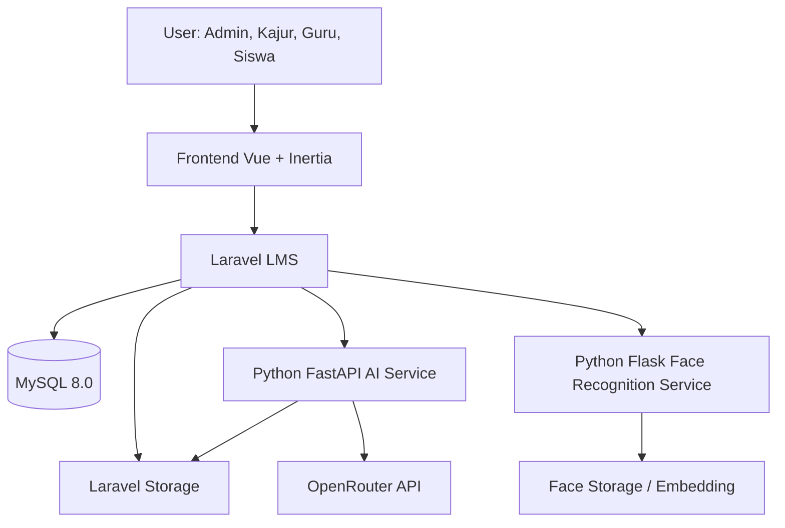
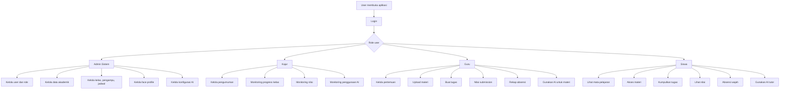
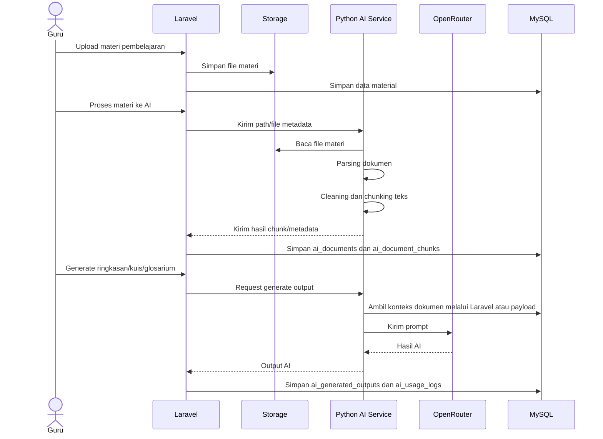
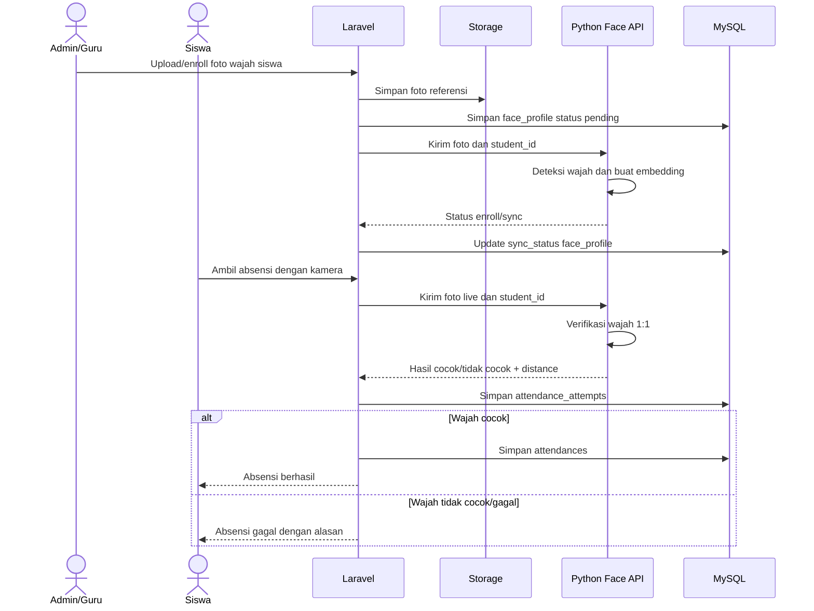

# Analisis Awal Project E-Learning Berbasis AI dan Face Recognition

**Nama file sumber:** `e-learning.zip`  
**Jumlah item terdeteksi:** ±559 item  
**Tahap dokumen:** Part 1 — Analisis Awal dan Fondasi PRD  
**Status:** Draft analisis awal untuk bahan penyusunan PRD gabungan, ERD, dan UML.

---

## 1. Tujuan Analisis

Analisis ini dibuat untuk membaca struktur awal project e-learning yang berisi beberapa komponen besar, yaitu aplikasi LMS, layanan AI, dan layanan absensi berbasis *face recognition*. Hasil analisis ini menjadi dasar untuk menyusun satu dokumen PRD final yang memuat alur sistem, aktor, kebutuhan fungsional, kebutuhan nonfungsional, ERD lengkap, dan UML.

Dokumen ini belum menjadi PRD final. Dokumen ini berfungsi sebagai peta awal agar pengembangan dokumen berikutnya lebih terarah, tidak tumpang tindih, dan mengikuti kondisi project aktual.

---

## 2. Ringkasan Struktur Project

Berdasarkan isi ZIP, project memiliki tiga bagian utama.

| Bagian | Lokasi Folder/File | Fungsi Utama |
|---|---|---|
| Core E-Learning | `elearning/elearning/` | Aplikasi utama berbasis Laravel, Inertia, Vue, Tailwind, dan DaisyUI. |
| AI Service | `elearning/AI_elearning/` | Layanan Python FastAPI untuk membaca dokumen, membuat ringkasan, kuis, glosarium, chat materi, dan web search. |
| Face Recognition Service | `elearning/face_recognition/` | Layanan Python Flask untuk enroll wajah, verifikasi wajah, hapus data wajah, dan health check service. |
| Docker Deployment | `elearning/docker-compose.yml` | Orkestrasi aplikasi Laravel, database MySQL, AI service, dan face recognition service. |
| Database Migration | `elearning/elearning/database/migrations/` | Sumber utama struktur tabel untuk penyusunan ERD final. |
| Route Laravel | `elearning/elearning/routes/` | Sumber utama untuk membaca alur sistem berdasarkan role. |
| Model Laravel | `elearning/elearning/app/Models/` | Sumber utama untuk class diagram dan relasi domain. |
| Controller Laravel | `elearning/elearning/app/Http/Controllers/` | Sumber utama untuk activity diagram dan sequence diagram. |
| Dokumen Planning | File `.md` dan `.dbml` di root project | Sumber pendukung untuk memahami rancangan awal. |

---

## 3. Dokumen Planning yang Ditemukan

File dokumen rancangan yang ditemukan dalam project:

| File | Peran dalam Analisis |
|---|---|
| `erd_konseptual_elearning.md` | Rancangan konseptual ERD e-learning. |
| `erd_konseptual_elearning.dbml` | Rancangan DBML awal untuk ERD. |
| `flow-auto-sync-face-recognition-laravel-python.md` | Alur sinkronisasi Laravel dengan Python face recognition. |
| `flow_sistem_elearning_role_terpisah_dengan_alur.md` | Alur sistem berdasarkan role. |
| `IMPLEMENTASI_FITUR_PENGUMUMAN.md` | Rancangan dan implementasi fitur pengumuman. |
| `implementation-plan-revisi-elearning.md` | Rencana revisi dan implementasi e-learning. |
| `Penjelasan_Face_Recognition_API_Machine_Learning.md` | Penjelasan API face recognition. |
| `PRD_AI_Elearning_OpenRouter_Python.md` | PRD awal fitur AI berbasis OpenRouter dan Python. |
| `PRD_AI_Elearning_OpenRouter_Python_v1_1.md` | Revisi PRD AI. |
| `roadmap_implementasi_laravel_elearning_bertahap_v2.md` | Roadmap implementasi bertahap Laravel e-learning. |
| `server.md` | Catatan server/deployment. |
| `struktur_folder_laravel_elearning_dengan_daisyui.md` | Rancangan struktur folder Laravel dan DaisyUI. |

---

## 4. Stack Teknologi Project

Berdasarkan file project yang terbaca, stack teknologi yang digunakan adalah sebagai berikut.

| Lapisan | Teknologi |
|---|---|
| Backend utama | Laravel 13 |
| Bahasa backend utama | PHP 8.3 |
| Frontend | Vue 3, Inertia.js, Vite |
| UI framework | Tailwind CSS 4 dan DaisyUI |
| Role & permission | Spatie Laravel Permission |
| Database | MySQL 8.0 |
| AI service | Python FastAPI |
| Face recognition service | Python Flask |
| AI gateway/model | OpenRouter |
| Deployment | Docker Compose |
| Queue | Laravel queue dengan konfigurasi `sync` pada Docker Compose |
| Session | Database session |
| Cache | Database cache |

---

## 5. Gambaran Umum Sistem

Project ini dapat dipahami sebagai **Learning Management System berbasis role** yang dikembangkan dengan tambahan dua fitur besar, yaitu:

1. **AI Learning Assistant** untuk mendukung pembelajaran berbasis dokumen, percakapan materi, ringkasan, kuis, glosarium, dan pencarian web.
2. **Absensi Face Recognition** untuk mencatat kehadiran siswa berdasarkan verifikasi wajah melalui kamera.

Sistem utama tetap berada di Laravel. Laravel berperan sebagai pusat autentikasi, role, data akademik, materi, tugas, nilai, pengumuman, absensi, dan pencatatan aktivitas AI. Layanan Python digunakan sebagai service pendukung yang dipanggil oleh Laravel melalui HTTP API.

---

## 6. Arsitektur Tingkat Tinggi



### Penjelasan Singkat

- User mengakses sistem melalui frontend Vue dan Inertia.
- Laravel mengatur autentikasi, otorisasi, data akademik, pembelajaran, absensi, dan AI logging.
- MySQL menyimpan data utama.
- Storage Laravel menyimpan file materi, tugas, avatar, dan foto referensi wajah.
- AI service membaca file dari storage, melakukan parsing, chunking, dan memanggil OpenRouter.
- Face recognition service melakukan enroll, verify, delete, dan health check untuk data wajah.

---

## 7. Aktor Sistem

Aktor utama yang teridentifikasi dari route, controller, dan struktur project adalah sebagai berikut.

| Aktor | Peran Utama |
|---|---|
| Admin Sistem | Mengelola user, role, data akademik, kelas, guru, siswa, mata pelajaran, pengampu, jadwal, face profile, dan konfigurasi AI. |
| Kajur | Mengelola pengumuman, memantau progress pembelajaran, memantau nilai, dan memantau penggunaan AI. |
| Guru | Mengelola pertemuan, materi, tugas, penilaian, rekap absensi, face profile siswa per kelas, serta fitur AI untuk materi. |
| Siswa | Mengakses mata pelajaran, membaca materi, mengerjakan tugas, melihat nilai, melakukan absensi wajah, dan menggunakan AI tutor. |

---

## 8. Modul Utama Sistem

### 8.1 Modul Autentikasi dan Profil

Modul ini menangani proses login, logout, manajemen profil, pembaruan password, dan avatar user.

Komponen terkait:

- `routes/auth.php`
- `routes/shared.php`
- `AuthenticatedSessionController.php`
- `ProfileController.php`
- `users`
- `sessions`
- `password_reset_tokens`

### 8.2 Modul Admin Sistem

Modul admin merupakan pusat pengelolaan master data dan konfigurasi sistem.

Fitur utama admin:

- dashboard admin
- manajemen user
- manajemen jurusan
- manajemen tahun ajaran
- manajemen semester
- manajemen mata pelajaran
- manajemen kelas
- manajemen guru
- manajemen siswa
- manajemen anggota kelas
- plotting pengampu
- manajemen jadwal kelas
- manajemen face profile siswa
- konfigurasi AI
- health check AI service

Route utama admin berada pada:

```text
elearning/elearning/routes/admin.php
```

### 8.3 Modul Kajur

Modul kajur berfokus pada pengumuman dan monitoring akademik.

Fitur utama kajur:

- dashboard kajur
- CRUD pengumuman
- monitoring progress kelas
- detail progress per kelas
- monitoring nilai
- monitoring penggunaan AI

Route utama kajur berada pada:

```text
elearning/elearning/routes/kajur.php
```

### 8.4 Modul Guru

Modul guru menangani aktivitas pembelajaran dan evaluasi.

Fitur utama guru:

- dashboard guru
- daftar kelas/mata pelajaran yang diajar
- manajemen pertemuan
- publish pertemuan
- aktivasi pertemuan
- penutupan pertemuan
- upload dan hapus materi
- buat dan hapus tugas
- lihat semua submission
- halaman grading
- beri nilai dan feedback
- lihat rekap nilai
- lihat rekap absensi
- kelola sinkronisasi face profile siswa per kelas
- proses materi ke AI
- generate ringkasan AI
- generate kuis AI
- generate glosarium AI
- melihat dan menghapus output AI

Route utama guru berada pada:

```text
elearning/elearning/routes/guru.php
```

### 8.5 Modul Siswa

Modul siswa menangani aktivitas belajar, pengumpulan tugas, absensi, dan AI tutor.

Fitur utama siswa:

- dashboard siswa
- melihat daftar mata pelajaran
- melihat pertemuan
- membaca materi
- melihat detail tugas
- mengumpulkan tugas
- melihat rekap nilai
- melakukan absensi wajah
- chat AI berbasis materi
- free chat AI
- melihat riwayat AI
- web search AI

Route utama siswa berada pada:

```text
elearning/elearning/routes/siswa.php
```

### 8.6 Modul Face Recognition

Modul ini menghubungkan Laravel dengan Python Flask face recognition service.

Fitur utama:

- enroll foto wajah siswa
- update foto referensi
- resync wajah siswa
- resync semua wajah
- resync wajah per kelas
- hapus atau nonaktifkan face profile
- verifikasi wajah saat absensi
- pencatatan absensi resmi
- pencatatan semua percobaan absensi, termasuk yang gagal

Komponen terkait:

- `face_recognition/app.py`
- `face_recognition/routes/enroll.py`
- `face_recognition/routes/verify.py`
- `face_recognition/routes/delete.py`
- `face_recognition/routes/health.py`
- `face_recognition/services/face_service.py`
- `face_recognition/services/storage_service.py`
- `FaceProfileController.php`
- `FaceAttendanceController.php`
- `AttendanceRecapController.php`

### 8.7 Modul AI Learning Assistant

Modul AI menghubungkan Laravel dengan Python FastAPI AI service.

Fitur utama:

- parsing dokumen materi
- parsing PDF
- parsing DOCX
- parsing spreadsheet
- chunking dokumen
- pencarian konteks dokumen
- chat berbasis materi
- free chat
- web search
- generate ringkasan
- generate kuis
- generate glosarium
- logging penggunaan AI
- pembatasan penggunaan AI berdasarkan role
- monitoring penggunaan AI oleh kajur/admin

Komponen terkait:

- `AI_elearning/app/main.py`
- `AI_elearning/app/routers/chat.py`
- `AI_elearning/app/routers/documents.py`
- `AI_elearning/app/routers/generate.py`
- `AI_elearning/app/routers/health.py`
- `AI_elearning/app/services/document_parser.py`
- `AI_elearning/app/services/chunker.py`
- `AI_elearning/app/services/retriever.py`
- `AI_elearning/app/services/openrouter_client.py`
- `AI_elearning/app/services/web_search_service.py`
- `AiMaterialController.php`
- `AiTutorController.php`
- `AiWebSearchController.php`
- `AiMonitoringController.php`
- `AiSettingController.php`

---

## 9. Flow Global Sistem



---

## 10. Flow AI Learning Assistant



---

## 11. Flow Absensi Face Recognition



---

## 12. Basis Data: Kelompok Tabel yang Terdeteksi

### 12.1 Autentikasi, Session, dan Permission

| Tabel | Fungsi |
|---|---|
| `users` | Menyimpan akun pengguna. |
| `password_reset_tokens` | Token reset password. |
| `sessions` | Session login berbasis database. |
| `roles` | Role dari Spatie Permission. |
| `permissions` | Permission dari Spatie Permission. |
| `model_has_roles` | Relasi user/model dengan role. |
| `model_has_permissions` | Relasi user/model dengan permission. |
| `role_has_permissions` | Relasi role dengan permission. |

### 12.2 Data Akademik

| Tabel | Fungsi |
|---|---|
| `departments` | Data jurusan/departemen. |
| `academic_years` | Tahun ajaran. |
| `semesters` | Semester dalam tahun ajaran. |
| `teachers` | Profil guru yang terhubung ke user. |
| `students` | Profil siswa yang terhubung ke user. |
| `subjects` | Mata pelajaran. |
| `class_groups` | Data kelas/rombongan belajar. |
| `student_class_enrollments` | Relasi siswa dengan kelas. |
| `department_head_assignments` | Penugasan kepala jurusan. |
| `teaching_assignments` | Plotting guru, mapel, kelas, semester. |
| `class_schedules` | Jadwal kelas berdasarkan pengampu. |

### 12.3 Pembelajaran

| Tabel | Fungsi |
|---|---|
| `meetings` | Pertemuan pembelajaran. |
| `materials` | Materi pembelajaran. |
| `assignments` | Tugas pada pertemuan. |
| `assignment_submissions` | Jawaban atau pengumpulan tugas siswa. |
| `assignment_grades` | Nilai dan feedback tugas. |

### 12.4 Absensi Face Recognition

| Tabel | Fungsi |
|---|---|
| `face_profiles` | Data foto referensi wajah siswa dan status sinkronisasi ke Python. |
| `attendances` | Data absensi resmi siswa per pertemuan. |
| `attendance_attempts` | Log semua percobaan absensi, baik berhasil maupun gagal. |

### 12.5 Pengumuman

| Tabel | Fungsi |
|---|---|
| `announcements` | Pengumuman berdasarkan target role dan status publikasi. |

### 12.6 AI Learning Assistant

| Tabel | Fungsi |
|---|---|
| `ai_documents` | Metadata dokumen yang diproses AI. |
| `ai_document_chunks` | Potongan/chunk dokumen untuk konteks AI. |
| `ai_chat_sessions` | Sesi percakapan AI. |
| `ai_chat_messages` | Pesan dalam sesi AI. |
| `ai_usage_limits` | Batasan penggunaan AI per role. |
| `ai_usage_logs` | Log penggunaan fitur AI. |
| `ai_generated_outputs` | Output AI seperti ringkasan, kuis, dan glosarium. |

### 12.7 Infrastruktur Laravel

| Tabel | Fungsi |
|---|---|
| `cache` | Penyimpanan cache database. |
| `cache_locks` | Lock cache. |
| `jobs` | Queue jobs. |
| `job_batches` | Batch jobs. |
| `failed_jobs` | Log job gagal. |

---

## 13. Catatan Ketidaksesuaian Dokumen Lama dan Kode Aktual

Beberapa bagian dokumen lama perlu diselaraskan dengan implementasi aktual.

### 13.1 ERD Lama Belum Lengkap

File `erd_konseptual_elearning.dbml` dan `erd_konseptual_elearning.md` sudah mencakup inti LMS, tetapi belum sepenuhnya mencakup fitur lanjutan seperti:

- face profile
- attendance
- attendance attempts
- announcements
- AI documents
- AI chunks
- AI chat sessions
- AI chat messages
- AI usage limits
- AI usage logs
- AI generated outputs
- tabel permission dari Spatie

**Keputusan rekomendasi:** ERD final harus dibuat ulang dari migration aktual Laravel, bukan hanya dari DBML lama.

### 13.2 Role Lama Berbeda dengan Struktur Permission Aktual

Rancangan lama masih menunjukkan kemungkinan penggunaan tabel `user_roles`. Pada implementasi aktual, sistem memakai Spatie Laravel Permission.

Struktur aktual yang perlu digunakan dalam ERD final:

- `roles`
- `permissions`
- `model_has_roles`
- `model_has_permissions`
- `role_has_permissions`

**Keputusan rekomendasi:** PRD final dan ERD final menggunakan struktur Spatie Permission.

### 13.3 Pembagian Peran Kajur dan Admin Perlu Diperjelas

Dokumen flow lama masih menunjukkan sebagian pengelolaan akademik berada pada Kajur. Pada route aktual, pengelolaan master akademik banyak berada pada Admin Sistem.

Rekomendasi pembagian final:

| Modul | Penanggung Jawab Final |
|---|---|
| User dan role | Admin Sistem |
| Jurusan | Admin Sistem |
| Tahun ajaran | Admin Sistem |
| Semester | Admin Sistem |
| Mata pelajaran | Admin Sistem |
| Kelas | Admin Sistem |
| Guru dan siswa | Admin Sistem |
| Anggota kelas | Admin Sistem |
| Plotting pengampu | Admin Sistem |
| Jadwal kelas | Admin Sistem |
| Pengumuman | Kajur |
| Monitoring akademik | Kajur |
| Monitoring AI | Kajur/Admin sesuai kebutuhan final |
| Pertemuan, materi, tugas, nilai | Guru |
| Absensi wajah | Siswa, Guru, Admin |
| AI materi | Guru |
| AI tutor | Siswa |

### 13.4 Database Aktual Menggunakan MySQL

Dokumen DBML lama menyebut database konseptual berbasis PostgreSQL, sedangkan Docker Compose aktual menggunakan MySQL 8.0.

**Keputusan rekomendasi:** PRD final, ERD final, dan deployment documentation sebaiknya menggunakan MySQL 8.0 sebagai basis database utama.

---

## 14. Draft Struktur PRD Final yang Disarankan

PRD final sebaiknya disusun dengan struktur berikut.

### 14.1 Pendahuluan

- Nama produk
- Latar belakang
- Masalah yang diselesaikan
- Tujuan pengembangan
- Ruang lingkup
- Definisi istilah

### 14.2 Gambaran Produk

- Deskripsi umum LMS
- Deskripsi AI learning assistant
- Deskripsi absensi face recognition
- Gambaran role-based access
- Batasan MVP

### 14.3 Aktor dan Hak Akses

- Admin Sistem
- Kajur
- Guru
- Siswa
- Matriks hak akses setiap role

### 14.4 Modul Sistem

- Autentikasi dan profil
- Manajemen user
- Manajemen akademik
- Manajemen kelas
- Manajemen pengampu
- Manajemen jadwal
- Manajemen pertemuan
- Manajemen materi
- Manajemen tugas
- Pengumpulan tugas
- Penilaian
- Pengumuman
- Monitoring akademik
- Absensi face recognition
- AI learning assistant
- AI monitoring
- Konfigurasi sistem

### 14.5 Flow Sistem

- Flow login dan redirect role
- Flow Admin Sistem
- Flow Kajur
- Flow Guru
- Flow Siswa
- Flow pembelajaran
- Flow tugas dan nilai
- Flow pengumuman
- Flow absensi wajah
- Flow AI dokumen
- Flow AI chat
- Flow AI web search

### 14.6 Kebutuhan Fungsional

Kebutuhan fungsional perlu ditulis berdasarkan role dan modul.

Contoh format:

| Kode | Role | Kebutuhan Fungsional | Prioritas |
|---|---|---|---|
| FR-ADM-001 | Admin Sistem | Sistem harus memungkinkan admin mengelola data user. | High |
| FR-GRU-001 | Guru | Sistem harus memungkinkan guru membuat pertemuan pada kelas yang diajar. | High |
| FR-SIS-001 | Siswa | Sistem harus memungkinkan siswa mengakses materi pada pertemuan aktif. | High |

### 14.7 Kebutuhan Nonfungsional

- Keamanan data user
- Keamanan data wajah
- Validasi akses berdasarkan role
- Audit trail untuk absensi dan AI
- Performa pemrosesan AI
- Performa verifikasi wajah
- Batas ukuran file dokumen AI
- Batas ukuran file foto wajah
- Ketersediaan service Python
- Skalabilitas deployment Docker
- Maintainability kode

### 14.8 Arsitektur Sistem

- Laravel LMS
- Vue/Inertia frontend
- MySQL database
- Python AI service
- Python face recognition service
- OpenRouter integration
- Docker Compose deployment

### 14.9 ERD Lengkap

ERD final dibuat dari migration aktual.

Isi ERD final perlu memuat:

- entitas
- atribut utama
- primary key
- foreign key
- relasi
- kardinalitas
- constraint unik
- indeks penting

### 14.10 UML

UML yang perlu dibuat:

- Use case diagram global
- Use case diagram per role
- Activity diagram login
- Activity diagram pembelajaran
- Activity diagram tugas dan penilaian
- Activity diagram absensi wajah
- Activity diagram AI materi
- Class diagram domain LMS
- Class diagram AI
- Class diagram face recognition
- Sequence diagram login
- Sequence diagram upload materi
- Sequence diagram proses AI
- Sequence diagram absensi wajah
- Sequence diagram submit tugas
- Sequence diagram penilaian tugas

### 14.11 Acceptance Criteria

Acceptance criteria perlu ditulis per fitur utama.

Contoh:

| Modul | Acceptance Criteria |
|---|---|
| Login | User berhasil diarahkan ke dashboard sesuai role setelah login. |
| Materi | Guru dapat mengunggah materi dan siswa dapat melihat materi pada pertemuan yang sesuai. |
| Absensi Wajah | Siswa hanya dapat tercatat hadir apabila verifikasi wajah berhasil. |
| AI Chat | Siswa dapat bertanya kepada AI berdasarkan konteks materi yang tersedia. |

### 14.12 Risiko dan Mitigasi

| Risiko | Dampak | Mitigasi |
|---|---|---|
| AI service tidak aktif | Fitur AI tidak dapat digunakan. | Tambahkan health check dan fallback pesan error yang jelas. |
| Face API tidak aktif | Absensi wajah gagal. | Sediakan status service dan opsi absensi manual oleh guru. |
| Foto wajah tidak valid | Siswa gagal absensi. | Validasi jumlah wajah saat enroll dan simpan error sinkronisasi. |
| Penyalahgunaan AI | Penggunaan AI tidak terkontrol. | Terapkan usage limit dan usage log. |
| Data wajah sensitif bocor | Risiko privasi tinggi. | Batasi akses storage, gunakan API key, dan audit akses. |

---

## 15. Rekomendasi Tahapan Kerja Berikutnya

### Part 2 — PRD Awal Versi Rapi

Fokus:

- menyusun PRD awal dalam format dokumen resmi
- menulis latar belakang
- menulis tujuan sistem
- menulis ruang lingkup
- menulis aktor dan hak akses
- menulis modul inti sistem

Output:

```text
PRD awal versi 1.0 dalam Markdown
```

### Part 3 — ERD Lengkap

Fokus:

- membaca seluruh migration
- membuat daftar tabel lengkap
- membuat atribut penting tiap tabel
- membuat relasi antar tabel
- membuat ERD dalam Mermaid atau DBML

Output:

```text
ERD lengkap + penjelasan relasi
```

### Part 4 — UML Use Case dan Activity Diagram

Fokus:

- use case global
- use case per role
- activity diagram login
- activity diagram pembelajaran
- activity diagram absensi wajah
- activity diagram AI

Output:

```text
UML use case dan activity diagram dalam Mermaid
```

### Part 5 — Class Diagram dan Sequence Diagram

Fokus:

- class diagram domain utama
- class diagram AI
- class diagram face recognition
- sequence diagram fitur prioritas

Output:

```text
Class diagram dan sequence diagram dalam Mermaid
```

### Part 6 — Finalisasi PRD Gabungan

Fokus:

- menggabungkan seluruh bagian
- merapikan struktur dokumen
- menyelaraskan istilah
- menambahkan acceptance criteria
- menambahkan risiko dan mitigasi

Output:

```text
PRD final gabungan e-learning AI + face recognition
```

---

## 16. Keputusan Awal yang Direkomendasikan

Untuk menjaga PRD final tetap konsisten dengan project aktual, keputusan awal berikut sebaiknya digunakan.

1. **Sumber utama PRD adalah kode aktual**, terutama route, controller, model, migration, dan Docker Compose.
2. **Dokumen planning lama digunakan sebagai pendukung**, bukan satu-satunya sumber kebenaran.
3. **ERD final dibuat ulang dari migration Laravel aktual**.
4. **Role final terdiri dari Admin Sistem, Kajur, Guru, dan Siswa**.
5. **Admin Sistem menjadi pengelola utama data akademik**.
6. **Kajur difokuskan pada pengumuman dan monitoring**.
7. **Face recognition menggunakan pola verifikasi 1:1**, yaitu wajah siswa diverifikasi terhadap identitas siswa yang sedang login.
8. **AI learning assistant berbasis dokumen, chunk retrieval, OpenRouter, dan web search**.
9. **Database utama adalah MySQL 8.0**.
10. **Dokumentasi final perlu dibuat bertahap** agar detail ERD dan UML tidak tercampur secara dangkal.

---

## 17. Status Analisis Part 1

| Komponen | Status |
|---|---|
| ZIP project terbaca | Selesai |
| Struktur folder utama dipetakan | Selesai |
| Komponen Laravel, AI, dan face recognition diidentifikasi | Selesai |
| Route per role dibaca secara awal | Selesai |
| Migration utama dibaca secara awal | Selesai |
| Tabel utama dikelompokkan | Selesai |
| Ketidaksesuaian dokumen lama dan kode aktual dicatat | Selesai |
| Struktur PRD final direkomendasikan | Selesai |
| ERD lengkap | Belum, masuk Part 3 |
| UML lengkap | Belum, masuk Part 4 dan Part 5 |
| PRD final gabungan | Belum, masuk Part 6 |

---

## 18. Catatan Penutup

Project ini sudah memiliki fondasi yang kuat karena terdiri atas aplikasi utama, service AI, service face recognition, migration database, route per role, model, controller, dan dokumen perencanaan. Tantangan utama bukan pada kurangnya bahan, tetapi pada penyatuan seluruh bahan menjadi satu dokumen PRD yang konsisten.

Langkah paling tepat setelah dokumen ini adalah menyusun **PRD Awal Versi 1.0**. PRD awal tersebut perlu fokus pada narasi produk, aktor, modul, scope, dan flow utama terlebih dahulu. Setelah itu, ERD dan UML dapat dimasukkan sebagai bagian teknis yang lebih detail.
