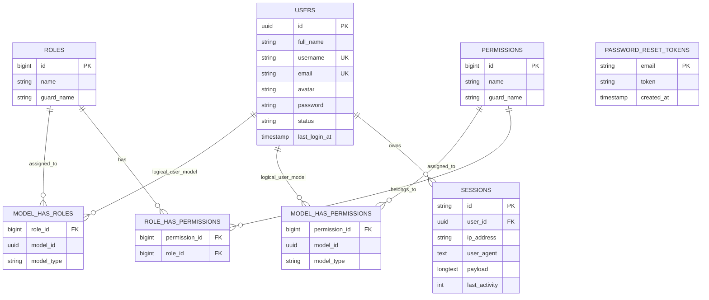
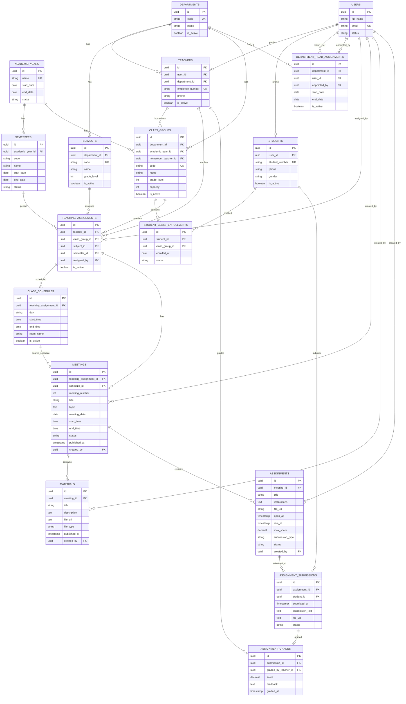
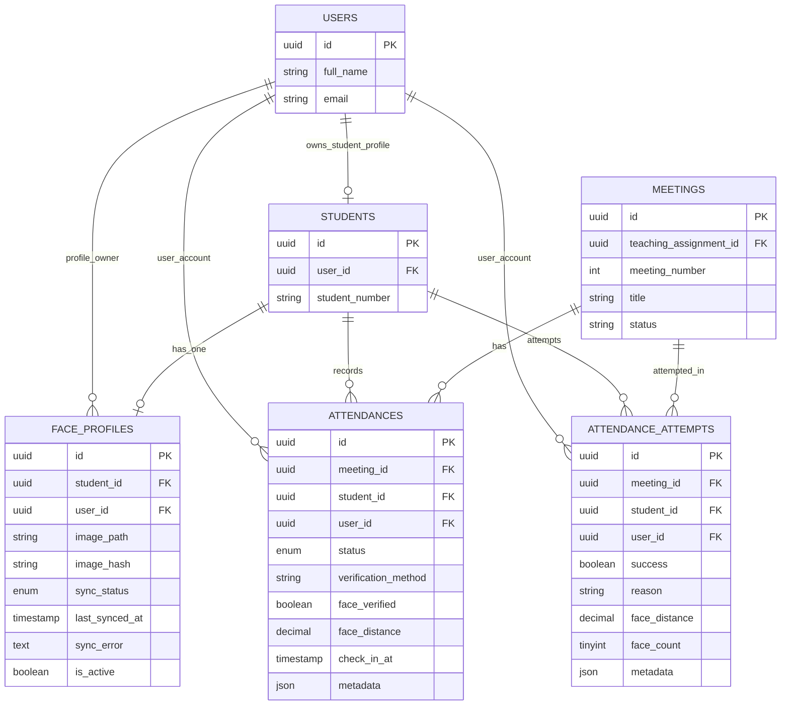
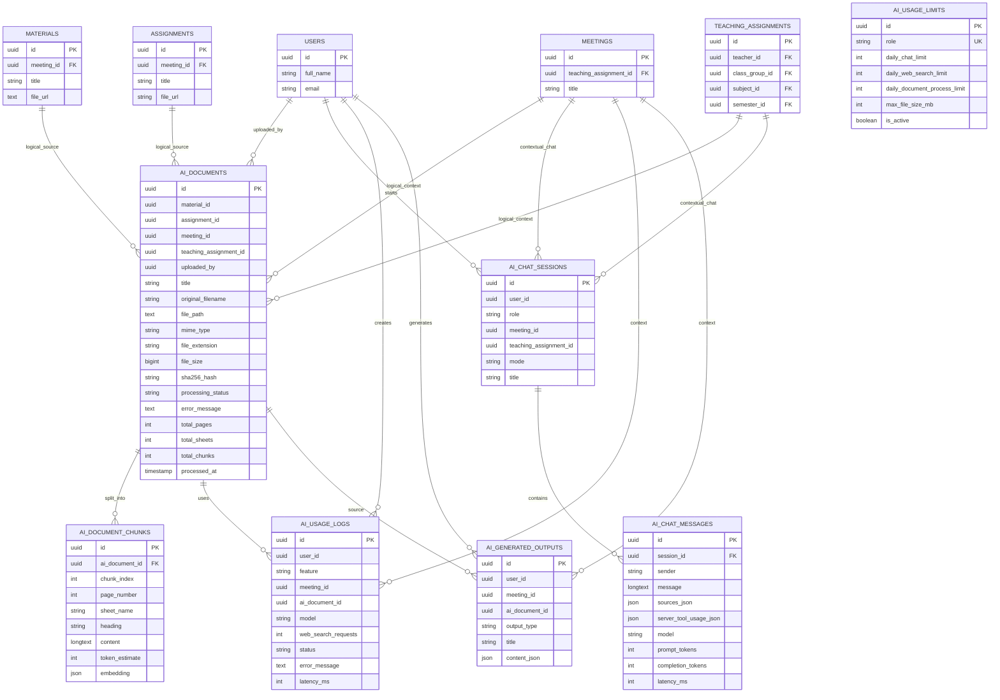
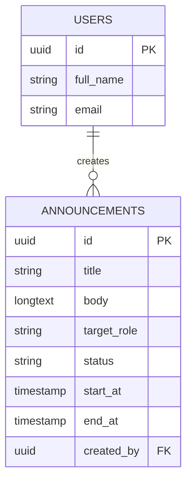

# Part 3 — ERD Lengkap Sistem E-Learning Berbasis AI dan Face Recognition

**Nama dokumen:** Entity Relationship Diagram (ERD) Lengkap  
**Project:** E-Learning Berbasis AI dan Absensi Face Recognition  
**Versi:** Draft 0.1  
**Status:** Dokumen kerja teknis untuk PRD final  
**Sumber utama:** Migration Laravel pada `elearning/database/migrations`  
**Sumber pendukung:** Model Laravel, dokumen planning ERD, planning AI, dan planning face recognition di dalam ZIP project.

---

## 1. Tujuan Part 3

Dokumen ini menyusun ERD lengkap untuk project e-learning berbasis AI dan absensi face recognition. Penyusunan ERD pada tahap ini menggunakan **migration aktual Laravel** sebagai acuan utama karena migration menunjukkan struktur tabel yang benar-benar dipakai oleh aplikasi.

Part 3 ini menjadi fondasi untuk:

1. menyusun ERD final di dokumen PRD;
2. membuat *class diagram*;
3. membuat *sequence diagram*;
4. membuat *activity diagram*;
5. menyelaraskan flow sistem dengan struktur database;
6. menghindari perbedaan antara dokumen planning lama dan kode aktual.

---

## 2. Ringkasan Database

Database utama project menggunakan **MySQL 8.0**. Struktur database terbagi ke dalam beberapa domain besar sebagai berikut.

| No | Domain | Fungsi Utama |
|---:|---|---|
| 1 | Autentikasi dan Role | Menyimpan user, session, role, permission, dan relasi role-user |
| 2 | Akademik | Menyimpan jurusan, tahun ajaran, semester, guru, siswa, kelas, dan enrollment |
| 3 | Pengajaran | Menyimpan plotting pengampu, jadwal kelas, dan pertemuan |
| 4 | Pembelajaran | Menyimpan materi, tugas, submission, dan nilai |
| 5 | Absensi Face Recognition | Menyimpan profil wajah, absensi resmi, dan log percobaan absensi |
| 6 | Pengumuman | Menyimpan pengumuman berdasarkan role target |
| 7 | AI Learning Assistant | Menyimpan dokumen AI, chunk dokumen, sesi chat, pesan chat, limit AI, log AI, dan output AI |
| 8 | Sistem Laravel | Menyimpan cache, queue job, batch job, dan failed job |

Secara keseluruhan terdapat **40 tabel** dari migration Laravel. Dari jumlah tersebut, sekitar **33 tabel** merupakan tabel domain aplikasi utama, sedangkan sisanya merupakan tabel bawaan Laravel untuk session, cache, queue, dan job processing.

---

## 3. Catatan Penting Sebelum Membaca ERD

### 3.1 Sistem memakai UUID untuk tabel domain utama

Sebagian besar tabel domain aplikasi memakai `uuid` sebagai primary key. Contohnya adalah `users`, `students`, `teachers`, `meetings`, `assignments`, `attendances`, dan tabel AI.

Keputusan ini baik untuk sistem yang berpotensi berkembang menjadi layanan terdistribusi karena UUID lebih aman untuk sinkronisasi lintas service dibanding ID auto-increment biasa.

### 3.2 Role memakai Spatie Laravel Permission

Dokumen planning lama sempat memakai konsep `user_roles`. Namun kode aktual memakai struktur Spatie Permission, yaitu:

- `roles`
- `permissions`
- `model_has_roles`
- `model_has_permissions`
- `role_has_permissions`

Karena itu, ERD final tidak menggunakan `user_roles` sebagai tabel role utama.

### 3.3 AI menggunakan relasi logis pada beberapa kolom

Beberapa kolom AI seperti `meeting_id`, `teaching_assignment_id`, `uploaded_by`, `user_id`, dan `ai_document_id` diberi index pada migration, tetapi tidak semuanya diberi `foreign key constraint` secara eksplisit. Dalam dokumen ini, relasi tersebut tetap ditampilkan sebagai **relasi logis** karena secara flow aplikasi kolom tersebut jelas mengarah ke tabel tertentu.

### 3.4 Face recognition memakai pola verifikasi 1:1

Tabel `face_profiles` menunjukkan bahwa satu siswa hanya memiliki satu face profile aktif. Absensi kemudian dilakukan melalui verifikasi wajah siswa terhadap profil wajah miliknya sendiri. Ini berarti sistem lebih dekat pada pola **verification 1:1**, bukan pencarian wajah bebas **identification 1:N**.

---

## 4. Daftar Tabel Berdasarkan Domain

### 4.1 Autentikasi, User, Role, dan Permission

| Tabel | Fungsi |
|---|---|
| `users` | Menyimpan akun seluruh pengguna sistem |
| `password_reset_tokens` | Menyimpan token reset password |
| `sessions` | Menyimpan session login user |
| `roles` | Menyimpan role dari Spatie Permission |
| `permissions` | Menyimpan permission dari Spatie Permission |
| `model_has_roles` | Pivot polymorphic antara model, umumnya user, dengan role |
| `model_has_permissions` | Pivot polymorphic antara model, umumnya user, dengan permission langsung |
| `role_has_permissions` | Pivot role dengan permission |

### 4.2 Akademik

| Tabel | Fungsi |
|---|---|
| `departments` | Data jurusan atau program keahlian |
| `academic_years` | Data tahun ajaran |
| `semesters` | Data semester berdasarkan tahun ajaran |
| `teachers` | Profil guru yang terhubung dengan user |
| `students` | Profil siswa yang terhubung dengan user |
| `subjects` | Data mata pelajaran |
| `class_groups` | Data kelas atau rombongan belajar |
| `student_class_enrollments` | Riwayat atau status siswa dalam kelas |
| `department_head_assignments` | Penugasan Kajur pada jurusan tertentu |

### 4.3 Pengajaran dan Pembelajaran

| Tabel | Fungsi |
|---|---|
| `teaching_assignments` | Plotting guru, kelas, mapel, dan semester |
| `class_schedules` | Jadwal kelas berdasarkan plotting pengampu |
| `meetings` | Pertemuan pembelajaran |
| `materials` | Materi pembelajaran pada pertemuan |
| `assignments` | Tugas pada pertemuan |
| `assignment_submissions` | Pengumpulan tugas siswa |
| `assignment_grades` | Nilai dan feedback dari guru |

### 4.4 Absensi Face Recognition

| Tabel | Fungsi |
|---|---|
| `face_profiles` | Data foto referensi wajah siswa dan status sinkronisasi ke Python service |
| `attendances` | Absensi resmi siswa per pertemuan |
| `attendance_attempts` | Log seluruh percobaan absensi, termasuk yang gagal |

### 4.5 Pengumuman

| Tabel | Fungsi |
|---|---|
| `announcements` | Pengumuman dengan target role tertentu |

### 4.6 AI Learning Assistant

| Tabel | Fungsi |
|---|---|
| `ai_documents` | Dokumen pembelajaran yang diproses AI |
| `ai_document_chunks` | Potongan teks hasil parsing dokumen |
| `ai_chat_sessions` | Sesi percakapan AI per user |
| `ai_chat_messages` | Pesan user dan assistant pada sesi AI |
| `ai_usage_limits` | Batas penggunaan AI per role |
| `ai_usage_logs` | Log penggunaan fitur AI |
| `ai_generated_outputs` | Output AI seperti ringkasan, kuis, glosarium, atau pertanyaan diskusi |

### 4.7 Sistem Laravel

| Tabel | Fungsi |
|---|---|
| `cache` | Cache aplikasi |
| `cache_locks` | Locking cache |
| `jobs` | Queue job |
| `job_batches` | Batch queue job |
| `failed_jobs` | Log job yang gagal |

---

## 5. ERD Domain Autentikasi dan Role

**Catatan:** `model_has_roles` dan `model_has_permissions` bersifat polymorphic. Secara teknis migration hanya menyimpan `model_type` dan `model_id`. Dalam project ini, relasi utamanya mengarah ke `users` karena role diberikan pada user.

---

## 6. ERD Domain Akademik dan Pembelajaran

---

## 7. ERD Domain Absensi Face Recognition

### 7.1 Aturan database pada face recognition

| Aturan | Penjelasan |
|---|---|
| Satu siswa satu face profile | `face_profiles.student_id` bersifat unique |
| Satu siswa satu absensi resmi per meeting | `attendances` memiliki unique `meeting_id + student_id` |
| Percobaan absensi boleh lebih dari satu | `attendance_attempts` tidak memiliki unique `meeting_id + student_id` |
| Absensi resmi tetap bersih | Gagal verifikasi dapat dicatat di `attendance_attempts`, sedangkan `attendances` menyimpan data final/resmi |
| Sinkronisasi wajah dilacak | `sync_status`, `last_synced_at`, dan `sync_error` melacak status integrasi Laravel-Python |

---

## 8. ERD Domain AI Learning Assistant

**Catatan teknis:** Pada migration, hanya `ai_document_chunks.ai_document_id` dan `ai_chat_messages.session_id` yang dipasang sebagai foreign key constraint eksplisit. Kolom AI lain diberi index dan digunakan sebagai relasi logis pada level aplikasi.

---

## 9. ERD Domain Pengumuman

Pengumuman menggunakan `target_role` berbentuk string. Artinya, target role tidak direlasikan langsung ke tabel `roles` melalui foreign key. Pendekatan ini membuat pengumuman fleksibel, tetapi validasi role harus dijaga pada level aplikasi.

---

## 10. Kardinalitas Relasi Utama

| No | Relasi | Kardinalitas | Makna |
|---:|---|---|---|
| 1 | `users` ke `teachers` | 1 : 0..1 | Satu user dapat memiliki satu profil guru |
| 2 | `users` ke `students` | 1 : 0..1 | Satu user dapat memiliki satu profil siswa |
| 3 | `departments` ke `teachers` | 1 : banyak | Satu jurusan dapat memiliki banyak guru |
| 4 | `departments` ke `subjects` | 1 : banyak | Satu jurusan dapat memiliki banyak mata pelajaran |
| 5 | `departments` ke `class_groups` | 1 : banyak | Satu jurusan dapat memiliki banyak kelas |
| 6 | `academic_years` ke `semesters` | 1 : banyak | Satu tahun ajaran memiliki beberapa semester |
| 7 | `academic_years` ke `class_groups` | 1 : banyak | Satu tahun ajaran memiliki banyak kelas |
| 8 | `students` ke `student_class_enrollments` | 1 : banyak | Satu siswa dapat memiliki riwayat enrollment kelas |
| 9 | `class_groups` ke `student_class_enrollments` | 1 : banyak | Satu kelas berisi banyak siswa |
| 10 | `teachers` ke `teaching_assignments` | 1 : banyak | Satu guru dapat mengajar banyak kombinasi kelas-mapel-semester |
| 11 | `class_groups` ke `teaching_assignments` | 1 : banyak | Satu kelas dapat memiliki banyak pengampu mapel |
| 12 | `subjects` ke `teaching_assignments` | 1 : banyak | Satu mapel dapat diajarkan di banyak kelas |
| 13 | `semesters` ke `teaching_assignments` | 1 : banyak | Satu semester memiliki banyak plotting pengampu |
| 14 | `teaching_assignments` ke `class_schedules` | 1 : banyak | Satu plotting dapat memiliki beberapa jadwal |
| 15 | `teaching_assignments` ke `meetings` | 1 : banyak | Satu plotting pengampu memiliki banyak pertemuan |
| 16 | `meetings` ke `materials` | 1 : banyak | Satu pertemuan dapat memiliki banyak materi |
| 17 | `meetings` ke `assignments` | 1 : banyak | Satu pertemuan dapat memiliki banyak tugas |
| 18 | `assignments` ke `assignment_submissions` | 1 : banyak | Satu tugas dikumpulkan oleh banyak siswa |
| 19 | `students` ke `assignment_submissions` | 1 : banyak | Satu siswa dapat mengumpulkan banyak tugas |
| 20 | `assignment_submissions` ke `assignment_grades` | 1 : 0..1 | Satu submission maksimal memiliki satu nilai |
| 21 | `students` ke `face_profiles` | 1 : 0..1 | Satu siswa maksimal memiliki satu profil wajah |
| 22 | `meetings` ke `attendances` | 1 : banyak | Satu meeting memiliki banyak data absensi resmi |
| 23 | `students` ke `attendances` | 1 : banyak | Satu siswa memiliki banyak data absensi |
| 24 | `meetings` ke `attendance_attempts` | 1 : banyak | Satu meeting memiliki banyak percobaan absensi |
| 25 | `ai_documents` ke `ai_document_chunks` | 1 : banyak | Satu dokumen AI dipecah menjadi banyak chunk |
| 26 | `ai_chat_sessions` ke `ai_chat_messages` | 1 : banyak | Satu sesi AI memiliki banyak pesan |
| 27 | `users` ke `announcements` | 1 : banyak | Satu user dapat membuat banyak pengumuman |

---

## 11. Detail Tabel Inti

### 11.1 `users`

| Kolom | Tipe | Keterangan |
|---|---|---|
| `id` | uuid | Primary key |
| `full_name` | string(150) | Nama lengkap user |
| `username` | string(100), nullable, unique | Username opsional |
| `email` | string(150), unique | Email login |
| `avatar` | string, nullable | Foto profil user |
| `email_verified_at` | timestamp, nullable | Waktu verifikasi email |
| `password` | string | Password hash |
| `status` | string(20) | Status user, default `active` |
| `last_login_at` | timestamp, nullable | Login terakhir |
| `remember_token` | string, nullable | Token remember me |
| `created_at`, `updated_at` | timestamp | Audit waktu |

### 11.2 `teachers`

| Kolom | Tipe | Keterangan |
|---|---|---|
| `id` | uuid | Primary key |
| `user_id` | uuid, unique, FK | Relasi ke `users` |
| `department_id` | uuid, nullable, FK | Relasi ke jurusan |
| `employee_number` | string(50), unique, nullable | Nomor pegawai |
| `phone` | string(30), nullable | Nomor telepon |
| `is_active` | boolean | Status aktif guru |
| `created_at`, `updated_at` | timestamp | Audit waktu |

### 11.3 `students`

| Kolom | Tipe | Keterangan |
|---|---|---|
| `id` | uuid | Primary key |
| `user_id` | uuid, unique, FK | Relasi ke `users` |
| `student_number` | string(50), unique, nullable | NIS/NISN atau nomor siswa. Awalnya wajib, lalu diubah menjadi nullable |
| `phone` | string(30), nullable | Nomor telepon |
| `gender` | string(20), nullable | Jenis kelamin |
| `is_active` | boolean | Status aktif siswa |
| `created_at`, `updated_at` | timestamp | Audit waktu |

### 11.4 `departments`

| Kolom | Tipe | Keterangan |
|---|---|---|
| `id` | uuid | Primary key |
| `code` | string(50), unique | Kode jurusan |
| `name` | string(150) | Nama jurusan |
| `description` | text, nullable | Deskripsi jurusan |
| `is_active` | boolean | Status aktif |
| `created_at`, `updated_at` | timestamp | Audit waktu |

### 11.5 `academic_years`

| Kolom | Tipe | Keterangan |
|---|---|---|
| `id` | uuid | Primary key |
| `name` | string(20), unique | Nama tahun ajaran, misalnya `2026/2027` |
| `start_date` | date | Tanggal mulai |
| `end_date` | date | Tanggal selesai |
| `status` | string(20) | Status tahun ajaran |
| `created_at`, `updated_at` | timestamp | Audit waktu |

### 11.6 `semesters`

| Kolom | Tipe | Keterangan |
|---|---|---|
| `id` | uuid | Primary key |
| `academic_year_id` | uuid, FK | Relasi ke tahun ajaran |
| `code` | string(20) | Kode semester, contoh `ganjil` atau `genap` |
| `name` | string(50) | Nama semester |
| `start_date` | date | Tanggal mulai semester |
| `end_date` | date | Tanggal selesai semester |
| `status` | string(20) | Status semester |

**Constraint:** kombinasi `academic_year_id + code` harus unik.

### 11.7 `class_groups`

| Kolom | Tipe | Keterangan |
|---|---|---|
| `id` | uuid | Primary key |
| `department_id` | uuid, FK | Jurusan pemilik kelas |
| `academic_year_id` | uuid, FK | Tahun ajaran kelas |
| `homeroom_teacher_id` | uuid, nullable, FK | Wali kelas |
| `code` | string(50), unique | Kode kelas |
| `name` | string(100) | Nama kelas |
| `grade_level` | integer | Tingkat kelas |
| `capacity` | integer, nullable | Kapasitas siswa |
| `is_active` | boolean | Status kelas |

### 11.8 `student_class_enrollments`

| Kolom | Tipe | Keterangan |
|---|---|---|
| `id` | uuid | Primary key |
| `student_id` | uuid, FK | Relasi ke siswa |
| `class_group_id` | uuid, FK | Relasi ke kelas |
| `enrolled_at` | date | Tanggal masuk kelas |
| `status` | string(30) | Status enrollment |
| `notes` | text, nullable | Catatan |

**Constraint:** kombinasi `student_id + class_group_id` harus unik.

### 11.9 `teaching_assignments`

| Kolom | Tipe | Keterangan |
|---|---|---|
| `id` | uuid | Primary key |
| `teacher_id` | uuid, FK | Guru pengampu |
| `class_group_id` | uuid, FK | Kelas yang diajar |
| `subject_id` | uuid, FK | Mata pelajaran |
| `semester_id` | uuid, FK | Semester aktif |
| `assigned_by` | uuid, FK | User yang membuat plotting |
| `is_active` | boolean | Status aktif plotting |

**Constraint:** kombinasi `teacher_id + class_group_id + subject_id + semester_id` harus unik.

### 11.10 `meetings`

| Kolom | Tipe | Keterangan |
|---|---|---|
| `id` | uuid | Primary key |
| `teaching_assignment_id` | uuid, FK | Relasi ke plotting pengampu |
| `schedule_id` | uuid, nullable, FK | Relasi ke jadwal kelas |
| `meeting_number` | integer | Nomor pertemuan |
| `title` | string(150) | Judul pertemuan |
| `topic` | text, nullable | Topik pembelajaran |
| `meeting_date` | date, nullable | Tanggal pertemuan |
| `start_time` | time, nullable | Waktu mulai |
| `end_time` | time, nullable | Waktu selesai |
| `status` | string(20) | `draft`, `published`, atau `closed` |
| `published_at` | timestamp, nullable | Waktu publikasi |
| `created_by` | uuid, FK | User pembuat pertemuan |

**Constraint:** kombinasi `teaching_assignment_id + meeting_number` harus unik.

### 11.11 `materials`

| Kolom | Tipe | Keterangan |
|---|---|---|
| `id` | uuid | Primary key |
| `meeting_id` | uuid, FK | Relasi ke pertemuan |
| `title` | string(150) | Judul materi |
| `description` | text, nullable | Deskripsi materi |
| `file_url` | text, nullable | Path/URL file materi |
| `file_type` | string(50), nullable | Jenis file |
| `published_at` | timestamp, nullable | Waktu publikasi |
| `created_by` | uuid, FK | User pembuat materi |

### 11.12 `assignments`

| Kolom | Tipe | Keterangan |
|---|---|---|
| `id` | uuid | Primary key |
| `meeting_id` | uuid, FK | Relasi ke pertemuan |
| `title` | string(150) | Judul tugas |
| `instructions` | text, nullable | Instruksi tugas |
| `file_url` | string(255), nullable | File lampiran tugas |
| `open_at` | timestamp, nullable | Waktu mulai pengerjaan |
| `due_at` | timestamp | Tenggat tugas |
| `max_score` | decimal(5,2) | Nilai maksimum |
| `submission_type` | string(50), nullable | Jenis pengumpulan |
| `status` | string(20) | Status tugas |
| `created_by` | uuid, FK | User pembuat tugas |

### 11.13 `assignment_submissions`

| Kolom | Tipe | Keterangan |
|---|---|---|
| `id` | uuid | Primary key |
| `assignment_id` | uuid, FK | Relasi ke tugas |
| `student_id` | uuid, FK | Siswa pengumpul |
| `submitted_at` | timestamp, nullable | Waktu pengumpulan |
| `submission_text` | text, nullable | Jawaban teks |
| `file_url` | text, nullable | File jawaban |
| `status` | string(30) | `not_submitted`, `submitted`, `late`, atau `returned` |
| `student_notes` | text, nullable | Catatan siswa |

**Constraint:** kombinasi `assignment_id + student_id` harus unik.

### 11.14 `assignment_grades`

| Kolom | Tipe | Keterangan |
|---|---|---|
| `id` | uuid | Primary key |
| `submission_id` | uuid, unique, FK | Submission yang dinilai |
| `graded_by_teacher_id` | uuid, FK | Guru penilai |
| `score` | decimal(5,2) | Skor |
| `feedback` | text, nullable | Umpan balik guru |
| `graded_at` | timestamp | Waktu penilaian |

---

## 12. Detail Tabel Face Recognition

### 12.1 `face_profiles`

| Kolom | Tipe | Keterangan |
|---|---|---|
| `id` | uuid | Primary key |
| `student_id` | uuid, unique, FK | Siswa pemilik profil wajah |
| `user_id` | uuid, FK | User pemilik akun siswa |
| `image_path` | string(500), nullable | Path foto referensi di storage Laravel |
| `image_hash` | string(64), nullable | SHA-256 hash file foto |
| `sync_status` | enum | `pending`, `syncing`, `synced`, `failed`, `disabled` |
| `last_synced_at` | timestamp, nullable | Terakhir berhasil sinkron ke Python |
| `sync_error` | text, nullable | Pesan error sinkronisasi |
| `is_active` | boolean | Status aktif profil wajah |

### 12.2 `attendances`

| Kolom | Tipe | Keterangan |
|---|---|---|
| `id` | uuid | Primary key |
| `meeting_id` | uuid, FK | Pertemuan yang diabsenkan |
| `student_id` | uuid, FK | Siswa yang absen |
| `user_id` | uuid, FK | User siswa |
| `status` | enum | `present`, `late`, `failed`, `manual`, `excused`, `absent` |
| `verification_method` | string(30) | Contoh `face_recognition`, `manual`, atau `qr` |
| `face_verified` | boolean, nullable | Hasil verifikasi wajah |
| `face_distance` | decimal(8,6), nullable | Jarak kemiripan wajah |
| `check_in_at` | timestamp, nullable | Waktu check-in |
| `metadata` | json, nullable | Response Python, IP, user agent, device |

**Constraint:** kombinasi `meeting_id + student_id` harus unik.

### 12.3 `attendance_attempts`

| Kolom | Tipe | Keterangan |
|---|---|---|
| `id` | uuid | Primary key |
| `meeting_id` | uuid, FK | Pertemuan |
| `student_id` | uuid, FK | Siswa |
| `user_id` | uuid, FK | User siswa |
| `success` | boolean | Apakah percobaan berhasil |
| `reason` | string(200), nullable | Alasan gagal, misalnya `FACE_NOT_MATCH` atau `NO_FACE_DETECTED` |
| `face_distance` | decimal(8,6), nullable | Nilai jarak wajah |
| `face_count` | tinyInteger, nullable | Jumlah wajah terdeteksi |
| `metadata` | json, nullable | Data teknis request dan response |

---

## 13. Detail Tabel AI Learning Assistant

### 13.1 `ai_documents`

| Kolom | Tipe | Keterangan |
|---|---|---|
| `id` | uuid | Primary key |
| `material_id` | uuid, nullable, index | Relasi logis ke materi |
| `assignment_id` | uuid, nullable, index | Relasi logis ke tugas |
| `meeting_id` | uuid, index | Relasi logis ke pertemuan |
| `teaching_assignment_id` | uuid, index | Relasi logis ke plotting pengampu |
| `uploaded_by` | uuid, index | Relasi logis ke user pengunggah |
| `title` | string | Judul dokumen AI |
| `original_filename` | string | Nama file asli |
| `file_path` | text | Path file |
| `mime_type` | string, nullable | MIME type |
| `file_extension` | string(10) | Ekstensi file |
| `file_size` | unsignedBigInteger | Ukuran file |
| `sha256_hash` | string(64), nullable, index | Hash file |
| `processing_status` | string(20) | `pending`, `processing`, `completed`, atau `failed` |
| `error_message` | text, nullable | Pesan error parsing |
| `total_pages` | unsignedInteger, nullable | Jumlah halaman PDF/DOCX |
| `total_sheets` | unsignedInteger, nullable | Jumlah sheet spreadsheet |
| `total_chunks` | unsignedInteger | Jumlah chunk hasil parsing |
| `processed_at` | timestamp, nullable | Waktu selesai diproses |

### 13.2 `ai_document_chunks`

| Kolom | Tipe | Keterangan |
|---|---|---|
| `id` | uuid | Primary key |
| `ai_document_id` | uuid, FK | Relasi ke dokumen AI |
| `chunk_index` | unsignedInteger | Urutan chunk |
| `page_number` | unsignedInteger, nullable | Nomor halaman sumber |
| `sheet_name` | string, nullable | Nama sheet bila sumber spreadsheet |
| `heading` | string, nullable | Heading atau judul bagian |
| `content` | longText | Isi chunk |
| `token_estimate` | unsignedInteger, nullable | Estimasi token |
| `embedding` | json, nullable | Cadangan embedding lokal masa depan |

### 13.3 `ai_chat_sessions`

| Kolom | Tipe | Keterangan |
|---|---|---|
| `id` | uuid | Primary key |
| `user_id` | uuid, index | User pemilik sesi |
| `role` | string(20) | Role saat menggunakan AI, misalnya `guru` atau `siswa` |
| `meeting_id` | uuid, nullable, index | Konteks pertemuan |
| `teaching_assignment_id` | uuid, nullable, index | Konteks plotting pengampu |
| `mode` | string(20) | `document`, `web_search`, atau `mixed` |
| `title` | string, nullable | Judul sesi chat |

### 13.4 `ai_chat_messages`

| Kolom | Tipe | Keterangan |
|---|---|---|
| `id` | uuid | Primary key |
| `session_id` | uuid, FK | Relasi ke sesi chat |
| `sender` | string(20) | `user` atau `assistant` |
| `message` | longText | Isi pesan |
| `sources_json` | json, nullable | Sumber dokumen atau link internet |
| `server_tool_usage_json` | json, nullable | Informasi penggunaan tool server |
| `model` | string, nullable | Model AI yang digunakan |
| `prompt_tokens` | unsignedInteger, nullable | Token prompt |
| `completion_tokens` | unsignedInteger, nullable | Token jawaban |
| `latency_ms` | unsignedInteger, nullable | Waktu respons dalam milidetik |
| `created_at` | timestamp, nullable | Waktu pesan dibuat |

### 13.5 `ai_usage_limits`

| Kolom | Tipe | Keterangan |
|---|---|---|
| `id` | uuid | Primary key |
| `role` | string(30), unique | Role yang dibatasi |
| `daily_chat_limit` | unsignedInteger | Batas chat harian |
| `daily_web_search_limit` | unsignedInteger | Batas web search harian |
| `daily_document_process_limit` | unsignedInteger | Batas proses dokumen harian |
| `max_file_size_mb` | unsignedInteger | Batas ukuran file |
| `is_active` | boolean | Status konfigurasi limit |

### 13.6 `ai_usage_logs`

| Kolom | Tipe | Keterangan |
|---|---|---|
| `id` | uuid | Primary key |
| `user_id` | uuid, index | User pengguna AI |
| `feature` | string(30) | `chat`, `summary`, `quiz`, `glossary`, `web_search`, atau `parse_document` |
| `meeting_id` | uuid, nullable, index | Konteks pertemuan |
| `ai_document_id` | uuid, nullable, index | Dokumen yang dipakai |
| `model` | string, nullable | Model AI |
| `web_search_requests` | unsignedInteger, nullable | Jumlah request web search |
| `status` | string(10) | `success` atau `failed` |
| `error_message` | text, nullable | Pesan error |
| `latency_ms` | unsignedInteger, nullable | Waktu respons |
| `created_at` | timestamp, nullable | Waktu log dibuat |

### 13.7 `ai_generated_outputs`

| Kolom | Tipe | Keterangan |
|---|---|---|
| `id` | uuid | Primary key |
| `user_id` | uuid, index | User pembuat output |
| `meeting_id` | uuid, index | Konteks pertemuan |
| `ai_document_id` | uuid, nullable, index | Dokumen sumber |
| `output_type` | string(30) | `summary`, `quiz`, `glossary`, `key_points`, atau `discussion_questions` |
| `title` | string, nullable | Judul output |
| `content_json` | json | Isi output AI |

---

## 14. Constraint dan Index Penting

| Tabel | Constraint/Index | Fungsi |
|---|---|---|
| `users` | unique `email` | Mencegah email ganda |
| `users` | unique nullable `username` | Mencegah username ganda |
| `teachers` | unique `user_id` | Satu user hanya satu profil guru |
| `teachers` | unique nullable `employee_number` | Mencegah nomor pegawai ganda |
| `students` | unique `user_id` | Satu user hanya satu profil siswa |
| `students` | unique nullable `student_number` | Mencegah nomor siswa ganda bila diisi |
| `semesters` | unique `academic_year_id + code` | Mencegah semester ganda dalam satu tahun ajaran |
| `class_groups` | unique `code` | Mencegah kode kelas ganda |
| `student_class_enrollments` | unique `student_id + class_group_id` | Mencegah siswa masuk kelas yang sama dua kali |
| `teaching_assignments` | unique `teacher_id + class_group_id + subject_id + semester_id` | Mencegah plotting pengampu ganda |
| `meetings` | unique `teaching_assignment_id + meeting_number` | Mencegah nomor pertemuan ganda dalam satu plotting |
| `assignment_submissions` | unique `assignment_id + student_id` | Satu siswa hanya punya satu submission per tugas |
| `assignment_grades` | unique `submission_id` | Satu submission hanya punya satu nilai final |
| `face_profiles` | unique `student_id` | Satu siswa hanya punya satu profil wajah |
| `attendances` | unique `meeting_id + student_id` | Satu siswa hanya punya satu absensi resmi per meeting |
| `ai_usage_limits` | unique `role` | Satu konfigurasi limit untuk setiap role |
| `ai_documents` | index `sha256_hash` | Membantu deteksi dokumen yang sama |
| `ai_chat_messages` | FK `session_id` | Pesan akan terhapus bila sesi dihapus |
| `ai_document_chunks` | FK `ai_document_id` | Chunk akan terhapus bila dokumen dihapus |

---

## 15. Rekomendasi Perbaikan Database

Bagian ini bukan kesalahan fatal, tetapi catatan untuk memperkuat desain database sebelum project berkembang lebih besar.

### 15.1 Tambahkan foreign key eksplisit pada tabel AI

Saat ini beberapa kolom AI hanya diberi index. Untuk menjaga integritas data, relasi berikut dapat dipertimbangkan menjadi foreign key eksplisit:

| Tabel | Kolom | Relasi Disarankan |
|---|---|---|
| `ai_documents` | `material_id` | ke `materials.id`, nullable, null on delete |
| `ai_documents` | `assignment_id` | ke `assignments.id`, nullable, null on delete |
| `ai_documents` | `meeting_id` | ke `meetings.id`, cascade atau restrict |
| `ai_documents` | `teaching_assignment_id` | ke `teaching_assignments.id`, cascade atau restrict |
| `ai_documents` | `uploaded_by` | ke `users.id`, restrict atau cascade sesuai kebijakan |
| `ai_chat_sessions` | `user_id` | ke `users.id` |
| `ai_chat_sessions` | `meeting_id` | ke `meetings.id`, nullable |
| `ai_chat_sessions` | `teaching_assignment_id` | ke `teaching_assignments.id`, nullable |
| `ai_usage_logs` | `user_id` | ke `users.id` |
| `ai_generated_outputs` | `user_id` | ke `users.id` |

Jika project masih sering berubah, index-only masih dapat diterima. Namun untuk produksi, foreign key eksplisit lebih aman.

### 15.2 Pertimbangkan tabel khusus status atau enum application-level

Beberapa status masih memakai string bebas, misalnya:

- `users.status`
- `academic_years.status`
- `semesters.status`
- `meetings.status`
- `assignments.status`
- `announcements.status`
- `ai_documents.processing_status`

Agar konsisten, status dapat dikunci menggunakan enum di level aplikasi atau dibuatkan dokumentasi value resmi.

### 15.3 Pertimbangkan relasi pengumuman ke role

`announcements.target_role` saat ini berupa string. Desain ini fleksibel, tetapi rawan salah ketik. Alternatifnya:

1. tetap string, tetapi divalidasi di aplikasi; atau
2. memakai tabel pivot `announcement_roles`; atau
3. mengarah ke `roles.id` bila target hanya satu role.

Untuk MVP, string masih cukup. Untuk sistem produksi besar, pivot role lebih kuat.

### 15.4 Pertimbangkan audit trail terpisah

Project sudah memiliki `attendance_attempts` dan `ai_usage_logs`, tetapi belum terlihat tabel audit umum. Jika nanti dibutuhkan, dapat dibuat tabel seperti:

- `activity_logs`
- `login_logs`
- `file_upload_logs`

Ini berguna untuk kebutuhan keamanan dan pelacakan perubahan data penting.

---

## 16. Kesimpulan Part 3

ERD aktual project menunjukkan bahwa sistem sudah cukup matang dan terbagi ke dalam domain yang jelas: autentikasi, akademik, pembelajaran, absensi wajah, pengumuman, dan AI learning assistant. Struktur akademik sudah kuat karena menggunakan pemisahan antara `users`, `teachers`, `students`, `class_groups`, `teaching_assignments`, `meetings`, `materials`, `assignments`, `submissions`, dan `grades`.

Modul face recognition juga cukup rapi karena memisahkan `face_profiles`, `attendances`, dan `attendance_attempts`. Pemisahan ini penting karena absensi resmi tidak tercampur dengan log percobaan yang gagal.

Modul AI sudah memiliki fondasi yang baik melalui tabel `ai_documents`, `ai_document_chunks`, `ai_chat_sessions`, `ai_chat_messages`, `ai_usage_limits`, `ai_usage_logs`, dan `ai_generated_outputs`. Catatan terpenting adalah beberapa relasi AI masih bersifat logis karena belum semua dibuat sebagai foreign key constraint pada migration.

---

## 17. Rencana Part 4

Part 4 sebaiknya berisi **UML Use Case Diagram dan Activity Diagram**. Urutan yang disarankan:

1. Use case diagram global seluruh role.
2. Use case diagram Admin Sistem.
3. Use case diagram Kajur.
4. Use case diagram Guru.
5. Use case diagram Siswa.
6. Activity diagram login dan redirect role.
7. Activity diagram pembelajaran siswa.
8. Activity diagram guru membuat pertemuan, materi, dan tugas.
9. Activity diagram absensi face recognition.
10. Activity diagram AI document processing.
11. Activity diagram AI chat berbasis materi.

Part 5 baru dilanjutkan ke **class diagram dan sequence diagram**, karena class dan sequence akan lebih stabil setelah use case dan activity diagram selesai.

---

## Lampiran A — DBML

File DBML terpisah juga disediakan agar ERD bisa dibuka di tools seperti dbdiagram.io. Nama file:

`erd_elearning_ai_face_recognition_part_3.dbml`
