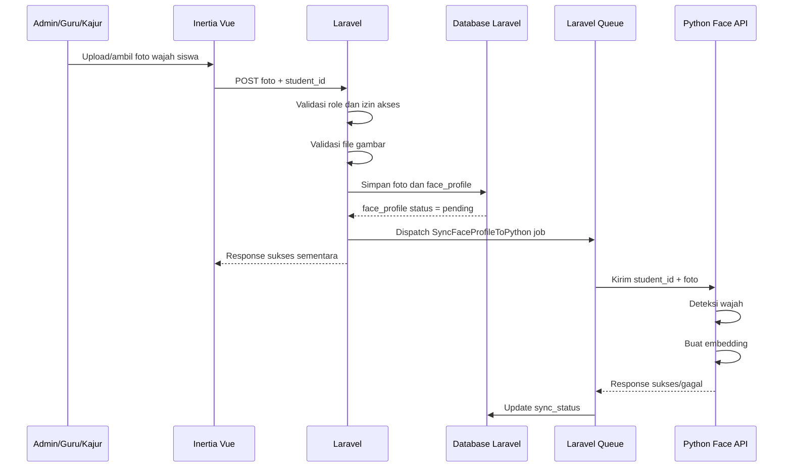
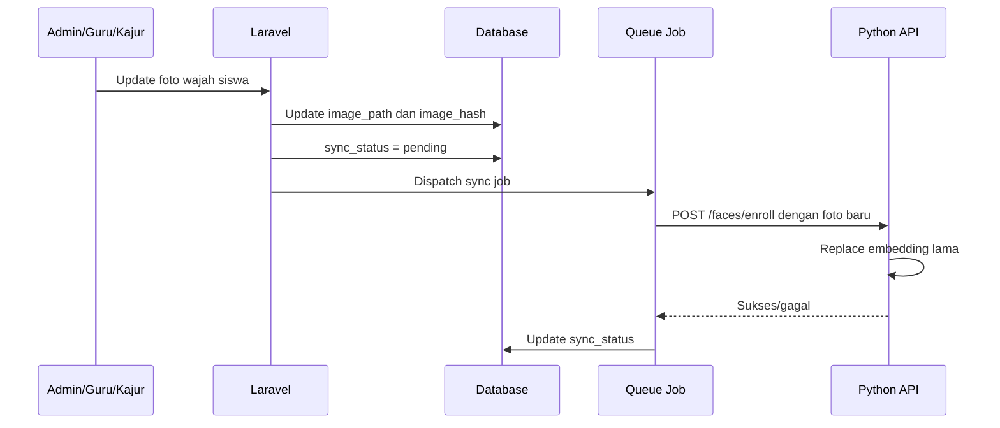
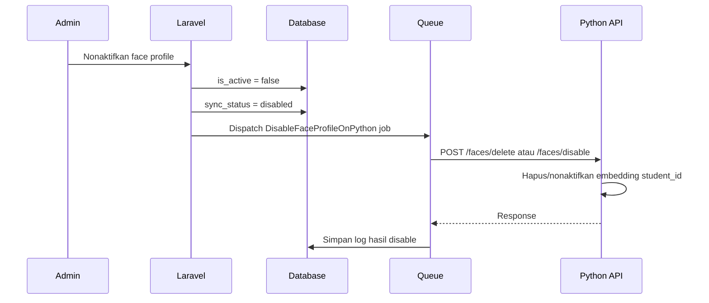
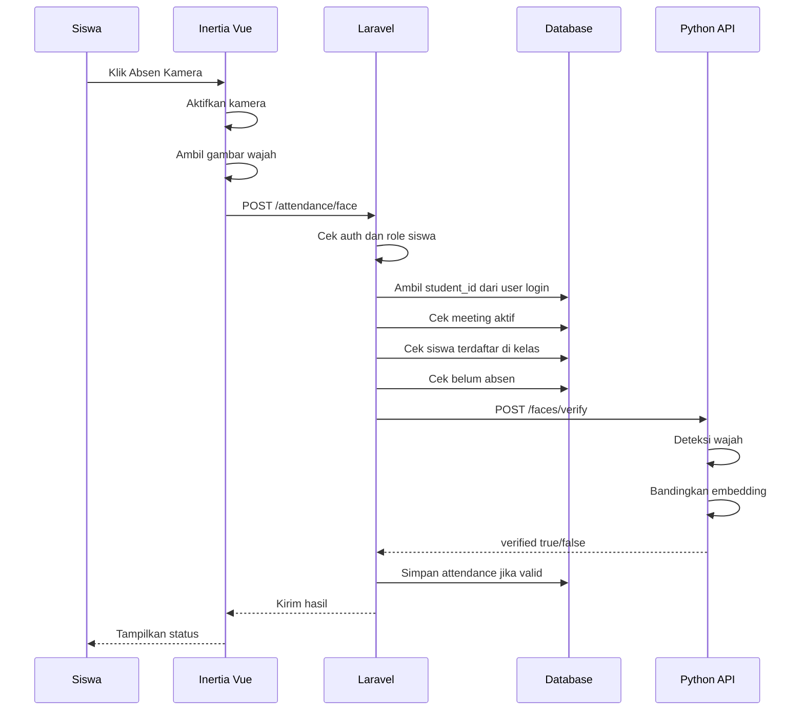

# Rancangan Flow Lengkap: Auto Sync Face Recognition untuk Absensi E-Learning Laravel + Inertia Vue + Python API

**Project:** E-Learning Laravel 13 + Inertia Vue + Python Face Recognition API  
**Topik:** Flow otomatis sinkronisasi data wajah siswa ke server Python dan flow absensi kamera  
**Tanggal dokumen:** 25 April 2026  
**Status:** Dokumen rancangan teknis awal untuk implementasi  

---

## 1. Ringkasan Konsep

Fitur absensi dengan face recognition sebaiknya tidak dibuat dengan cara frontend langsung mengirim gambar ke API Python. Arsitektur yang lebih aman adalah menjadikan **Laravel sebagai pusat sistem**, sedangkan **Python hanya bertugas sebagai mesin face recognition**.

Dengan desain ini, Laravel tetap bertanggung jawab terhadap:

1. autentikasi user;
2. deteksi role admin, guru, kajur, dan siswa;
3. validasi kelas dan jadwal;
4. validasi apakah siswa terdaftar pada kelas tertentu;
5. validasi apakah absensi masih dibuka;
6. penyimpanan data absensi;
7. penyimpanan status sinkronisasi wajah;
8. audit log dan keamanan data.

Python bertanggung jawab terhadap:

1. menerima gambar wajah dari Laravel;
2. mendeteksi jumlah wajah dalam gambar;
3. membuat face embedding;
4. menyimpan atau memperbarui data embedding;
5. membandingkan wajah absensi dengan data wajah yang sudah terdaftar;
6. mengembalikan hasil verifikasi ke Laravel.

Konsep finalnya:

```text
Laravel = pusat data dan aturan akademik
Python  = mesin pengenal wajah
Vue     = antarmuka kamera dan tampilan pengguna
```

---

## 2. Prinsip Utama yang Harus Dipahami

### 2.1 Python Tidak Mengenali Siswa Secara Otomatis Tanpa Data Awal

Python tidak bisa langsung mengetahui bahwa sebuah wajah adalah milik siswa tertentu tanpa proses pendaftaran. Sistem harus mendaftarkan wajah siswa terlebih dahulu.

Contoh:

```text
student_id: 12
nama      : Andi Saputra
foto      : wajah_andi.jpg
```

Foto tersebut diproses oleh Python menjadi **face embedding**, yaitu representasi numerik dari wajah.

Contoh sederhana:

```json
{
  "student_id": 12,
  "embedding": [0.123, -0.233, 0.842, 0.551]
}
```

Pada praktik sebenarnya, embedding memiliki dimensi lebih banyak. Ketika siswa melakukan absensi, foto dari kamera juga diubah menjadi embedding, lalu dibandingkan dengan embedding yang sudah terdaftar.

---

### 2.2 Sistem Absensi Lebih Baik Menggunakan Verification, Bukan Identification

Ada dua pola face recognition:

#### A. Identification: 1 banding banyak

Sistem mencoba menjawab:

```text
Wajah ini milik siapa?
```

Flow:

```text
wajah dari kamera
vs
semua wajah siswa
```

Kelemahannya:

1. proses lebih berat jika jumlah siswa besar;
2. risiko salah identifikasi lebih tinggi;
3. tidak perlu untuk absensi karena siswa sudah login.

#### B. Verification: 1 banding 1

Sistem menjawab:

```text
Apakah wajah ini benar milik siswa yang sedang login?
```

Flow:

```text
wajah dari kamera
vs
wajah milik student_id yang sedang login
```

Untuk project e-learning, pola **verification** lebih disarankan karena siswa sudah login. Laravel sudah mengetahui identitas user dari session login. Python hanya perlu memverifikasi apakah wajah di kamera cocok dengan wajah siswa tersebut.

Contoh:

```text
Siswa login sebagai Andi
Laravel tahu student_id = 12
Python hanya mengecek apakah wajah kamera cocok dengan student_id 12
```

---

## 3. Arsitektur Sistem yang Disarankan

### 3.1 Arsitektur Umum

```text
+----------------------+
|      Inertia Vue     |
|  Kamera & Tampilan   |
+----------+-----------+
           |
           | HTTP Request
           v
+----------------------+
|      Laravel 13      |
| Auth, Role, Kelas,   |
| Absensi, Database    |
+----------+-----------+
           |
           | Internal API Request
           v
+----------------------+
| Python Face API      |
| Deteksi Wajah,       |
| Embedding, Matching  |
+----------------------+
```

### 3.2 Alasan Vue Tidak Langsung Mengakses Python

Frontend tidak sebaiknya langsung mengakses Python API karena:

1. endpoint Python bisa terlihat di browser;
2. request lebih mudah dimanipulasi dari DevTools;
3. user bisa mencoba mengirim gambar palsu langsung ke Python;
4. Python tidak tahu konteks akademik seperti jadwal, kelas, role, dan status absensi;
5. Laravel kehilangan kontrol terhadap validasi dan audit log.

Alur yang benar:

```text
Vue → Laravel → Python → Laravel → Database
```

Bukan:

```text
Vue → Python → Database
```

---

## 4. Aktor Sistem

### 4.1 Admin

Admin memiliki wewenang paling luas.

Tugas admin:

1. mengelola data user;
2. mengelola siswa;
3. mendaftarkan wajah siswa;
4. memperbarui foto wajah siswa;
5. melihat status sinkronisasi wajah;
6. melakukan sinkron ulang semua data wajah jika diperlukan;
7. melihat log absensi dan log verifikasi wajah.

### 4.2 Kajur

Kajur hanya memiliki kewenangan sesuai jurusan yang dipimpinnya.

Tugas kajur:

1. melihat siswa dalam jurusannya;
2. melihat status wajah siswa dalam jurusannya;
3. melakukan sinkron ulang wajah siswa dalam jurusannya;
4. memantau absensi siswa jurusan;
5. tidak boleh mengakses data wajah siswa di luar jurusan.

### 4.3 Guru

Guru memiliki kewenangan berdasarkan kelas atau mata pelajaran yang diajarkan.

Tugas guru:

1. melihat siswa pada kelas yang dia ajar;
2. melihat status wajah siswa pada kelas tersebut;
3. melakukan sinkron ulang wajah siswa pada kelas yang dia ajar;
4. memantau absensi pada pertemuan yang dia buat;
5. tidak boleh mengakses seluruh data siswa.

### 4.4 Siswa

Siswa adalah pengguna yang melakukan absensi.

Tugas siswa:

1. login;
2. membuka halaman kelas/pertemuan;
3. melakukan absensi kamera;
4. menerima status berhasil atau gagal;
5. tidak boleh mengakses endpoint sinkronisasi wajah.

---

## 5. Data Inti yang Dibutuhkan

### 5.1 Tabel `users`

Tabel ini sudah menjadi pusat autentikasi.

Data penting:

```text
id
name
email
password
status
created_at
updated_at
```

Role bisa dikelola melalui Spatie Permission atau sistem role yang sudah digunakan project.

---

### 5.2 Tabel `students`

Tabel ini menyimpan profil siswa.

Contoh kolom:

```text
id
user_id
nis
class_group_id
department_id
created_at
updated_at
```

Relasi penting:

```text
users.id    → students.user_id
students.id → face_profiles.student_id
students.id → attendances.student_id
```

---

### 5.3 Tabel `face_profiles`

Tabel ini menjadi penghubung antara siswa di Laravel dan data wajah yang digunakan Python.

Rekomendasi struktur:

```text
id
student_id
user_id
image_path
image_hash
sync_status
last_synced_at
sync_error
is_active
created_at
updated_at
```

Penjelasan kolom:

| Kolom | Fungsi |
|---|---|
| `id` | Primary key |
| `student_id` | Menghubungkan data wajah dengan siswa |
| `user_id` | Menghubungkan data wajah dengan akun user |
| `image_path` | Lokasi foto wajah di storage Laravel |
| `image_hash` | Hash file untuk mendeteksi perubahan foto |
| `sync_status` | Status sinkronisasi ke Python |
| `last_synced_at` | Waktu terakhir berhasil sync |
| `sync_error` | Pesan error jika sync gagal |
| `is_active` | Menandai data wajah aktif atau nonaktif |
| `created_at` | Waktu pembuatan |
| `updated_at` | Waktu perubahan |

Nilai `sync_status` yang disarankan:

```text
pending   = data wajah baru dibuat, belum dikirim ke Python
syncing   = sedang diproses oleh queue job
synced    = berhasil tersinkron ke Python
failed    = gagal tersinkron
disabled  = data wajah dinonaktifkan
```

Contoh isi tabel:

| student_id | image_path | sync_status | last_synced_at | sync_error |
|---|---|---|---|---|
| 12 | faces/students/12.jpg | synced | 2026-04-25 10:30:00 | null |
| 13 | faces/students/13.jpg | failed | null | Multiple faces detected |
| 14 | faces/students/14.jpg | pending | null | null |

---

### 5.4 Tabel `attendances`

Tabel ini menyimpan hasil absensi siswa.

Rekomendasi struktur:

```text
id
meeting_id
student_id
user_id
status
verification_method
face_verified
face_distance
check_in_at
metadata
created_at
updated_at
```

Penjelasan:

| Kolom | Fungsi |
|---|---|
| `meeting_id` | Pertemuan yang diikuti |
| `student_id` | Siswa yang melakukan absensi |
| `user_id` | User login yang melakukan absensi |
| `status` | hadir, terlambat, gagal, izin, alpha |
| `verification_method` | face_recognition, manual, QR, atau metode lain |
| `face_verified` | Hasil verifikasi wajah |
| `face_distance` | Nilai jarak kemiripan dari Python |
| `check_in_at` | Waktu absensi |
| `metadata` | JSON berisi response Python, IP, device, dan data tambahan |
| `created_at` | Waktu pembuatan |
| `updated_at` | Waktu perubahan |

Contoh metadata:

```json
{
  "python_response": {
    "verified": true,
    "distance": 0.38,
    "threshold": 0.45,
    "face_count": 1
  },
  "ip": "127.0.0.1",
  "user_agent": "Mozilla/5.0",
  "source": "web_camera"
}
```

---

### 5.5 Tabel `face_sync_logs`

Tabel ini opsional tetapi sangat disarankan untuk audit.

Struktur:

```text
id
face_profile_id
student_id
action
status
request_payload
response_payload
error_message
attempt
created_at
updated_at
```

Nilai `action`:

```text
enroll
update
disable
delete
resync
verify
```

Manfaat tabel ini:

1. memudahkan debugging;
2. mengetahui kapan data wajah dikirim ke Python;
3. mengetahui data siswa mana yang gagal;
4. menjadi catatan audit jika ada sengketa absensi.

---

## 6. Flow Otomatis Sinkronisasi Data Wajah

### 6.1 Tujuan Auto Sync

Tujuan auto sync adalah agar setiap perubahan data wajah di Laravel langsung dikirim ke Python tanpa perlu klik tombol manual.

Contoh kejadian yang memicu auto sync:

1. siswa baru didaftarkan wajahnya;
2. foto wajah siswa diganti;
3. data wajah siswa dinonaktifkan;
4. data wajah siswa diaktifkan ulang;
5. admin memperbaiki foto yang sebelumnya gagal.

---

### 6.2 Flow Auto Sync Saat Wajah Baru Didaftarkan



Penjelasan:

1. Admin/guru/kajur memilih siswa.
2. Foto wajah diambil dari kamera atau upload file.
3. Vue mengirim foto ke Laravel.
4. Laravel memvalidasi apakah user berhak mengelola siswa tersebut.
5. Laravel menyimpan foto ke storage.
6. Laravel membuat atau memperbarui record `face_profiles`.
7. Status awal dibuat `pending`.
8. Observer atau controller menjalankan queue job.
9. Queue job mengirim data ke Python.
10. Python memproses gambar.
11. Jika berhasil, Laravel mengubah status menjadi `synced`.
12. Jika gagal, Laravel mengubah status menjadi `failed` dan menyimpan pesan error.

---

### 6.3 Flow Auto Sync Saat Foto Wajah Diganti

```text
Foto lama:
faces/students/12_old.jpg

Foto baru:
faces/students/12_new.jpg
```

Flow:



Poin penting:

1. Python harus mengganti embedding lama, bukan membuat data duplikat.
2. `student_id` menjadi kunci utama di Python.
3. Jika foto baru gagal diproses, sistem bisa tetap menandai status `failed`.
4. Laravel bisa menyimpan error seperti `No face detected` atau `Multiple faces detected`.

---

### 6.4 Flow Auto Sync Saat Wajah Dinonaktifkan

Ada kondisi ketika wajah siswa harus dinonaktifkan:

1. siswa pindah sekolah;
2. siswa lulus;
3. data wajah salah;
4. orang tua/siswa mencabut persetujuan;
5. admin ingin reset data wajah.

Flow:



Rekomendasi:

- untuk tahap awal, Python boleh menghapus embedding dari cache;
- untuk audit, Laravel tetap menyimpan record `face_profiles`;
- jangan hard delete data penting tanpa kebijakan yang jelas.

---

## 7. Komponen Laravel yang Dibutuhkan

### 7.1 Model `FaceProfile`

Contoh properti konseptual:

```php
class FaceProfile extends Model
{
    protected $fillable = [
        'student_id',
        'user_id',
        'image_path',
        'image_hash',
        'sync_status',
        'last_synced_at',
        'sync_error',
        'is_active',
    ];

    protected $casts = [
        'is_active' => 'boolean',
        'last_synced_at' => 'datetime',
    ];

    public function student()
    {
        return $this->belongsTo(Student::class);
    }

    public function user()
    {
        return $this->belongsTo(User::class);
    }
}
```

---

### 7.2 Observer `FaceProfileObserver`

Observer digunakan agar Laravel otomatis mendeteksi perubahan data wajah.

Contoh konsep:

```php
class FaceProfileObserver
{
    public function created(FaceProfile $faceProfile): void
    {
        SyncFaceProfileToPython::dispatch($faceProfile->id);
    }

    public function updated(FaceProfile $faceProfile): void
    {
        if ($faceProfile->wasChanged(['image_path', 'image_hash', 'is_active'])) {
            if ($faceProfile->is_active) {
                SyncFaceProfileToPython::dispatch($faceProfile->id);
            } else {
                DisableFaceProfileOnPython::dispatch($faceProfile->id);
            }
        }
    }
}
```

Kapan observer berjalan?

1. setelah face profile baru dibuat;
2. setelah foto wajah diganti;
3. setelah status aktif/nonaktif berubah.

---

### 7.3 Job `SyncFaceProfileToPython`

Job ini bertugas mengirim foto wajah ke Python.

Alasan menggunakan job:

1. proses pengiriman dan face recognition bisa memakan waktu;
2. request upload dari user tetap cepat;
3. jika Python sedang mati, job bisa dicoba ulang;
4. sistem lebih stabil untuk banyak data.

Contoh konsep:

```php
class SyncFaceProfileToPython implements ShouldQueue
{
    public int $tries = 3;
    public int $timeout = 60;

    public function __construct(
        public int $faceProfileId
    ) {}

    public function handle(): void
    {
        $faceProfile = FaceProfile::with(['student', 'user'])->findOrFail($this->faceProfileId);

        if (! $faceProfile->is_active) {
            return;
        }

        $faceProfile->update([
            'sync_status' => 'syncing',
            'sync_error' => null,
        ]);

        $response = Http::withHeaders([
            'X-Internal-Api-Key' => config('services.face_api.key'),
        ])->attach(
            'image',
            Storage::get($faceProfile->image_path),
            basename($faceProfile->image_path)
        )->post(config('services.face_api.url') . '/faces/enroll', [
            'student_id' => $faceProfile->student_id,
            'user_id' => $faceProfile->user_id,
            'name' => $faceProfile->user?->name,
        ]);

        if ($response->successful() && $response->json('success') === true) {
            $faceProfile->update([
                'sync_status' => 'synced',
                'last_synced_at' => now(),
                'sync_error' => null,
            ]);

            return;
        }

        $faceProfile->update([
            'sync_status' => 'failed',
            'sync_error' => $response->json('message') ?? 'Failed to sync face profile',
        ]);
    }

    public function failed(Throwable $exception): void
    {
        FaceProfile::where('id', $this->faceProfileId)->update([
            'sync_status' => 'failed',
            'sync_error' => $exception->getMessage(),
        ]);
    }
}
```

---

### 7.4 Job `DisableFaceProfileOnPython`

Job ini dipakai saat data wajah dinonaktifkan.

Contoh konsep:

```php
class DisableFaceProfileOnPython implements ShouldQueue
{
    public function __construct(
        public int $faceProfileId
    ) {}

    public function handle(): void
    {
        $faceProfile = FaceProfile::findOrFail($this->faceProfileId);

        $response = Http::withHeaders([
            'X-Internal-Api-Key' => config('services.face_api.key'),
        ])->post(config('services.face_api.url') . '/faces/delete', [
            'student_id' => $faceProfile->student_id,
        ]);

        if ($response->successful()) {
            $faceProfile->update([
                'sync_status' => 'disabled',
                'last_synced_at' => now(),
                'sync_error' => null,
            ]);
        }
    }
}
```

---

### 7.5 Service `FaceRecognitionService`

Agar controller tidak terlalu penuh, request ke Python sebaiknya dibungkus di service.

Contoh:

```php
class FaceRecognitionService
{
    public function enroll(FaceProfile $faceProfile): array
    {
        return Http::withHeaders([
            'X-Internal-Api-Key' => config('services.face_api.key'),
        ])->attach(
            'image',
            Storage::get($faceProfile->image_path),
            basename($faceProfile->image_path)
        )->post(config('services.face_api.url') . '/faces/enroll', [
            'student_id' => $faceProfile->student_id,
            'user_id' => $faceProfile->user_id,
        ])->json();
    }

    public function verify(int $studentId, UploadedFile $image): array
    {
        return Http::withHeaders([
            'X-Internal-Api-Key' => config('services.face_api.key'),
        ])->attach(
            'image',
            file_get_contents($image->getRealPath()),
            'attendance.jpg'
        )->post(config('services.face_api.url') . '/faces/verify', [
            'expected_student_id' => $studentId,
        ])->json();
    }
}
```

---

### 7.6 Konfigurasi `.env`

Tambahkan:

```env
FACE_API_URL=http://127.0.0.1:5000
FACE_API_KEY=secret-internal-key
FACE_API_TIMEOUT=30
```

Di `config/services.php`:

```php
'face_api' => [
    'url' => env('FACE_API_URL', 'http://127.0.0.1:5000'),
    'key' => env('FACE_API_KEY'),
    'timeout' => env('FACE_API_TIMEOUT', 30),
],
```

---

## 8. Endpoint Laravel yang Dibutuhkan

### 8.1 Endpoint Admin

```text
GET  /admin/face-profiles
POST /admin/students/{student}/face-profile
PUT  /admin/students/{student}/face-profile
POST /admin/students/{student}/face-profile/resync
POST /admin/face-profiles/resync-all
DELETE /admin/students/{student}/face-profile
```

Fungsi:

| Endpoint | Fungsi |
|---|---|
| `GET /admin/face-profiles` | Melihat semua status wajah siswa |
| `POST /admin/students/{student}/face-profile` | Mendaftarkan wajah siswa |
| `PUT /admin/students/{student}/face-profile` | Mengganti foto wajah siswa |
| `POST /admin/students/{student}/face-profile/resync` | Sinkron ulang satu siswa |
| `POST /admin/face-profiles/resync-all` | Sinkron ulang semua siswa |
| `DELETE /admin/students/{student}/face-profile` | Menonaktifkan data wajah siswa |

---

### 8.2 Endpoint Kajur

```text
GET  /kajur/face-profiles
POST /kajur/students/{student}/face-profile/resync
POST /kajur/face-profiles/resync-department
```

Aturan akses:

1. Kajur hanya melihat siswa dalam jurusannya.
2. Kajur tidak boleh resync siswa dari jurusan lain.
3. Validasi jurusan harus dilakukan dari assignment kajur, bukan dari asumsi `teacher->department_id`.

---

### 8.3 Endpoint Guru

```text
GET  /guru/classes/{classGroup}/face-profiles
POST /guru/classes/{classGroup}/face-profiles/resync
POST /guru/students/{student}/face-profile/resync
```

Aturan akses:

1. Guru hanya dapat mengakses kelas yang dia ajar.
2. Guru hanya dapat resync wajah siswa dari kelas tersebut.
3. Guru tidak boleh mengubah face profile semua siswa kecuali memang diberi izin khusus.

---

### 8.4 Endpoint Siswa untuk Absensi

```text
POST /siswa/meetings/{meeting}/attendance/face
```

Request:

```text
image: file dari kamera
```

Laravel mendapatkan `student_id` dari user login, bukan dari request frontend.

Poin penting:

```text
student_id jangan dikirim bebas dari frontend
```

Karena jika `student_id` dikirim dari frontend, siswa bisa mencoba memalsukan ID siswa lain.

Yang benar:

```php
$studentId = auth()->user()->student->id;
```

---

## 9. Endpoint Python yang Dibutuhkan

### 9.1 `GET /health`

Untuk mengecek apakah service Python aktif.

Response:

```json
{
  "success": true,
  "service": "face-recognition-api",
  "status": "ok"
}
```

---

### 9.2 `POST /faces/enroll`

Untuk mendaftarkan atau memperbarui wajah siswa.

Request multipart:

```text
student_id: 12
user_id: 45
name: Andi Saputra
image: file
```

Response berhasil:

```json
{
  "success": true,
  "student_id": 12,
  "face_count": 1,
  "message": "Face profile synced successfully"
}
```

Response gagal tidak ada wajah:

```json
{
  "success": false,
  "student_id": 12,
  "face_count": 0,
  "message": "No face detected"
}
```

Response gagal wajah lebih dari satu:

```json
{
  "success": false,
  "student_id": 12,
  "face_count": 2,
  "message": "Multiple faces detected"
}
```

---

### 9.3 `POST /faces/delete`

Untuk menghapus atau menonaktifkan embedding siswa.

Request:

```json
{
  "student_id": 12
}
```

Response:

```json
{
  "success": true,
  "student_id": 12,
  "message": "Face profile deleted"
}
```

---

### 9.4 `POST /faces/verify`

Untuk verifikasi absensi.

Request multipart:

```text
expected_student_id: 12
image: file absensi
```

Response berhasil:

```json
{
  "success": true,
  "verified": true,
  "expected_student_id": 12,
  "matched_student_id": 12,
  "distance": 0.38,
  "threshold": 0.45,
  "face_count": 1,
  "message": "Face verified successfully"
}
```

Response gagal wajah tidak cocok:

```json
{
  "success": true,
  "verified": false,
  "expected_student_id": 12,
  "matched_student_id": null,
  "distance": 0.72,
  "threshold": 0.45,
  "face_count": 1,
  "message": "Face does not match"
}
```

Response gagal karena belum ada data wajah:

```json
{
  "success": false,
  "verified": false,
  "expected_student_id": 12,
  "message": "No registered face profile for this student"
}
```

---

## 10. Struktur Python API yang Disarankan

Struktur folder:

```text
face_recognition_service/
├── app.py
├── config.py
├── requirements.txt
├── routes/
│   ├── health.py
│   ├── enroll.py
│   ├── verify.py
│   └── delete.py
├── services/
│   ├── image_reader.py
│   ├── face_detector.py
│   ├── face_encoder.py
│   ├── face_matcher.py
│   └── face_store.py
├── storage/
│   ├── reference_images/
│   └── embeddings/
└── README.md
```

Penjelasan:

| File/Folder | Fungsi |
|---|---|
| `app.py` | Entry point API |
| `config.py` | Konfigurasi threshold, API key, folder storage |
| `routes/` | Endpoint HTTP |
| `services/image_reader.py` | Membaca dan validasi gambar |
| `services/face_detector.py` | Mendeteksi wajah |
| `services/face_encoder.py` | Membuat embedding |
| `services/face_matcher.py` | Membandingkan embedding |
| `services/face_store.py` | Menyimpan dan membaca embedding |
| `storage/reference_images/` | Menyimpan foto referensi jika diperlukan |
| `storage/embeddings/` | Menyimpan embedding/cache |

---

## 11. Cara Python Menyimpan Data Wajah

### 11.1 Opsi Sederhana untuk Prototype

Python menyimpan embedding di file lokal.

Contoh:

```text
storage/embeddings/
├── 12.json
├── 13.json
└── 14.json
```

Isi `12.json`:

```json
{
  "student_id": 12,
  "user_id": 45,
  "name": "Andi Saputra",
  "embedding": [0.123, -0.221, 0.442],
  "updated_at": "2026-04-25T10:30:00"
}
```

Kelebihan:

1. mudah dibuat;
2. tidak membutuhkan database tambahan di Python;
3. cocok untuk tahap awal.

Kekurangan:

1. kurang ideal untuk skala besar;
2. perlu mekanisme backup;
3. jika server Python pindah, file harus ikut dipindah.

---

### 11.2 Opsi Lebih Rapi

Python tidak menyimpan database permanen, tetapi hanya menyimpan cache embedding yang berasal dari Laravel.

Dalam desain ini:

```text
Laravel = sumber data utama
Python  = cache embedding untuk proses cepat
```

Jika cache Python hilang, Laravel bisa melakukan resync semua data wajah.

---

### 11.3 Opsi Produksi

Untuk produksi lebih besar, embedding bisa disimpan di database atau vector store.

Namun untuk project e-learning sekolah/kampus skala kecil-menengah, file JSON atau database sederhana sudah cukup untuk tahap awal.

---

## 12. Flow Lengkap Absensi dengan Kamera

### 12.1 Flow dari Sudut Pandang Siswa

```text
1. Siswa login.
2. Siswa membuka kelas.
3. Siswa membuka pertemuan aktif.
4. Sistem menampilkan tombol "Absen dengan Kamera".
5. Siswa menekan tombol.
6. Browser meminta izin kamera.
7. Kamera aktif.
8. Sistem mengambil gambar wajah.
9. Gambar dikirim ke Laravel.
10. Laravel memverifikasi jadwal, kelas, dan status siswa.
11. Laravel mengirim gambar ke Python.
12. Python mengecek kecocokan wajah.
13. Laravel menerima hasil dari Python.
14. Laravel menyimpan absensi jika valid.
15. Siswa menerima notifikasi berhasil/gagal.
```

---

### 12.2 Sequence Diagram Absensi



---

### 12.3 Validasi Laravel Sebelum Mengirim ke Python

Sebelum gambar dikirim ke Python, Laravel harus mengecek:

1. user sudah login;
2. user memiliki role siswa;
3. user memiliki relasi `student`;
4. meeting/pertemuan ada;
5. meeting sedang aktif;
6. siswa terdaftar di kelas tersebut;
7. siswa belum pernah absen pada meeting yang sama;
8. siswa memiliki face profile aktif;
9. face profile sudah tersinkron;
10. file gambar valid.

Jika salah satu gagal, Laravel tidak perlu mengirim gambar ke Python.

Contoh pesan gagal:

```text
Wajah belum didaftarkan.
Data wajah belum tersinkron.
Absensi belum dibuka.
Anda sudah melakukan absensi.
Anda tidak terdaftar di kelas ini.
```

---

### 12.4 Validasi Python Saat Menerima Gambar

Python harus mengecek:

1. API key valid;
2. `expected_student_id` tersedia;
3. file gambar valid;
4. data wajah siswa sudah ada;
5. gambar bisa dibaca;
6. ada wajah terdeteksi;
7. hanya ada satu wajah;
8. wajah memiliki kualitas cukup;
9. distance score berada di bawah threshold.

Jika lebih dari satu wajah terdeteksi, response harus gagal.

```json
{
  "success": false,
  "verified": false,
  "face_count": 2,
  "message": "Multiple faces detected"
}
```

---

## 13. Status Absensi yang Disarankan

Nilai `status` pada tabel `attendances`:

```text
present
late
failed
manual
excused
absent
```

Contoh penggunaan:

| Status | Keterangan |
|---|---|
| `present` | Hadir tepat waktu |
| `late` | Hadir tetapi melewati batas waktu |
| `failed` | Percobaan absensi gagal |
| `manual` | Absensi diinput manual oleh guru/admin |
| `excused` | Izin |
| `absent` | Tidak hadir |

Untuk percobaan gagal, ada dua pilihan:

### Pilihan A: Tidak menyimpan absensi gagal

Kelebihan:

1. tabel attendance tetap bersih;
2. hanya data valid yang masuk.

Kekurangan:

1. sulit audit jika siswa mengaku sudah mencoba absen.

### Pilihan B: Simpan log percobaan gagal di tabel terpisah

Lebih disarankan.

Buat tabel:

```text
attendance_attempts
- id
- meeting_id
- student_id
- user_id
- success
- reason
- face_distance
- face_count
- metadata
- created_at
```

Dengan begitu, absensi resmi tetap bersih, tetapi percobaan gagal tetap tercatat.

---

## 14. Mekanisme Retry dan Failure Handling

### 14.1 Jika Python Mati Saat Auto Sync

Kondisi:

```text
Admin upload foto wajah
Laravel simpan face profile
Queue job jalan
Python tidak bisa dihubungi
```

Yang harus terjadi:

1. Laravel tidak menghapus data wajah;
2. `sync_status` menjadi `failed`;
3. `sync_error` berisi pesan error;
4. job boleh retry otomatis;
5. admin bisa klik "Sinkron Ulang".

Contoh status:

```text
sync_status: failed
sync_error : Connection refused to Python API
```

---

### 14.2 Jika Python Gagal Mendeteksi Wajah

Contoh response:

```json
{
  "success": false,
  "message": "No face detected"
}
```

Laravel menyimpan:

```text
sync_status = failed
sync_error  = No face detected
```

UI menampilkan:

```text
Foto wajah tidak valid. Pastikan wajah terlihat jelas dan hanya satu orang dalam foto.
```

---

### 14.3 Jika Foto Berisi Lebih dari Satu Wajah

Python response:

```json
{
  "success": false,
  "face_count": 2,
  "message": "Multiple faces detected"
}
```

Laravel menyimpan:

```text
sync_status = failed
sync_error  = Multiple faces detected
```

UI menampilkan:

```text
Foto tidak dapat digunakan karena terdeteksi lebih dari satu wajah.
```

---

### 14.4 Jika Siswa Belum Sinkron tapi Mencoba Absen

Laravel harus menolak sebelum memanggil Python.

Response ke siswa:

```text
Data wajah Anda belum siap digunakan. Silakan hubungi admin/guru.
```

Status internal:

```text
face_profile.sync_status != synced
```

---

## 15. Idempotency: Mencegah Data Ganda di Python

Setiap request enroll harus bersifat **replace**, bukan create duplicate.

Artinya:

```text
POST /faces/enroll student_id=12
```

Jika student_id 12 sudah ada di Python, maka Python harus memperbarui embedding lama.

Bukan membuat:

```text
12_1
12_2
12_3
```

Kunci utamanya:

```text
student_id
```

Dengan demikian, request sync bisa diulang berkali-kali tanpa merusak data.

---

## 16. Keamanan API Laravel ↔ Python

### 16.1 API Key Internal

Setiap request dari Laravel ke Python harus memakai header:

```text
X-Internal-Api-Key: secret-key
```

Python menolak request tanpa header ini.

Response gagal:

```json
{
  "success": false,
  "message": "Unauthorized internal request"
}
```

---

### 16.2 Batasi Akses Jaringan

Jika memungkinkan, Python API tidak dibuka ke publik.

Idealnya:

```text
Laravel dan Python berada dalam server/VPS yang sama
Python berjalan di localhost atau private network
```

Contoh:

```text
http://127.0.0.1:5000
```

Bukan:

```text
https://public-domain.com/python-face-api
```

Jika harus publik, wajib gunakan:

1. HTTPS;
2. API key;
3. rate limiting;
4. firewall;
5. pembatasan IP Laravel.

---

### 16.3 Jangan Simpan Foto Mentah Jika Tidak Diperlukan

Untuk privasi, lebih baik menyimpan embedding sebagai data utama. Foto referensi boleh disimpan hanya jika memang diperlukan untuk audit atau pendaftaran ulang.

Rekomendasi:

1. simpan foto referensi di storage private;
2. jangan expose foto wajah lewat URL publik;
3. batasi akses hanya admin tertentu;
4. simpan embedding secara aman;
5. buat kebijakan retensi data.

---

### 16.4 Data Biometrik Harus Diperlakukan Sebagai Data Sensitif

Face recognition menggunakan data wajah yang termasuk data biometrik. Karena itu perlu ada:

1. persetujuan penggunaan data;
2. tujuan penggunaan yang jelas;
3. pembatasan akses;
4. keamanan penyimpanan;
5. audit log;
6. mekanisme penghapusan atau penonaktifan data.

---

## 17. UI/UX yang Disarankan

### 17.1 Halaman Admin Face Profiles

Kolom yang ditampilkan:

| Nama | NIS | Kelas | Jurusan | Status Wajah | Terakhir Sync | Aksi |
|---|---|---|---|---|---|---|
| Andi | 12345 | XI RPL 1 | RPL | Synced | 25 Apr 2026 | Lihat / Resync |
| Budi | 12346 | XI RPL 1 | RPL | Failed | - | Perbaiki Foto |
| Citra | 12347 | XI TKJ 1 | TKJ | Pending | - | Menunggu |

Badge status:

```text
Synced  = hijau
Pending = kuning
Syncing = biru
Failed  = merah
Disabled = abu-abu
```

---

### 17.2 Halaman Guru Kelas

Guru tidak perlu melihat semua siswa, cukup siswa pada kelas/pertemuan yang dia ajar.

Tampilkan:

1. nama siswa;
2. status wajah;
3. status absensi;
4. tombol resync wajah jika diizinkan;
5. catatan error jika ada.

---

### 17.3 Halaman Siswa Absensi Kamera

Komponen UI:

1. preview kamera;
2. panduan posisi wajah;
3. tombol ambil gambar;
4. indikator loading;
5. hasil verifikasi;
6. pesan gagal yang jelas.

Contoh pesan:

```text
Berhasil: Absensi berhasil dicatat.
Gagal: Wajah tidak cocok dengan akun Anda.
Gagal: Tidak ada wajah terdeteksi.
Gagal: Terdeteksi lebih dari satu wajah.
Gagal: Data wajah belum tersinkron.
```

---

## 18. Anti-Kecurangan Dasar

Face recognition dasar masih bisa tertipu menggunakan foto. Karena itu minimal perlu perlindungan tambahan.

### 18.1 Validasi Satu Wajah

Jika lebih dari satu wajah muncul, sistem menolak.

```text
face_count harus sama dengan 1
```

### 18.2 Ambil Beberapa Frame

Jangan hanya mengambil satu foto.

Flow:

```text
ambil frame 1
ambil frame 2
ambil frame 3
bandingkan semuanya
```

Absensi berhasil jika minimal dua dari tiga frame valid.

### 18.3 Challenge Sederhana

Tahap lanjutan bisa memakai instruksi:

```text
kedipkan mata
menoleh sedikit ke kanan
menoleh sedikit ke kiri
```

Ini disebut liveness detection sederhana.

### 18.4 Batasi Waktu dan Meeting

Siswa hanya bisa absen pada:

1. kelas yang dia ikuti;
2. pertemuan yang sedang aktif;
3. rentang waktu yang ditentukan.

### 18.5 Simpan Metadata

Simpan:

1. IP address;
2. user agent;
3. waktu request;
4. distance score;
5. face_count;
6. hasil Python.

Ini berguna untuk audit.

---

## 19. Flow Sinkron Manual sebagai Cadangan

Walaupun sistem otomatis, tombol manual tetap berguna.

### 19.1 Tombol Admin

```text
Sinkron Ulang Semua Wajah
```

Flow:

```text
Admin klik tombol
Laravel mengambil semua face_profile aktif
Laravel dispatch batch queue job
Setiap siswa dikirim ke Python
Laravel menampilkan jumlah berhasil dan gagal
```

### 19.2 Tombol Kajur

```text
Sinkron Ulang Wajah Jurusan
```

Flow:

```text
Kajur klik tombol
Laravel mengambil siswa sesuai jurusan Kajur
Laravel dispatch job per siswa
```

### 19.3 Tombol Guru

```text
Sinkron Ulang Wajah Kelas Ini
```

Flow:

```text
Guru klik tombol
Laravel mengambil siswa pada kelas yang dia ajar
Laravel dispatch job per siswa
```

### 19.4 Tombol Satu Siswa

```text
Sinkron Ulang Siswa Ini
```

Digunakan saat hanya satu siswa bermasalah.

---

## 20. Rekomendasi Implementasi Bertahap

### Tahap 1: Rapikan Python API

Target:

1. endpoint `/health`;
2. endpoint `/faces/enroll`;
3. endpoint `/faces/verify`;
4. endpoint `/faces/delete`;
5. response JSON konsisten;
6. API key internal;
7. validasi no face dan multiple faces;
8. penggunaan distance score.

Output:

```text
Python siap menerima data dari Laravel.
```

---

### Tahap 2: Buat Database Laravel

Buat migration:

1. `face_profiles`;
2. `attendances`;
3. `attendance_attempts`;
4. `face_sync_logs`.

Output:

```text
Laravel siap menyimpan data wajah, status sync, dan absensi.
```

---

### Tahap 3: Buat Enroll Face di Laravel

Fitur:

1. admin/guru/kajur upload foto wajah;
2. Laravel simpan foto;
3. Laravel buat `face_profile`;
4. status awal `pending`.

Output:

```text
Data wajah bisa didaftarkan dari Laravel.
```

---

### Tahap 4: Buat Auto Sync

Fitur:

1. observer `FaceProfileObserver`;
2. job `SyncFaceProfileToPython`;
3. job `DisableFaceProfileOnPython`;
4. queue worker;
5. retry job;
6. update status `synced` atau `failed`.

Output:

```text
Setiap foto wajah otomatis dikirim ke Python.
```

---

### Tahap 5: Buat Absensi Kamera

Fitur:

1. halaman siswa untuk kamera;
2. endpoint Laravel untuk absensi;
3. Laravel panggil Python `/faces/verify`;
4. Laravel simpan attendance;
5. tampilkan hasil ke siswa.

Output:

```text
Siswa bisa melakukan absensi kamera.
```

---

### Tahap 6: Tambahkan Monitoring Admin/Guru/Kajur

Fitur:

1. status wajah siswa;
2. riwayat sync;
3. log error;
4. tombol resync;
5. laporan absensi.

Output:

```text
Pengelola bisa memantau kesiapan dan masalah data wajah.
```

---

### Tahap 7: Tambahkan Anti-Cheat Lanjutan

Fitur:

1. multi-frame verification;
2. liveness sederhana;
3. audit attempt;
4. pembatasan device/IP jika diperlukan;
5. notifikasi jika verifikasi sering gagal.

Output:

```text
Absensi lebih aman dan sulit dimanipulasi.
```

---

## 21. Checklist Validasi Teknis

### 21.1 Checklist Python

- [ ] `/health` berjalan.
- [ ] `/faces/enroll` menerima multipart image.
- [ ] `/faces/enroll` menolak gambar tanpa wajah.
- [ ] `/faces/enroll` menolak gambar dengan banyak wajah.
- [ ] `/faces/enroll` menyimpan embedding berdasarkan `student_id`.
- [ ] `/faces/enroll` mengganti embedding lama jika `student_id` sudah ada.
- [ ] `/faces/verify` menerima `expected_student_id`.
- [ ] `/faces/verify` mengembalikan `verified`, `distance`, `threshold`, dan `face_count`.
- [ ] `/faces/delete` menghapus atau menonaktifkan embedding.
- [ ] API menolak request tanpa `X-Internal-Api-Key`.

---

### 21.2 Checklist Laravel

- [ ] Migration `face_profiles` dibuat.
- [ ] Model `FaceProfile` dibuat.
- [ ] Relasi `Student -> FaceProfile` dibuat.
- [ ] Relasi `User -> Student` dipakai untuk mendapatkan student login.
- [ ] Upload foto wajah tersimpan di storage private.
- [ ] Observer mendeteksi perubahan `image_path`, `image_hash`, dan `is_active`.
- [ ] Queue job sync berjalan.
- [ ] Status `pending`, `syncing`, `synced`, `failed`, `disabled` berjalan.
- [ ] Error dari Python tersimpan di `sync_error`.
- [ ] Tombol resync tersedia.
- [ ] Endpoint absensi kamera tersedia.
- [ ] Absensi menolak siswa tanpa face profile.
- [ ] Absensi menolak face profile yang belum `synced`.
- [ ] Absensi menyimpan `face_distance`.
- [ ] Absensi menyimpan metadata response Python.

---

### 21.3 Checklist UI

- [ ] Admin dapat melihat status wajah semua siswa.
- [ ] Kajur hanya dapat melihat siswa jurusannya.
- [ ] Guru hanya dapat melihat siswa kelas yang dia ajar.
- [ ] Siswa dapat membuka kamera.
- [ ] UI menampilkan pesan error yang jelas.
- [ ] UI menampilkan loading saat verifikasi.
- [ ] UI menampilkan status berhasil setelah absensi.
- [ ] UI tidak mengirim `student_id` bebas dari frontend saat absensi.

---

## 22. Contoh Skenario Pengujian

### Skenario 1: Admin Mendaftarkan Wajah Valid

Langkah:

1. admin login;
2. buka data siswa;
3. upload foto satu wajah jelas;
4. Laravel menyimpan face profile;
5. queue job berjalan;
6. Python berhasil membuat embedding.

Ekspektasi:

```text
sync_status = synced
sync_error = null
```

---

### Skenario 2: Admin Upload Foto Tanpa Wajah

Ekspektasi:

```text
sync_status = failed
sync_error = No face detected
```

UI menampilkan:

```text
Foto tidak valid karena tidak ada wajah terdeteksi.
```

---

### Skenario 3: Admin Upload Foto Berisi Dua Orang

Ekspektasi:

```text
sync_status = failed
sync_error = Multiple faces detected
```

---

### Skenario 4: Python Mati Saat Sync

Ekspektasi:

```text
sync_status = failed
sync_error = Connection refused
```

Admin bisa klik:

```text
Sinkron Ulang
```

---

### Skenario 5: Siswa Absen dengan Wajah Benar

Ekspektasi:

```text
attendance.status = present
face_verified = true
face_distance <= threshold
```

---

### Skenario 6: Siswa Absen dengan Wajah Orang Lain

Ekspektasi:

```text
attendance tidak dibuat
attendance_attempt dibuat
success = false
reason = Face does not match
```

---

### Skenario 7: Siswa Belum Punya Face Profile

Ekspektasi:

```text
Laravel menolak sebelum memanggil Python
```

Pesan:

```text
Data wajah Anda belum terdaftar.
```

---

### Skenario 8: Siswa Sudah Pernah Absen

Ekspektasi:

```text
Laravel menolak request kedua
```

Pesan:

```text
Anda sudah melakukan absensi pada pertemuan ini.
```

---

## 23. Contoh Flow Detail dari Awal sampai Akhir

### 23.1 Pendaftaran Data Wajah

```text
Admin membuka halaman siswa
↓
Admin memilih siswa Andi
↓
Admin klik Daftarkan Wajah
↓
Admin mengambil foto dari kamera
↓
Vue mengirim foto ke Laravel
↓
Laravel validasi user admin
↓
Laravel validasi siswa ada
↓
Laravel validasi file adalah gambar
↓
Laravel simpan foto ke storage private
↓
Laravel buat face_profile:
    student_id = 12
    user_id = 45
    image_path = faces/students/12.jpg
    sync_status = pending
↓
FaceProfileObserver berjalan
↓
SyncFaceProfileToPython job masuk queue
↓
Queue worker memproses job
↓
Laravel kirim foto ke Python
↓
Python cek API key
↓
Python membaca gambar
↓
Python mendeteksi wajah
↓
Python memastikan hanya ada satu wajah
↓
Python membuat embedding
↓
Python menyimpan embedding dengan key student_id 12
↓
Python return success
↓
Laravel update:
    sync_status = synced
    last_synced_at = now()
    sync_error = null
↓
Admin melihat status wajah Andi: Tersinkron
```

---

### 23.2 Absensi Siswa

```text
Andi login sebagai siswa
↓
Laravel mengetahui user_id = 45
↓
Laravel mengetahui student_id = 12
↓
Andi membuka meeting Matematika
↓
Andi klik Absen Kamera
↓
Browser meminta izin kamera
↓
Vue mengambil gambar wajah
↓
Vue mengirim gambar ke Laravel
↓
Laravel cek:
    user login?
    role siswa?
    student profile ada?
    meeting aktif?
    siswa ikut kelas?
    belum pernah absen?
    face_profile aktif?
    face_profile synced?
↓
Laravel kirim gambar ke Python:
    expected_student_id = 12
    image = attendance.jpg
↓
Python cek:
    API key valid?
    student_id 12 punya embedding?
    gambar valid?
    ada wajah?
    hanya satu wajah?
↓
Python hitung distance:
    distance = 0.38
    threshold = 0.45
↓
Karena 0.38 <= 0.45:
    verified = true
↓
Python return response ke Laravel
↓
Laravel simpan:
    meeting_id
    student_id = 12
    user_id = 45
    status = present
    verification_method = face_recognition
    face_verified = true
    face_distance = 0.38
    check_in_at = now()
↓
Vue menampilkan:
    Absensi berhasil dicatat
```

---

## 24. Potensi Error dan Solusinya

| Masalah | Penyebab | Solusi |
|---|---|---|
| 403 saat akses halaman face profile | Role middleware atau policy salah | Cek role dan policy per admin/guru/kajur |
| Python tidak mengenali siswa | Data belum synced | Cek `sync_status` dan queue worker |
| Data wajah lama masih dipakai | Python belum replace embedding | Pastikan `/faces/enroll` idempotent berdasarkan `student_id` |
| Absensi lambat | Laravel memproses Python langsung terlalu lama | Gunakan timeout dan validasi awal |
| Siswa bisa kirim student_id palsu | Frontend mengirim student_id | Jangan ambil student_id dari frontend |
| Foto wajah publik | Storage salah konfigurasi | Simpan di disk private |
| Banyak wajah dalam kamera | Tidak ada validasi face_count | Python wajib menolak `face_count > 1` |
| Python API disalahgunakan | Endpoint terbuka | Pakai API key, private network, firewall |
| Queue tidak berjalan | Worker belum aktif | Jalankan `php artisan queue:work` |
| Status selalu pending | Job tidak diproses | Cek queue connection dan failed jobs |

---

## 25. Perintah Laravel yang Kemungkinan Dibutuhkan

```bash
php artisan make:model FaceProfile -m
php artisan make:model Attendance -m
php artisan make:model AttendanceAttempt -m
php artisan make:model FaceSyncLog -m

php artisan make:observer FaceProfileObserver --model=FaceProfile

php artisan make:job SyncFaceProfileToPython
php artisan make:job DisableFaceProfileOnPython

php artisan make:controller Admin/FaceProfileController
php artisan make:controller Kajur/FaceProfileController
php artisan make:controller Guru/FaceProfileController
php artisan make:controller Siswa/FaceAttendanceController

php artisan queue:table
php artisan migrate
php artisan queue:work
```

Jika memakai database queue:

```env
QUEUE_CONNECTION=database
```

---

## 26. Contoh Response Final untuk UI

### Berhasil Sync

```json
{
  "message": "Data wajah berhasil disinkronkan.",
  "status": "synced"
}
```

### Gagal Sync

```json
{
  "message": "Data wajah gagal disinkronkan.",
  "status": "failed",
  "error": "Multiple faces detected"
}
```

### Berhasil Absensi

```json
{
  "message": "Absensi berhasil dicatat.",
  "attendance": {
    "status": "present",
    "face_verified": true,
    "face_distance": 0.38
  }
}
```

### Gagal Absensi

```json
{
  "message": "Wajah tidak cocok dengan akun Anda.",
  "verified": false,
  "distance": 0.72
}
```

---

## 27. Rekomendasi Final

Desain terbaik untuk project ini adalah:

```text
1. Laravel menjadi pusat data siswa dan absensi.
2. Python hanya menjadi service face recognition.
3. Data wajah otomatis dikirim ke Python memakai Observer + Queue Job.
4. Tombol manual tetap disediakan sebagai fallback.
5. Saat absensi, Laravel menggunakan student_id dari user login.
6. Python hanya memverifikasi apakah wajah cocok dengan student_id tersebut.
7. Hasil absensi hanya disimpan oleh Laravel.
8. Setiap error sync dan verifikasi disimpan sebagai log.
```

Dengan desain ini, sistem menjadi:

1. lebih aman;
2. lebih mudah diaudit;
3. lebih mudah diperbaiki;
4. lebih fleksibel untuk dikembangkan;
5. tidak bergantung pada klik manual;
6. tidak mudah dimanipulasi dari frontend.

---

## 28. Referensi Teknis

1. Laravel Events Documentation  
   https://laravel.com/docs/13.x/events

2. Laravel Queues Documentation  
   https://laravel.com/docs/13.x/queues

3. Laravel HTTP Client Documentation  
   https://laravel.com/docs/13.x/http-client

4. Laravel Filesystem Documentation  
   https://laravel.com/docs/13.x/filesystem

5. Laravel Requests Documentation  
   https://laravel.com/docs/13.x/requests

6. FastAPI Request Files Documentation  
   https://fastapi.tiangolo.com/tutorial/request-files/

7. FastAPI Request Forms and Files Documentation  
   https://fastapi.tiangolo.com/tutorial/request-forms-and-files/

---

## 29. Catatan Implementasi

Dokumen ini masih berupa rancangan teknis. Saat implementasi ke project asli, nama tabel, nama relasi, dan nama route perlu disesuaikan dengan struktur project Laravel yang sudah ada.

Prioritas implementasi yang paling aman:

```text
1. Perbaiki dan rapikan Python API.
2. Buat tabel face_profiles.
3. Buat upload/enroll wajah di Laravel.
4. Buat auto sync menggunakan queue.
5. Buat halaman monitoring status wajah.
6. Buat absensi kamera.
7. Tambahkan logging dan anti-cheat dasar.
```

Jangan langsung membuat fitur absensi kamera sebelum sistem pendaftaran wajah dan sinkronisasi otomatis stabil.

