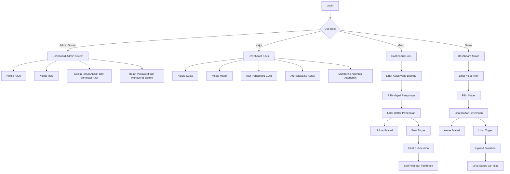
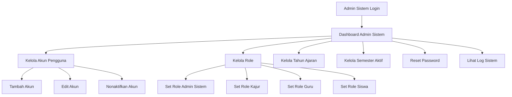
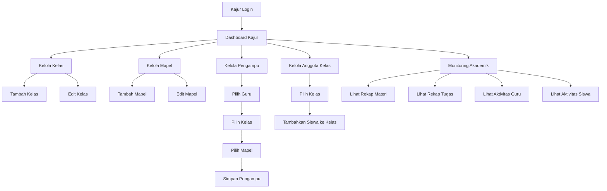
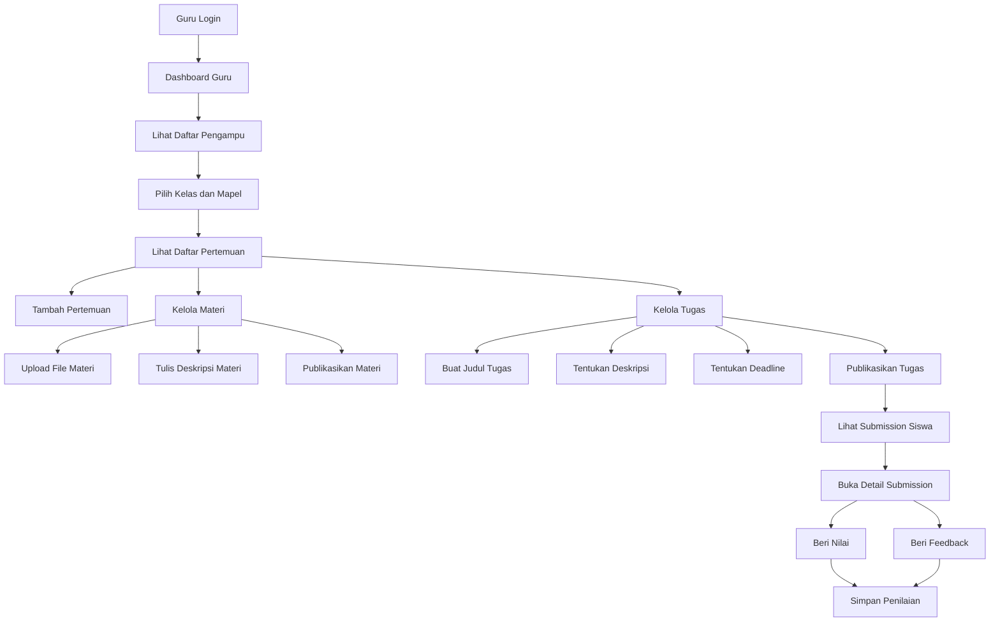
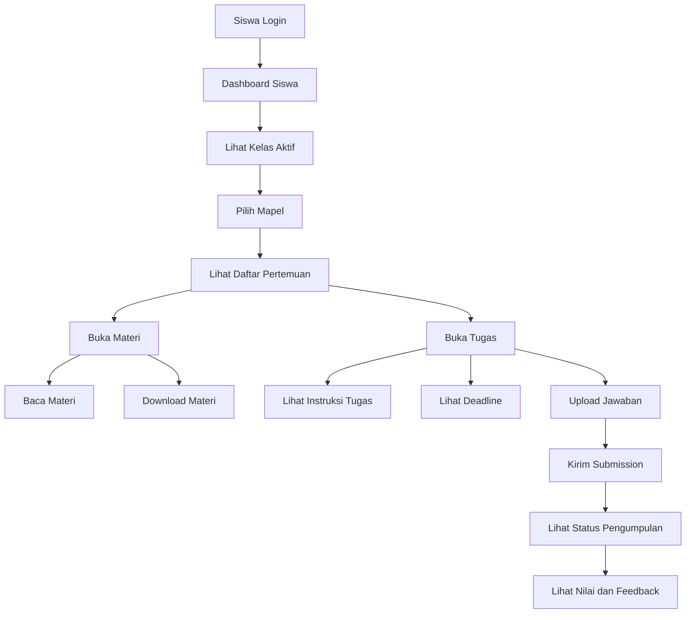
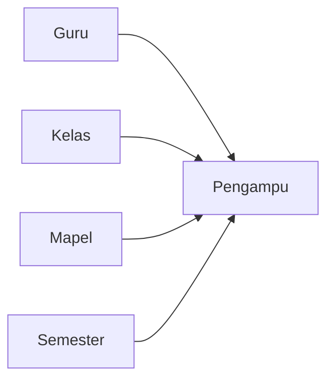
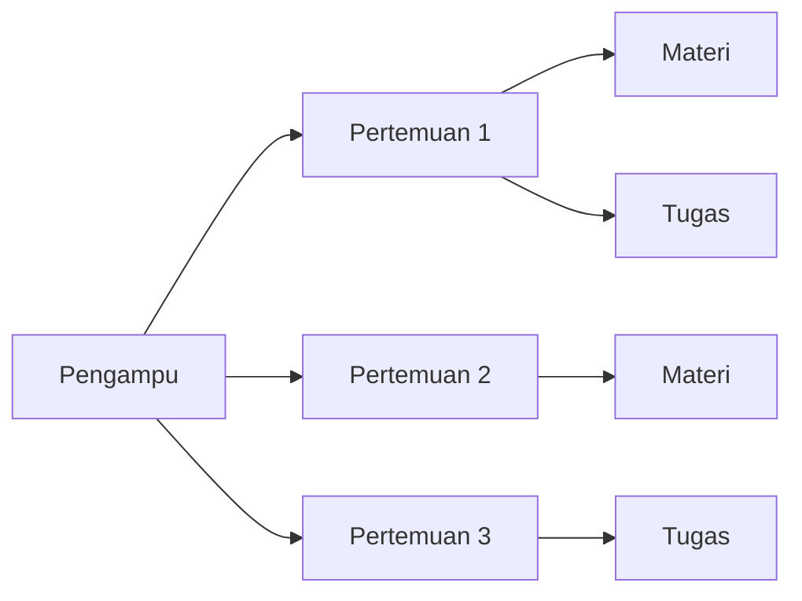
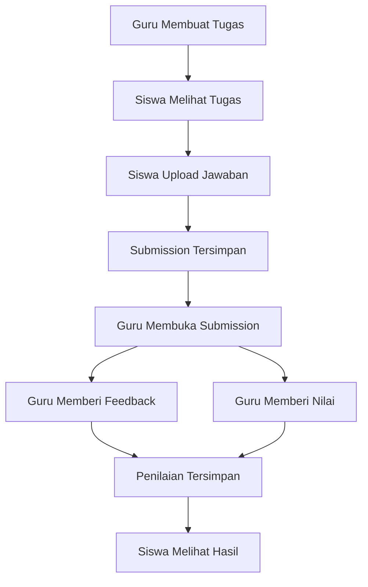

# Flow Sistem E-Learning Siswa (Role Dipisah: Admin Sistem, Kajur, Guru, Siswa)

## 1. Tujuan Dokumen
Dokumen ini merapikan flow sistem e-learning berdasarkan wireframe awal kamu, lalu menyesuaikannya dengan keputusan terbaru bahwa **role Admin Sistem dipisah dari Kajur**.

Tujuan dokumen ini:
- membuat **alur sistem lebih rapi dan mudah dipahami**
- memperjelas **siapa mengerjakan apa**
- memastikan flow cocok untuk tahap berikutnya, yaitu **ERD dan database**
- mencegah role saling tumpang tindih
- menjadikan sistem lebih realistis untuk dikembangkan menjadi aplikasi sungguhan

---

## 2. Keputusan Struktur Role
Kamu sudah setuju dengan versi terbaru bahwa **Admin dipisah dari Kajur**. Menurut saya, ini keputusan yang bagus sekali, karena secara sistem keduanya memang sebaiknya tidak dicampur.

### 2.1 Admin Sistem
Admin Sistem adalah pengelola teknis aplikasi.

Fokus utamanya:
- kelola akun
- kelola role
- reset password
- kelola tahun ajaran dan semester aktif
- konfigurasi sistem
- log aktivitas sistem
- monitoring teknis

**Admin Sistem tidak fokus ke akademik harian.**
Dia mengurus wadah sistemnya, bukan isi proses belajar sehari-hari.

### 2.2 Kajur
Kajur adalah pengelola akademik pada level jurusan/program.

Fokus utamanya:
- kelola kelas
- kelola mapel
- mapping guru ke mapel dan kelas
- mapping siswa ke kelas
- monitoring pembelajaran
- monitoring tugas dan aktivitas akademik
- melihat rekap progres pembelajaran

**Kajur tidak masuk ke urusan teknis sistem**, kecuali hanya melihat data yang dibutuhkan.

### 2.3 Guru
Guru adalah pelaksana proses pembelajaran.

Fokus utamanya:
- mengajar kelas yang diampu
- membuat pertemuan
- upload materi
- membuat tugas
- melihat pengumpulan tugas
- memberi nilai dan feedback

### 2.4 Siswa
Siswa adalah pengguna utama pembelajaran.

Fokus utamanya:
- melihat materi
- melihat tugas
- mengumpulkan tugas
- melihat status pengumpulan
- melihat nilai dan feedback

---

## 3. Penilaian terhadap Wireframe Awal
Wireframe awal kamu sebenarnya **sudah benar arahnya**. Dari sketsa itu sudah terlihat beberapa hal penting:
- ada pemisahan area guru, siswa, dan jurusan
- ada alur materi dan tugas
- ada proses input tugas
- ada proses nilai

Artinya kamu sudah memikirkan proses inti e-learning, bukan sekadar tampilan.

Tetapi, supaya sistem lebih siap dibangun, ada beberapa hal yang harus dirapikan.

### 3.1 Masalah pertama: alur terlalu langsung
Di wireframe awal, beberapa flow masih sangat pendek. Misalnya:
- tugas → siswa → nilai
- mapel → jadwal → materi

Secara visual ini cepat dipahami, tetapi untuk sistem nyata, alur seperti ini masih terlalu singkat. Harus ada tahapan yang lebih realistis.

### 3.2 Masalah kedua: kelas belum jadi pusat sistem
Dalam e-learning, siswa tidak cukup hanya dihubungkan ke mapel. Siswa harus terhubung ke:
- kelas
- semester
- mapel yang dia ikuti melalui kelasnya

Kalau kelas tidak dijadikan pusat, nanti akan sulit menjawab pertanyaan seperti:
- tugas ini untuk kelas mana?
- guru ini mengajar mapel apa di kelas berapa?
- materi ini hanya untuk 10 siswa tertentu atau seluruh kelas?

### 3.3 Masalah ketiga: jadwal terlalu dibebani
Di wireframe awal, jadwal seolah menjadi tempat lahirnya materi dan tugas. Ini bisa dipakai, tetapi kurang ideal.

Karena dalam sistem pembelajaran, ada perbedaan antara:

**Jadwal** = informasi waktu belajar  
**Pertemuan** = unit kegiatan belajar

Materi dan tugas lebih tepat ditempelkan ke **pertemuan**, bukan ke jadwal saja.

### 3.4 Masalah keempat: penilaian belum lewat submission
Nilai seharusnya tidak langsung menempel ke tugas. Nilai harus lahir dari proses:
- siswa mengumpulkan tugas
- guru memeriksa pengumpulan
- guru memberi feedback
- guru memberi nilai

Jadi nanti ada objek penting bernama **submission/pengumpulan tugas**.

---

## 4. Struktur Flow yang Saya Rekomendasikan
Saya sarankan sistem dibangun dengan alur inti berikut:

**Tahun Ajaran → Semester → Kelas → Pengampu → Pertemuan → Materi / Tugas → Submission → Nilai**

Di sini ada beberapa istilah penting:

### 4.1 Tahun Ajaran
Menentukan konteks akademik besar, misalnya 2025/2026.

### 4.2 Semester
Menentukan periode aktif, misalnya Ganjil atau Genap.

### 4.3 Kelas
Menentukan kelompok siswa, misalnya X-A, XI-TKJ-1, atau kelas lain sesuai kebutuhan kamu.

### 4.4 Pengampu
Pengampu adalah relasi antara:
- guru
- mapel
- kelas
- semester

Ini penting sekali.
Karena guru tidak hanya “punya mapel”, tetapi **mengampu mapel tertentu pada kelas tertentu di semester tertentu**.

### 4.5 Pertemuan
Pertemuan adalah unit aktivitas belajar.
Contoh:
- Pertemuan 1: Pengenalan Sistem Operasi
- Pertemuan 2: Instalasi Linux
- Pertemuan 3: Tugas Praktik

Materi dan tugas sebaiknya menempel ke pertemuan.

### 4.6 Submission
Submission adalah data hasil pengumpulan tugas dari siswa.
Misalnya:
- siapa yang mengumpulkan
- file apa yang dikirim
- kapan dikirim
- apakah terlambat
- status penilaian

### 4.7 Nilai
Nilai tidak berdiri sendiri dari awal, tetapi berasal dari submission yang sudah diperiksa guru.

---

## 5. Kenapa Flow Ini Lebih Rapi?
Karena setiap data punya tempat yang jelas.

### Sebelum dirapikan
- materi bisa membingungkan milik siapa
- tugas bisa tidak jelas untuk kelas mana
- guru bisa sulit dibedakan mengajar di kelas mana
- nilai bisa tidak jelas berasal dari pengumpulan yang mana

### Setelah dirapikan
- siswa berada di kelas
- guru mengampu mapel tertentu pada kelas tertentu
- pembelajaran berjalan dalam bentuk pertemuan
- materi dan tugas menempel ke pertemuan
- submission menempel ke tugas
- nilai menempel ke submission siswa

Dengan pola ini, nanti UI, flow backend, dan ERD akan jauh lebih konsisten.

---

## 6. Flow Global Sistem
Berikut gambaran besar alur sistem yang saya sarankan.

---

## 7. Flow Role Admin Sistem
Role ini fokus ke hal teknis dan fondasi aplikasi.

### 7.1 Fungsi utama Admin Sistem
- membuat akun pengguna
- menentukan role pengguna
- aktivasi dan nonaktifkan akun
- reset password
- menentukan semester aktif
- melihat log aktivitas sistem
- konfigurasi dasar aplikasi

### 7.2 Yang sebaiknya tidak dilakukan Admin Sistem
- tidak membuat materi pelajaran
- tidak membuat tugas
- tidak memberi nilai
- tidak mengubah isi akademik harian guru

### 7.3 Flow Admin Sistem

### 7.4 Penjelasan sederhananya
Admin Sistem menyiapkan semua orang agar bisa masuk ke sistem dengan hak akses yang benar. Setelah itu, urusan akademik dijalankan Kajur dan Guru.

---

## 8. Flow Role Kajur
Role Kajur adalah jembatan antara struktur akademik dan pelaksanaan belajar.

### 8.1 Fungsi utama Kajur
- membuat kelas
- membuat mapel
- menentukan guru pengampu
- menempatkan siswa ke kelas
- memantau apakah pembelajaran berjalan
- memantau apakah tugas sudah dibuat dan dinilai

### 8.2 Yang sebaiknya tidak dilakukan Kajur
- tidak reset password teknis harian, kecuali diberi fitur khusus
- tidak menggantikan guru dalam upload materi secara rutin
- tidak menilai tugas siswa satu per satu

### 8.3 Flow Kajur

### 8.4 Penjelasan sederhananya
Kajur menyiapkan struktur akademik: siapa mengajar apa, di kelas mana, dan siswa masuk ke kelas yang mana. Setelah struktur siap, guru baru bisa mengajar dengan rapi.

---

## 9. Flow Role Guru
Guru adalah pusat proses pembelajaran harian.

### 9.1 Fungsi utama Guru
- melihat kelas yang diampu
- melihat mapel pengampu
- membuat pertemuan
- upload materi
- membuat tugas
- melihat submission siswa
- memberi nilai dan feedback

### 9.2 Flow Guru secara ringkas
**Login → pilih kelas pengampu → pilih mapel → pilih pertemuan → kelola materi/tugas → cek submission → beri nilai**

### 9.3 Flow Guru detail

### 9.4 Kenapa guru harus masuk lewat pengampu?
Karena guru bisa saja:
- mengajar mapel yang sama di dua kelas berbeda
- mengajar lebih dari satu mapel
- mengajar pada semester yang berbeda

Kalau guru langsung masuk ke mapel tanpa konteks pengampu, nanti datanya bisa bercampur.

### 9.5 Kenapa materi dan tugas harus ada di bawah pertemuan?
Karena pertemuan membuat alur belajar lebih natural.

Contoh:
- Pertemuan 1 → materi pengantar
- Pertemuan 2 → video pembelajaran
- Pertemuan 3 → tugas individu
- Pertemuan 4 → diskusi dan evaluasi

Kalau semua materi dan tugas hanya menempel ke mapel, nanti susah melihat urutan belajar.

---

## 10. Flow Role Siswa
Siswa harus mendapat alur yang sederhana, tidak rumit, dan langsung ke kebutuhan utama.

### 10.1 Fungsi utama Siswa
- melihat mapel yang diikuti
- membuka pertemuan
- melihat materi
- mengunduh materi
- melihat tugas
- upload tugas
- melihat status pengumpulan
- melihat nilai dan feedback

### 10.2 Flow Siswa secara ringkas
**Login → lihat kelas aktif → pilih mapel → lihat pertemuan → buka materi / buka tugas → upload → lihat status dan nilai**

### 10.3 Flow Siswa detail

### 10.4 Penjelasan sederhananya
Siswa tidak perlu melihat struktur sistem yang rumit. Untuk siswa, yang penting hanya:
- ada materi yang bisa dibaca
- ada tugas yang bisa dikumpulkan
- ada informasi deadline
- ada hasil nilai dan komentar guru

---

## 11. Alur Detail yang Paling Penting dalam Sistem
Berikut adalah alur inti yang menurut saya wajib benar sejak awal.

### 11.1 Alur Pengampu
Ini alur akademik paling penting, karena menjadi jembatan antara guru, kelas, dan mapel.

**Maknanya:** satu data pengampu menyatakan bahwa guru tertentu mengajar mapel tertentu pada kelas tertentu di semester tertentu.

Tanpa ini, flow sistem akan mudah kacau.

---

### 11.2 Alur Pertemuan

**Maknanya:** guru mengajar berdasarkan pengampu, lalu di dalamnya ada beberapa pertemuan. Setiap pertemuan bisa memiliki materi, tugas, atau keduanya.

---

### 11.3 Alur Tugas sampai Nilai

**Maknanya:** nilai tidak muncul tiba-tiba. Nilai lahir dari submission yang diperiksa guru.

---

## 12. Kenapa “Jadwal” Sebaiknya Tidak Jadi Pusat Utama?
Ini bagian penting karena dari wireframe awal kamu, jadwal terlihat sangat dominan.

Menurut saya, jadwal tetap perlu ada, tetapi **fungsinya cukup sebagai penunjang**, bukan pusat data utama.

### 12.1 Jadwal cocok dipakai untuk
- kalender belajar
- hari dan jam pelajaran
- tampilan agenda
- penanda kapan pertemuan berlangsung

### 12.2 Jadwal kurang cocok dijadikan pusat semua data
Karena kalau semua menempel ke jadwal, akan muncul masalah:
- bagaimana kalau satu jadwal dipakai untuk beberapa aktivitas?
- bagaimana kalau materi diunggah sebelum hari H?
- bagaimana kalau tugas tetap aktif setelah jadwal lewat?
- bagaimana kalau guru ingin membuat urutan pembelajaran yang tidak selalu sama dengan slot jadwal?

### 12.3 Solusi terbaik
Jadikan struktur seperti ini:
- **Pengampu** = fondasi akademik
- **Pertemuan** = unit pembelajaran
- **Jadwal** = informasi waktu

Jadi jadwal boleh menempel ke pengampu atau pertemuan, tetapi bukan menjadi pusat utama materi dan tugas.

---

## 13. Halaman yang Disarankan per Role
Bagian ini penting supaya flow tidak berhenti di konsep, tetapi mudah diterjemahkan ke UI.

## 13.1 Admin Sistem
Menu yang disarankan:
- Dashboard
- Manajemen Akun
- Manajemen Role
- Tahun Ajaran
- Semester Aktif
- Reset Password
- Log Aktivitas
- Pengaturan Sistem

## 13.2 Kajur
Menu yang disarankan:
- Dashboard
- Kelas
- Mapel
- Pengampu
- Anggota Kelas
- Monitoring Materi
- Monitoring Tugas
- Monitoring Guru
- Monitoring Siswa
- Rekap Akademik

## 13.3 Guru
Menu yang disarankan:
- Dashboard
- Pengampu Saya
- Pertemuan
- Materi
- Tugas
- Submission
- Nilai
- Rekap Pembelajaran

## 13.4 Siswa
Menu yang disarankan:
- Dashboard
- Kelas Saya
- Mapel Saya
- Pertemuan
- Materi
- Tugas
- Nilai dan Feedback
- Profil

---

## 14. Aturan Bisnis Dasar yang Sebaiknya Ditetapkan Sejak Awal
Agar flow tidak berubah-ubah saat implementasi, aturan bisnis dasar sebaiknya ditetapkan sekarang.

### 14.1 Aturan tentang akun
- satu akun hanya punya satu role utama pada tahap awal
- akun yang nonaktif tidak bisa login
- reset password dilakukan Admin Sistem

### 14.2 Aturan tentang semester
- hanya ada satu semester aktif pada satu waktu
- data pengampu terikat ke semester
- siswa melihat data berdasarkan semester aktif

### 14.3 Aturan tentang pengampu
- satu guru bisa punya banyak pengampu
- satu kelas bisa punya banyak pengampu
- satu mapel bisa muncul di beberapa kelas melalui pengampu berbeda

### 14.4 Aturan tentang pertemuan
- pertemuan dibuat oleh guru berdasarkan pengampu
- urutan pertemuan harus jelas
- pertemuan bisa punya materi, tugas, atau keduanya

### 14.5 Aturan tentang tugas
- tugas harus punya deadline jika memang ingin dibatasi waktu
- tugas bisa berstatus draft atau publish
- siswa hanya bisa melihat tugas yang sudah dipublish

### 14.6 Aturan tentang submission
- satu siswa idealnya punya satu submission utama per tugas, kecuali nanti kamu ingin fitur resubmission
- submission menyimpan waktu kirim
- submission harus bisa ditandai terlambat atau tepat waktu

### 14.7 Aturan tentang nilai
- nilai diberikan guru berdasarkan submission
- feedback dan nilai tersimpan bersama proses penilaian
- siswa hanya melihat nilai miliknya sendiri

---

## 15. Contoh Skenario Nyata Supaya Lebih Mudah Dibayangkan
Bagian ini saya buat supaya flow-nya terasa lebih hidup.

### Skenario 1: Kajur menyiapkan struktur
1. Kajur login.
2. Kajur membuat kelas XI RPL 1.
3. Kajur membuat mapel Pemrograman Web.
4. Kajur memilih Guru Andi sebagai pengampu mapel tersebut di kelas XI RPL 1 pada semester ganjil.
5. Kajur memasukkan daftar siswa ke kelas XI RPL 1.
6. Struktur akademik siap dipakai.

### Skenario 2: Guru menjalankan pembelajaran
1. Guru Andi login.
2. Guru melihat bahwa dia mengampu Pemrograman Web di XI RPL 1.
3. Guru membuka pengampu tersebut.
4. Guru membuat Pertemuan 1: Pengenalan HTML.
5. Guru upload materi PDF dan video.
6. Pada Pertemuan 2, guru membuat tugas membuat halaman HTML sederhana.
7. Guru menentukan deadline.
8. Tugas dipublish ke siswa.

### Skenario 3: Siswa mengikuti pembelajaran
1. Siswa login.
2. Siswa melihat mapel Pemrograman Web di kelasnya.
3. Siswa membuka Pertemuan 1 dan membaca materi HTML.
4. Siswa membuka Pertemuan 2 dan membaca instruksi tugas.
5. Siswa upload file jawaban sebelum deadline.
6. Submission tersimpan.
7. Setelah diperiksa guru, siswa melihat nilai dan feedback.

Dari skenario ini terlihat bahwa flow sistem menjadi lebih logis, bertahap, dan mudah diturunkan ke database.

---

## 16. Ringkasan Flow Final yang Direkomendasikan
Kalau diringkas, flow final sistem yang saya rekomendasikan adalah seperti ini:

### 16.1 Fondasi sistem
- Admin Sistem mengelola akun dan sistem
- Kajur mengelola struktur akademik

### 16.2 Inti akademik
- Kajur membuat kelas, mapel, dan pengampu
- siswa ditempatkan ke kelas
- guru mendapat pengampu sesuai mapel dan kelas

### 16.3 Inti pembelajaran
- guru membuat pertemuan
- pertemuan berisi materi dan/atau tugas
- siswa membuka pertemuan, membaca materi, dan mengerjakan tugas

### 16.4 Inti evaluasi
- siswa mengirim submission
- guru memeriksa submission
- guru memberi feedback dan nilai
- siswa melihat hasil

---
