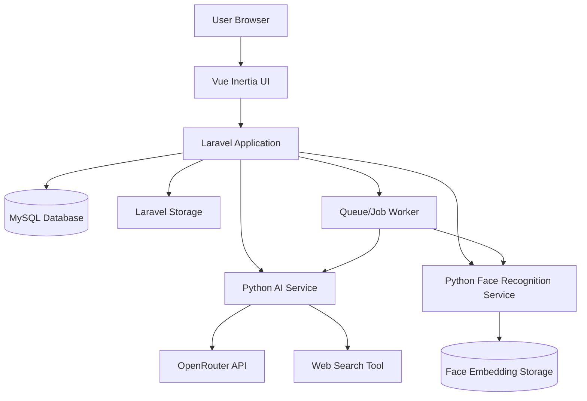
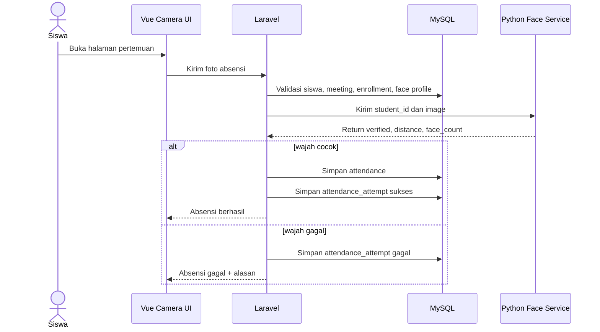
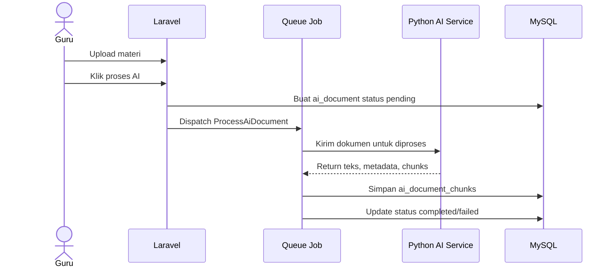
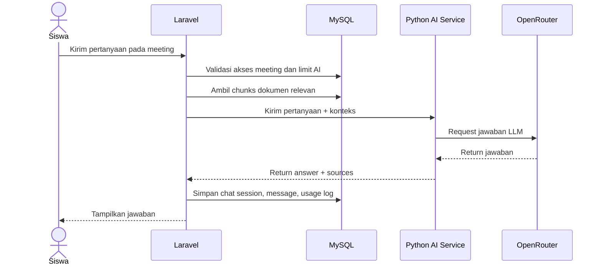
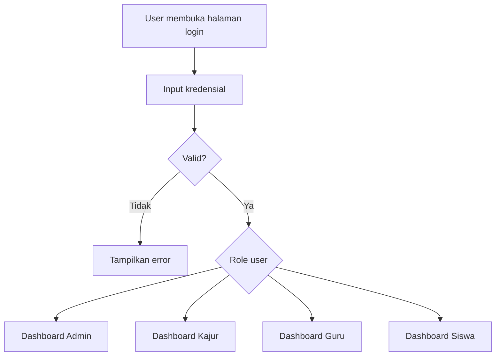
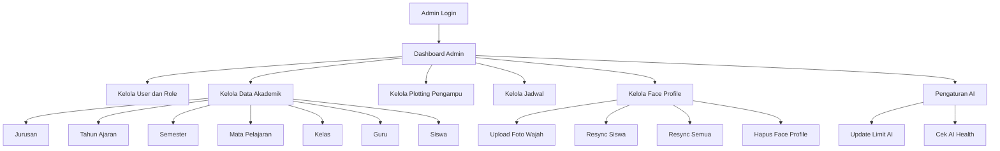
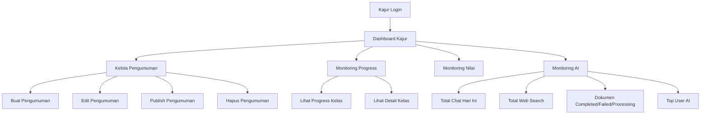
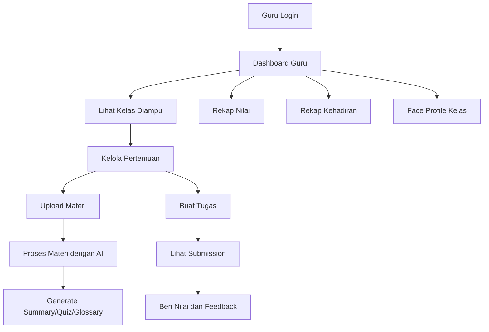
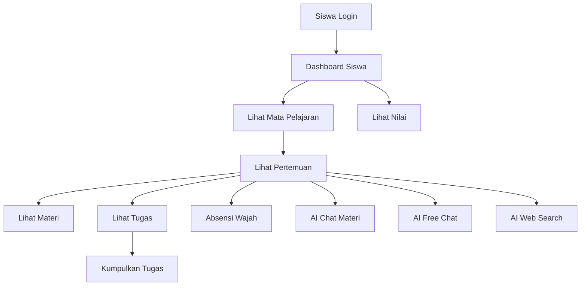

# Part 2 — PRD Awal Sistem E-Learning Berbasis AI dan Face Recognition

**Nama dokumen:** Product Requirement Document (PRD) Awal  
**Project:** E-Learning Berbasis AI dan Absensi Face Recognition  
**Versi:** Draft 0.1  
**Status:** Dokumen kerja awal, belum final  
**Sumber analisis:** Struktur project ZIP, route Laravel, controller, migration database, dokumen planning AI, dokumen planning face recognition, dan dokumen flow sistem.

---

## 1. Ringkasan Eksekutif

Project ini merupakan sistem **Learning Management System (LMS)** berbasis web yang dikembangkan untuk kebutuhan pembelajaran sekolah. Sistem memiliki empat role utama, yaitu **Admin Sistem**, **Kajur**, **Guru**, dan **Siswa**. Sistem tidak hanya menangani proses e-learning standar seperti manajemen kelas, materi, tugas, pengumpulan tugas, nilai, dan pengumuman, tetapi juga diperluas dengan dua fitur besar, yaitu **AI Learning Assistant** dan **Absensi Face Recognition**.

Komponen utama aplikasi terdiri atas:

1. **Laravel sebagai aplikasi pusat**  
   Laravel menjadi pusat autentikasi, manajemen role, aturan akademik, penyimpanan data, validasi akses, dan penghubung ke service eksternal.

2. **Inertia Vue sebagai antarmuka pengguna**  
   Vue digunakan sebagai layer frontend untuk dashboard tiap role, form input, halaman pembelajaran, absensi kamera, dan interaksi AI.

3. **MySQL sebagai database utama**  
   MySQL menyimpan data user, akademik, kelas, pertemuan, materi, tugas, nilai, absensi, pengumuman, AI document, AI chat, dan log penggunaan AI.

4. **Python AI Service**  
   Service AI digunakan untuk membaca dokumen pembelajaran, melakukan ekstraksi teks, membagi dokumen menjadi chunk, menjawab pertanyaan siswa, membuat ringkasan, kuis, glosarium, serta mendukung pencarian berbasis web.

5. **Python Face Recognition Service**  
   Service face recognition digunakan untuk enrollment wajah siswa, sinkronisasi face profile, verifikasi wajah saat absensi, dan penghapusan data embedding wajah.

Sistem dirancang dengan konsep **role-based access control**, sehingga setiap pengguna hanya dapat mengakses fitur sesuai perannya.

---

## 2. Tujuan Produk

Tujuan utama produk adalah menyediakan sistem pembelajaran digital yang mampu:

1. Mengelola proses akademik sekolah secara terstruktur.
2. Memisahkan tanggung jawab Admin Sistem, Kajur, Guru, dan Siswa.
3. Memudahkan guru dalam membuat pertemuan, mengunggah materi, memberi tugas, dan melakukan penilaian.
4. Memudahkan siswa dalam mengakses materi, mengumpulkan tugas, melihat nilai, dan mengikuti pembelajaran.
5. Menyediakan absensi berbasis wajah agar kehadiran siswa tercatat lebih aman dan terverifikasi.
6. Menyediakan AI Learning Assistant untuk membantu siswa memahami materi dan membantu guru menghasilkan konten pembelajaran.
7. Menyediakan monitoring akademik dan monitoring penggunaan AI untuk pihak Kajur.
8. Menyediakan konfigurasi teknis dan pengelolaan batas penggunaan AI untuk Admin Sistem.

---

## 3. Ruang Lingkup Produk

### 3.1 Termasuk dalam Scope

Produk mencakup modul berikut:

| No | Modul | Keterangan |
|---:|---|---|
| 1 | Autentikasi | Login, logout, profil, avatar, update password |
| 2 | Manajemen User | CRUD user dan pengaturan role |
| 3 | Manajemen Akademik | Jurusan, tahun ajaran, semester, guru, siswa, mapel, kelas |
| 4 | Plotting Pengampu | Penugasan guru ke kelas, mapel, dan semester |
| 5 | Jadwal Kelas | Pengaturan hari, jam mulai, jam selesai, dan ruang |
| 6 | Pertemuan | Guru membuat, mem-publish, mengaktifkan, menutup, dan menghapus pertemuan |
| 7 | Materi | Guru mengunggah materi pembelajaran |
| 8 | Tugas | Guru membuat tugas, siswa mengumpulkan, guru memberi nilai |
| 9 | Nilai | Guru dan siswa melihat rekap nilai |
| 10 | Pengumuman | Kajur membuat pengumuman, pengguna lain membaca |
| 11 | Monitoring Akademik | Kajur memantau progress kelas dan nilai |
| 12 | Absensi Face Recognition | Enrollment wajah, sinkronisasi wajah, absensi kamera, rekap kehadiran |
| 13 | AI Learning Assistant | Proses dokumen, chat materi, free chat, web search, summary, quiz, glossary |
| 14 | Monitoring AI | Kajur melihat statistik penggunaan AI |
| 15 | Pengaturan AI | Admin mengatur limit penggunaan AI dan mengecek health service |

---

### 3.2 Di Luar Scope Awal

Fitur berikut tidak menjadi prioritas awal PRD ini, kecuali nanti diputuskan masuk ke fase lanjutan:

1. Pembayaran/SPP.
2. Integrasi WhatsApp gateway.
3. Integrasi email notification secara penuh.
4. Mobile app native Android/iOS.
5. Video conference internal.
6. Proctoring ujian.
7. Rekomendasi pembelajaran adaptif tingkat lanjut.
8. Training model face recognition dari nol.
9. Training LLM sendiri.
10. Multi-sekolah atau multi-tenant penuh.

---

## 4. Definisi Istilah

| Istilah | Definisi |
|---|---|
| LMS | Learning Management System, sistem untuk mengelola proses pembelajaran digital |
| Admin Sistem | Role teknis yang mengelola user, konfigurasi, data akademik, AI, dan face profile |
| Kajur | Kepala jurusan yang berfokus pada pengumuman dan monitoring akademik |
| Guru | Pengajar yang mengelola pertemuan, materi, tugas, nilai, dan rekap kehadiran |
| Siswa | Pengguna pembelajaran yang mengakses materi, tugas, nilai, absensi, dan AI tutor |
| Teaching Assignment | Penugasan guru pada kelas, mata pelajaran, dan semester tertentu |
| Meeting | Pertemuan pembelajaran dalam satu teaching assignment |
| Face Profile | Data foto wajah siswa yang disimpan Laravel dan disinkronkan ke Python |
| Face Embedding | Representasi numerik wajah hasil pemrosesan Python |
| Verification 1:1 | Verifikasi wajah siswa terhadap data wajah miliknya sendiri, bukan pencarian seluruh siswa |
| AI Document | Dokumen pembelajaran yang diproses untuk kebutuhan AI |
| Chunk | Potongan teks dokumen yang dipakai AI sebagai konteks jawaban |
| AI Usage Limit | Batas pemakaian AI per role |
| AI Usage Log | Catatan pemakaian fitur AI |

---

## 5. Aktor Sistem

### 5.1 Admin Sistem

Admin Sistem adalah pengelola utama aplikasi dari sisi teknis dan data dasar. Admin berwenang mengelola user, role, data akademik, konfigurasi AI, dan face profile siswa.

**Tanggung jawab utama:**

1. Mengelola akun pengguna.
2. Mengelola data jurusan.
3. Mengelola tahun ajaran dan semester.
4. Mengelola mata pelajaran.
5. Mengelola kelas.
6. Mengelola data guru dan siswa.
7. Mengelola plotting pengampu.
8. Mengelola jadwal kelas.
9. Mengelola dan menyinkronkan face profile siswa.
10. Mengatur limit penggunaan AI.
11. Mengecek status layanan AI.

---

### 5.2 Kajur

Kajur adalah aktor akademik yang berfokus pada penyampaian informasi dan monitoring kegiatan pembelajaran. Pada versi sistem aktual, Kajur tidak menjadi pengelola utama data akademik karena fitur akademik inti dipindahkan ke Admin Sistem.

**Tanggung jawab utama:**

1. Mengelola pengumuman.
2. Melihat pengumuman.
3. Memantau progress pembelajaran kelas.
4. Melihat detail progress per kelas.
5. Memantau rekap nilai.
6. Memantau penggunaan AI.

---

### 5.3 Guru

Guru adalah aktor yang menjalankan proses pembelajaran. Guru memiliki akses ke kelas dan mata pelajaran yang ditugaskan melalui teaching assignment.

**Tanggung jawab utama:**

1. Melihat daftar pengampu atau kelas ajar.
2. Membuat pertemuan.
3. Mem-publish, mengaktifkan, dan menutup pertemuan.
4. Mengunggah materi.
5. Membuat tugas.
6. Melihat submission siswa.
7. Memberi nilai dan feedback.
8. Melihat rekap nilai.
9. Melihat rekap kehadiran.
10. Melihat status face profile siswa pada kelas yang diajar.
11. Melakukan resync face profile siswa pada kelas yang diajar.
12. Memproses materi dengan AI.
13. Membuat ringkasan, kuis, dan glosarium berbasis AI.

---

### 5.4 Siswa

Siswa adalah aktor yang mengikuti pembelajaran. Siswa hanya dapat mengakses kelas, pertemuan, materi, tugas, nilai, absensi, dan AI yang sesuai dengan enrollment aktifnya.

**Tanggung jawab utama:**

1. Melihat dashboard pembelajaran.
2. Melihat daftar mata pelajaran.
3. Melihat daftar pertemuan.
4. Membuka detail pertemuan.
5. Mengakses materi.
6. Melihat dan mengumpulkan tugas.
7. Melihat nilai.
8. Melakukan absensi wajah.
9. Menggunakan AI chat berdasarkan materi.
10. Menggunakan free chat AI.
11. Menggunakan AI web search.
12. Melihat riwayat chat AI.

---

## 6. Gambaran Arsitektur Sistem

### 6.1 Prinsip Arsitektur

1. Laravel menjadi pusat sistem.
2. Python tidak mengambil keputusan akademik.
3. Python AI hanya memproses dokumen, konteks, dan request AI.
4. Python face recognition hanya memproses wajah dan mengembalikan hasil teknis.
5. Semua validasi role, kelas, jadwal, enrollment, dan status pertemuan dilakukan oleh Laravel.
6. Semua data penting tetap disimpan dalam database utama.
7. Job queue dapat digunakan untuk proses berat seperti sinkronisasi wajah dan pemrosesan dokumen AI.

---

## 7. Modul dan Kebutuhan Fungsional

## 7.1 Modul Autentikasi dan Profil

### Deskripsi

Modul autentikasi digunakan untuk memastikan hanya user terdaftar yang dapat masuk ke sistem. Setelah login, user diarahkan ke dashboard sesuai role.

### Kebutuhan Fungsional

| ID | Kebutuhan |
|---|---|
| FR-AUTH-001 | Sistem harus menyediakan halaman login. |
| FR-AUTH-002 | Sistem harus memvalidasi email/username dan password. |
| FR-AUTH-003 | Sistem harus menolak user dengan status tidak aktif. |
| FR-AUTH-004 | Sistem harus mengarahkan user ke dashboard sesuai role. |
| FR-AUTH-005 | Sistem harus menyediakan logout. |
| FR-AUTH-006 | Sistem harus menyediakan halaman edit profil. |
| FR-AUTH-007 | Sistem harus menyediakan perubahan password. |
| FR-AUTH-008 | Sistem harus mendukung upload avatar user. |

### Acceptance Criteria

1. User dengan kredensial valid dapat masuk ke sistem.
2. User diarahkan ke dashboard sesuai role.
3. User tidak dapat mengakses dashboard role lain.
4. User dapat memperbarui profil dan password.
5. User dapat logout dengan aman.

---

## 7.2 Modul Admin Sistem

### Deskripsi

Modul Admin Sistem merupakan pusat pengelolaan data utama. Admin mengelola struktur akademik, user, AI settings, dan face profile.

### Kebutuhan Fungsional

| ID | Kebutuhan |
|---|---|
| FR-ADM-001 | Admin dapat melihat dashboard admin. |
| FR-ADM-002 | Admin dapat mengelola user. |
| FR-ADM-003 | Admin dapat mengelola jurusan/departemen. |
| FR-ADM-004 | Admin dapat mengelola tahun ajaran. |
| FR-ADM-005 | Admin dapat mengelola semester. |
| FR-ADM-006 | Admin dapat mengelola mata pelajaran. |
| FR-ADM-007 | Admin dapat mengelola kelas. |
| FR-ADM-008 | Admin dapat mengelola data guru. |
| FR-ADM-009 | Admin dapat mengelola data siswa. |
| FR-ADM-010 | Admin dapat mengelola anggota kelas. |
| FR-ADM-011 | Admin dapat mengelola plotting pengampu. |
| FR-ADM-012 | Admin dapat mengelola jadwal kelas. |
| FR-ADM-013 | Admin dapat mengelola face profile siswa. |
| FR-ADM-014 | Admin dapat melakukan resync face profile satu siswa. |
| FR-ADM-015 | Admin dapat melakukan resync semua face profile. |
| FR-ADM-016 | Admin dapat menghapus face profile siswa. |
| FR-ADM-017 | Admin dapat mengatur limit penggunaan AI per role. |
| FR-ADM-018 | Admin dapat mengecek health status AI service. |

### Acceptance Criteria

1. Admin dapat melakukan CRUD data akademik.
2. Admin dapat menghubungkan guru, kelas, mata pelajaran, dan semester melalui plotting pengampu.
3. Admin dapat mengatur jadwal kelas berdasarkan teaching assignment.
4. Admin dapat mendaftarkan dan menyinkronkan foto wajah siswa.
5. Admin dapat mengatur limit AI untuk role guru dan siswa.
6. Admin tidak perlu masuk ke aktivitas pembelajaran harian guru.

---

## 7.3 Modul Kajur

### Deskripsi

Modul Kajur digunakan untuk mengelola pengumuman dan memantau kegiatan akademik. Kajur tidak menjadi aktor utama CRUD akademik pada versi aktual, tetapi menjadi aktor monitoring dan komunikasi akademik.

### Kebutuhan Fungsional

| ID | Kebutuhan |
|---|---|
| FR-KJR-001 | Kajur dapat melihat dashboard kajur. |
| FR-KJR-002 | Kajur dapat membuat pengumuman. |
| FR-KJR-003 | Kajur dapat mengubah pengumuman. |
| FR-KJR-004 | Kajur dapat menghapus pengumuman. |
| FR-KJR-005 | Kajur dapat mengatur status pengumuman. |
| FR-KJR-006 | Kajur dapat menentukan target role pengumuman. |
| FR-KJR-007 | Kajur dapat melihat progress pembelajaran kelas. |
| FR-KJR-008 | Kajur dapat melihat detail progress kelas. |
| FR-KJR-009 | Kajur dapat melihat rekap nilai. |
| FR-KJR-010 | Kajur dapat melihat monitoring penggunaan AI. |

### Acceptance Criteria

1. Kajur dapat membuat pengumuman berstatus draft atau published.
2. Pengumuman published dapat dilihat oleh target role.
3. Kajur dapat melihat progress pembelajaran tanpa mengubah data pembelajaran guru.
4. Kajur dapat melihat statistik penggunaan AI.
5. Kajur tidak dapat mengakses route Admin Sistem.

---

## 7.4 Modul Guru

### Deskripsi

Modul Guru digunakan untuk menjalankan kegiatan pembelajaran. Guru bekerja berdasarkan teaching assignment aktif.

### Kebutuhan Fungsional

| ID | Kebutuhan |
|---|---|
| FR-GRU-001 | Guru dapat melihat dashboard guru. |
| FR-GRU-002 | Guru dapat melihat daftar kelas/mata pelajaran yang diampu. |
| FR-GRU-003 | Guru dapat membuat pertemuan pada teaching assignment miliknya. |
| FR-GRU-004 | Guru dapat melihat detail pertemuan. |
| FR-GRU-005 | Guru dapat mem-publish pertemuan. |
| FR-GRU-006 | Guru dapat mengaktifkan pertemuan. |
| FR-GRU-007 | Guru dapat menutup pertemuan. |
| FR-GRU-008 | Guru dapat menghapus pertemuan. |
| FR-GRU-009 | Guru dapat mengunggah materi pada pertemuan. |
| FR-GRU-010 | Guru dapat menghapus materi. |
| FR-GRU-011 | Guru dapat membuat tugas pada pertemuan. |
| FR-GRU-012 | Guru dapat melihat seluruh submission tugas. |
| FR-GRU-013 | Guru dapat melihat submission berdasarkan tugas. |
| FR-GRU-014 | Guru dapat memberi nilai dan feedback. |
| FR-GRU-015 | Guru dapat melihat rekap nilai. |
| FR-GRU-016 | Guru dapat melihat rekap kehadiran. |
| FR-GRU-017 | Guru dapat melihat status face profile siswa pada kelas yang diajar. |
| FR-GRU-018 | Guru dapat melakukan resync face profile satu siswa di kelasnya. |
| FR-GRU-019 | Guru dapat melakukan resync face profile seluruh siswa di kelasnya. |
| FR-GRU-020 | Guru dapat memproses materi ke AI. |
| FR-GRU-021 | Guru dapat membuat ringkasan AI. |
| FR-GRU-022 | Guru dapat membuat kuis AI. |
| FR-GRU-023 | Guru dapat membuat glosarium AI. |
| FR-GRU-024 | Guru dapat melihat output AI yang sudah dibuat. |
| FR-GRU-025 | Guru dapat menghapus output AI. |

### Acceptance Criteria

1. Guru hanya dapat mengelola kelas yang ditugaskan kepadanya.
2. Guru tidak dapat membuat pertemuan untuk teaching assignment milik guru lain.
3. Materi dan tugas hanya dapat dibuat pada pertemuan yang valid.
4. Guru dapat memberi nilai untuk submission siswa pada kelas yang diajar.
5. Guru dapat melihat rekap kehadiran siswa.
6. Guru dapat memproses dokumen materi ke AI apabila file materi tersedia.
7. Guru tidak dapat melewati batas penggunaan AI harian.

---

## 7.5 Modul Siswa

### Deskripsi

Modul Siswa digunakan untuk mengikuti pembelajaran. Akses siswa dibatasi oleh enrollment aktif pada kelas tertentu.

### Kebutuhan Fungsional

| ID | Kebutuhan |
|---|---|
| FR-SIS-001 | Siswa dapat melihat dashboard siswa. |
| FR-SIS-002 | Siswa dapat melihat daftar mata pelajaran aktif. |
| FR-SIS-003 | Siswa dapat melihat daftar pertemuan dari mata pelajaran. |
| FR-SIS-004 | Siswa dapat melihat detail pertemuan yang sudah dipublikasikan. |
| FR-SIS-005 | Siswa dapat melihat materi pembelajaran. |
| FR-SIS-006 | Siswa dapat melihat detail tugas. |
| FR-SIS-007 | Siswa dapat mengumpulkan tugas. |
| FR-SIS-008 | Siswa dapat melihat rekap nilai. |
| FR-SIS-009 | Siswa dapat melakukan absensi wajah. |
| FR-SIS-010 | Siswa dapat bertanya kepada AI berdasarkan materi. |
| FR-SIS-011 | Siswa dapat menggunakan free chat AI. |
| FR-SIS-012 | Siswa dapat melihat riwayat chat AI. |
| FR-SIS-013 | Siswa dapat melakukan AI web search. |

### Acceptance Criteria

1. Siswa hanya dapat melihat kelas tempat ia terdaftar aktif.
2. Siswa hanya dapat membuka pertemuan yang sudah published.
3. Siswa dapat mengumpulkan tugas sesuai aturan tugas.
4. Siswa dapat melihat nilai setelah guru memberi penilaian.
5. Siswa dapat melakukan absensi wajah jika meeting aktif dan face profile sudah synced.
6. Siswa tidak dapat menggunakan AI melebihi limit harian.

---

## 7.6 Modul Pengumuman

### Deskripsi

Modul Pengumuman menjadi kanal komunikasi resmi dari Kajur kepada pengguna sistem.

### Kebutuhan Fungsional

| ID | Kebutuhan |
|---|---|
| FR-ANN-001 | Kajur dapat membuat pengumuman. |
| FR-ANN-002 | Kajur dapat mengubah pengumuman. |
| FR-ANN-003 | Kajur dapat menghapus pengumuman. |
| FR-ANN-004 | Kajur dapat menentukan target role pengumuman. |
| FR-ANN-005 | Kajur dapat menentukan status pengumuman. |
| FR-ANN-006 | Kajur dapat mengatur tanggal mulai dan tanggal selesai pengumuman. |
| FR-ANN-007 | User yang login dapat melihat pengumuman sesuai target role. |

### Acceptance Criteria

1. Pengumuman draft tidak tampil ke pembaca umum.
2. Pengumuman published tampil kepada target role sesuai pengaturan.
3. Pengumuman dapat memiliki periode tampil.
4. User tidak dapat mengubah pengumuman milik Kajur tanpa hak akses.

---

## 7.7 Modul Absensi Face Recognition

### Deskripsi

Modul ini digunakan untuk mencatat kehadiran siswa melalui kamera. Sistem menggunakan pola **verification 1:1**, yaitu wajah siswa diverifikasi terhadap face profile milik siswa tersebut.

### Alur Utama

### Kebutuhan Fungsional

| ID | Kebutuhan |
|---|---|
| FR-FACE-001 | Admin dapat mengunggah foto wajah siswa. |
| FR-FACE-002 | Sistem menyimpan foto wajah pada storage Laravel. |
| FR-FACE-003 | Sistem menghitung image hash untuk mendeteksi perubahan foto. |
| FR-FACE-004 | Sistem membuat atau memperbarui face profile siswa. |
| FR-FACE-005 | Sistem menjalankan sinkronisasi face profile ke Python. |
| FR-FACE-006 | Sistem menyimpan status sync: pending, syncing, synced, failed, disabled. |
| FR-FACE-007 | Admin dapat melakukan resync satu siswa. |
| FR-FACE-008 | Admin dapat melakukan resync semua siswa. |
| FR-FACE-009 | Guru dapat melihat status face profile siswa pada kelas yang diajar. |
| FR-FACE-010 | Guru dapat melakukan resync siswa pada kelas yang diajar. |
| FR-FACE-011 | Siswa dapat melakukan absensi melalui kamera. |
| FR-FACE-012 | Laravel harus memvalidasi meeting aktif sebelum memanggil Python. |
| FR-FACE-013 | Laravel harus memvalidasi enrollment aktif siswa. |
| FR-FACE-014 | Laravel harus menolak absensi ganda pada meeting yang sama. |
| FR-FACE-015 | Laravel harus menolak absensi jika face profile belum siap. |
| FR-FACE-016 | Python harus memverifikasi wajah berdasarkan student_id. |
| FR-FACE-017 | Sistem harus menyimpan attendance jika verifikasi berhasil. |
| FR-FACE-018 | Sistem harus menyimpan attendance_attempt pada percobaan berhasil dan gagal. |
| FR-FACE-019 | Sistem harus mengembalikan pesan gagal yang jelas jika wajah tidak cocok, tidak terdeteksi, lebih dari satu wajah, atau Python service bermasalah. |

### Acceptance Criteria

1. Siswa yang belum memiliki face profile tidak dapat melakukan absensi wajah.
2. Siswa yang face profile-nya belum synced tidak dapat melakukan absensi wajah.
3. Siswa tidak dapat absen di kelas yang bukan enrollment aktifnya.
4. Siswa tidak dapat melakukan absensi dua kali pada meeting yang sama.
5. Jika wajah cocok, data masuk ke `attendances`.
6. Jika wajah tidak cocok, data tetap masuk ke `attendance_attempts`.
7. Jika Python service tidak aktif, sistem tidak boleh mencatat attendance sukses.
8. Semua percobaan absensi memiliki audit trail.

---

## 7.8 Modul AI Learning Assistant

### Deskripsi

Modul AI Learning Assistant digunakan untuk membantu guru dan siswa dalam aktivitas pembelajaran. Guru dapat memproses materi, membuat ringkasan, kuis, dan glosarium. Siswa dapat bertanya kepada AI berdasarkan materi, menggunakan free chat, dan melakukan web search.

### Alur Pemrosesan Dokumen AI

### Alur Chat AI Siswa

### Kebutuhan Fungsional

| ID | Kebutuhan |
|---|---|
| FR-AI-001 | Guru dapat memproses file materi ke AI. |
| FR-AI-002 | Sistem harus membuat data `ai_documents` saat materi diproses. |
| FR-AI-003 | Sistem harus mencegah duplikasi proses dokumen yang sedang pending/processing. |
| FR-AI-004 | Sistem harus dapat memproses ulang dokumen yang gagal. |
| FR-AI-005 | Python AI Service harus mengekstrak teks dari dokumen. |
| FR-AI-006 | Python AI Service harus membuat chunk dokumen. |
| FR-AI-007 | Sistem harus menyimpan chunk pada `ai_document_chunks`. |
| FR-AI-008 | Guru dapat membuat ringkasan AI dari dokumen selesai diproses. |
| FR-AI-009 | Guru dapat membuat kuis AI dari dokumen selesai diproses. |
| FR-AI-010 | Guru dapat membuat glosarium AI dari dokumen selesai diproses. |
| FR-AI-011 | Guru dapat melihat output AI. |
| FR-AI-012 | Guru dapat menghapus output AI. |
| FR-AI-013 | Siswa dapat bertanya ke AI berdasarkan materi meeting. |
| FR-AI-014 | Siswa dapat menggunakan free chat AI. |
| FR-AI-015 | Siswa dapat melihat riwayat AI chat. |
| FR-AI-016 | Siswa dapat menggunakan AI web search jika fitur aktif. |
| FR-AI-017 | Sistem harus menyimpan chat session dan chat message. |
| FR-AI-018 | Sistem harus menyimpan sumber jawaban AI jika tersedia. |
| FR-AI-019 | Sistem harus mencatat penggunaan AI pada `ai_usage_logs`. |
| FR-AI-020 | Sistem harus menerapkan limit AI berdasarkan role. |
| FR-AI-021 | Admin dapat mengubah limit AI per role. |
| FR-AI-022 | Kajur dapat melihat statistik penggunaan AI. |
| FR-AI-023 | Sistem harus mengembalikan error yang jelas jika AI service gagal. |

### Acceptance Criteria

1. Guru tidak dapat memproses materi yang tidak memiliki file.
2. Guru tidak dapat memproses dokumen jika melebihi limit harian.
3. AI hanya menjawab konteks materi jika mode document digunakan.
4. Siswa tidak dapat bertanya AI pada meeting yang belum accessible.
5. AI web search dapat dinonaktifkan oleh konfigurasi.
6. Semua penggunaan AI tercatat sebagai log.
7. Kajur dapat melihat statistik penggunaan AI.
8. Admin dapat mengubah batas penggunaan AI.

---

## 8. Flow Sistem Utama

## 8.1 Flow Login dan Redirect Role

---

## 8.2 Flow Admin Sistem

---

## 8.3 Flow Kajur

---

## 8.4 Flow Guru

---

## 8.5 Flow Siswa

---

## 9. Data Utama Sistem

### 9.1 Data Autentikasi dan Role

| Tabel | Fungsi |
|---|---|
| `users` | Data akun pengguna |
| `roles` | Data role dari Spatie Permission |
| `permissions` | Data permission |
| `model_has_roles` | Relasi user dengan role |
| `model_has_permissions` | Relasi user/model dengan permission |
| `role_has_permissions` | Relasi role dengan permission |
| `sessions` | Data sesi login |
| `password_reset_tokens` | Token reset password |

---

### 9.2 Data Akademik

| Tabel | Fungsi |
|---|---|
| `departments` | Data jurusan/departemen |
| `academic_years` | Data tahun ajaran |
| `semesters` | Data semester |
| `teachers` | Data profil guru |
| `students` | Data profil siswa |
| `subjects` | Data mata pelajaran |
| `class_groups` | Data kelas |
| `student_class_enrollments` | Relasi siswa dengan kelas |
| `department_head_assignments` | Penugasan kepala jurusan |
| `teaching_assignments` | Penugasan guru pada kelas, mapel, semester |
| `class_schedules` | Jadwal kelas |

---

### 9.3 Data Pembelajaran

| Tabel | Fungsi |
|---|---|
| `meetings` | Pertemuan pembelajaran |
| `materials` | Materi pertemuan |
| `assignments` | Tugas pembelajaran |
| `assignment_submissions` | Pengumpulan tugas siswa |
| `assignment_grades` | Nilai dan feedback tugas |

---

### 9.4 Data Absensi Face Recognition

| Tabel | Fungsi |
|---|---|
| `face_profiles` | Data foto wajah dan status sinkronisasi |
| `attendances` | Data kehadiran siswa |
| `attendance_attempts` | Audit trail percobaan absensi |

---

### 9.5 Data Pengumuman

| Tabel | Fungsi |
|---|---|
| `announcements` | Pengumuman dari Kajur |

---

### 9.6 Data AI

| Tabel | Fungsi |
|---|---|
| `ai_documents` | Dokumen yang diproses AI |
| `ai_document_chunks` | Potongan teks dokumen |
| `ai_chat_sessions` | Sesi chat AI |
| `ai_chat_messages` | Riwayat pesan AI |
| `ai_usage_limits` | Batas penggunaan AI per role |
| `ai_usage_logs` | Log penggunaan AI |
| `ai_generated_outputs` | Output AI seperti summary, quiz, glossary |

---

## 10. Kebutuhan Nonfungsional

| ID | Kategori | Kebutuhan |
|---|---|---|
| NFR-001 | Keamanan | Sistem harus membatasi akses berdasarkan role. |
| NFR-002 | Keamanan | Siswa tidak boleh mengirim `student_id` manual saat absensi; sistem harus mengambil dari user login. |
| NFR-003 | Keamanan | Face profile harus disimpan pada storage yang tidak mudah diakses publik. |
| NFR-004 | Keamanan | Password harus disimpan dalam bentuk hash. |
| NFR-005 | Keamanan | Endpoint Python harus dilindungi menggunakan token/API key. |
| NFR-006 | Privasi | Metadata absensi dan data wajah harus diperlakukan sebagai data sensitif. |
| NFR-007 | Audit | Semua percobaan absensi harus tercatat. |
| NFR-008 | Audit | Semua penggunaan AI harus tercatat. |
| NFR-009 | Kinerja | Proses berat seperti AI document processing dan sync face profile sebaiknya berjalan melalui queue. |
| NFR-010 | Reliabilitas | Jika Python AI service gagal, sistem Laravel tetap dapat berjalan untuk fitur LMS dasar. |
| NFR-011 | Reliabilitas | Jika Python face service gagal, sistem tidak boleh mencatat absensi sukses palsu. |
| NFR-012 | Maintainability | Controller sebaiknya tetap tipis, sedangkan logic utama berada pada service layer. |
| NFR-013 | Skalabilitas | Struktur modul harus mendukung penambahan fitur e-learning lanjutan. |
| NFR-014 | Usability | Dashboard tiap role harus menampilkan menu sesuai kebutuhan aktor. |
| NFR-015 | Validasi | Sistem harus memberi pesan error yang jelas dan mudah dipahami user. |
| NFR-016 | Batas File | Sistem harus membatasi ukuran file AI sesuai konfigurasi `ai_usage_limits`. |
| NFR-017 | Ketersediaan | Admin harus dapat mengecek health status AI service. |
| NFR-018 | Integritas Data | Relasi data akademik harus menjaga konsistensi antara kelas, siswa, guru, mapel, dan semester. |

---

## 11. Risiko dan Mitigasi

| Risiko | Dampak | Mitigasi |
|---|---|---|
| Python Face Service mati | Absensi wajah gagal | Return error jelas, simpan attempt gagal, sediakan rekap untuk guru |
| Python AI Service mati | Fitur AI tidak tersedia | Fitur LMS tetap berjalan, admin dapat cek health service |
| Face profile gagal sync | Siswa tidak dapat absen wajah | Tampilkan status failed, sediakan resync oleh admin/guru |
| Wajah tidak terdeteksi | Absensi gagal | Tampilkan instruksi kamera, catat attempt |
| Lebih dari satu wajah terdeteksi | Potensi kecurangan | Tolak absensi dan catat reason |
| Siswa mencoba absen di kelas lain | Data kehadiran tidak valid | Validasi enrollment aktif sebelum memanggil Python |
| AI menjawab di luar konteks | Jawaban tidak sesuai materi | Gunakan mode document dan sumber chunk materi |
| Penggunaan AI berlebihan | Biaya/kuota tinggi | Terapkan AI usage limit per role |
| Data wajah bocor | Masalah privasi serius | Storage private, akses terbatas, endpoint terlindungi |
| Dokumen AI gagal diproses | Materi tidak bisa dipakai AI | Simpan status failed dan sediakan proses ulang |
| Duplikasi absensi | Kehadiran ganda | Unique constraint meeting_id + student_id |
| Role overlap | Hak akses kacau | Gunakan middleware role dan Spatie Permission |

---

## 12. Batasan MVP

Untuk MVP, sistem sebaiknya fokus pada:

1. Login dan role dashboard.
2. Manajemen data akademik oleh Admin.
3. Pengumuman oleh Kajur.
4. Pertemuan, materi, tugas, dan nilai oleh Guru.
5. Akses materi, tugas, nilai, absensi, dan AI oleh Siswa.
6. Enrollment face profile siswa.
7. Absensi wajah dengan verification 1:1.
8. AI document processing.
9. AI chat materi.
10. AI summary, quiz, glossary untuk guru.
11. AI usage limit dan AI monitoring.

---

## 13. Catatan Konsistensi Dokumen

Berdasarkan analisis ZIP, ada beberapa perbedaan antara dokumen planning lama dan kode aktual. Untuk PRD final, versi yang disarankan adalah mengikuti kode aktual.

| Area | Dokumen Lama | Kode Aktual | Keputusan PRD |
|---|---|---|---|
| Pengelolaan akademik | Banyak fitur ada pada Kajur | Fitur akademik utama ada pada Admin | Ikuti kode aktual: Admin sebagai pengelola akademik utama |
| Role user | Ada konsep `user_roles` | Menggunakan Spatie Permission | Ikuti Spatie Permission |
| Database | Beberapa dokumen menyebut PostgreSQL | Docker dan konfigurasi memakai MySQL | Gunakan MySQL 8.0 |
| Face recognition | Ada konsep integrasi | Sudah ada controller dan migration | Gunakan flow Laravel sebagai pusat validasi |
| AI | Ada PRD AI v1.0 dan v1.1 | Sudah ada route, model, controller AI | Gunakan v1.1 + implementasi aktual |

---

## 14. Output Part 2

Dokumen Part 2 ini menghasilkan:

1. PRD awal versi 0.1.
2. Definisi aktor final.
3. Scope dan batasan MVP.
4. Modul dan kebutuhan fungsional.
5. Kebutuhan nonfungsional.
6. Flow utama sistem.
7. Gambaran data utama.
8. Risiko dan mitigasi.
9. Dasar untuk Part 3.

---

## 15. Rencana Part 3

Part 3 yang paling tepat adalah:

# **Part 3 — ERD Lengkap Berdasarkan Migration Aktual**

Isi Part 3:

1. Daftar semua tabel final.
2. Field penting setiap tabel.
3. Primary key dan foreign key.
4. Relasi antar tabel.
5. ERD Mermaid.
6. ERD DBML.
7. Catatan normalisasi.
8. Catatan relasi LMS, AI, dan Face Recognition.
9. Rekomendasi perbaikan struktur database jika ditemukan kekurangan.

Part 3 penting karena ERD final harus menjadi dasar untuk UML, class diagram, sequence diagram, dan final PRD gabungan.
