# Part 5 — Sequence Diagram dan Class Diagram

**Project:** E-Learning Berbasis AI dan Absensi *Face Recognition*  
**Versi Dokumen:** 0.1  
**Format:** Markdown + Mermaid  
**Fokus:** Penyusunan *sequence diagram* dan *class diagram* berdasarkan struktur aktual project Laravel, service AI Python, service *face recognition*, route, controller, service, model, dan migration database.

---

## 1. Tujuan Part 5

Dokumen ini menyusun dua jenis UML lanjutan yang diperlukan untuk melengkapi PRD besar project e-learning, yaitu:

1. **Class Diagram**, untuk menggambarkan struktur kelas, entitas domain, service, dan relasi antarobjek utama.
2. **Sequence Diagram**, untuk menggambarkan urutan komunikasi antara aktor, antarmuka, controller Laravel, service internal, database, AI service, dan *face recognition service*.

Diagram pada bagian ini tidak dibuat sebagai diagram dekoratif, tetapi sebagai dokumentasi teknis yang bisa langsung dimasukkan ke PRD final, dokumen arsitektur, atau dokumentasi pengembangan.

---

## 2. Prinsip Penyusunan Diagram

| Prinsip | Penjelasan |
|---|---|
| Berbasis kode aktual | Diagram mengikuti controller, model, service, dan route yang ada di project. |
| Tidak hanya konseptual | Diagram memasukkan service nyata seperti `AiService`, `AiGatewayService`, `FaceRecognitionService`, dan `ProcessAiDocument`. |
| Dipisahkan per domain | Diagram tidak dipaksakan menjadi satu gambar besar agar tetap terbaca. |
| Mengikuti role sistem | Sequence diagram disusun berdasarkan aktivitas Admin, Kajur, Guru, dan Siswa. |
| Siap untuk PRD final | Seluruh diagram menggunakan format Mermaid agar bisa dipakai di Markdown, GitHub, GitLab, Obsidian, atau editor Mermaid lain. |

---

# 3. Class Diagram

## 3.1 Class Diagram Arsitektur Layer Sistem

Diagram ini menunjukkan pemisahan layer utama antara pengguna, route, controller, service, model, database, dan service eksternal.

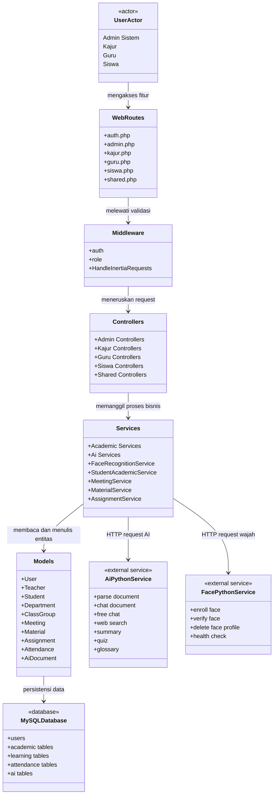
```mermaid
classDiagram
    class UserActor {
        <<actor>>
        Admin Sistem
        Kajur
        Guru
        Siswa
    }

    class WebRoutes {
        +auth.php
        +admin.php
        +kajur.php
        +guru.php
        +siswa.php
        +shared.php
    }

    class Middleware {
        +auth
        +role
        +HandleInertiaRequests
    }

    class Controllers {
        +Admin Controllers
        +Kajur Controllers
        +Guru Controllers
        +Siswa Controllers
        +Shared Controllers
    }

    class Services {
        +Academic Services
        +Ai Services
        +FaceRecognitionService
        +StudentAcademicService
        +MeetingService
        +MaterialService
        +AssignmentService
    }

    class Models {
        +User
        +Teacher
        +Student
        +Department
        +ClassGroup
        +Meeting
        +Material
        +Assignment
        +Attendance
        +AiDocument
    }

    class MySQLDatabase {
        <<database>>
        +users
        +academic tables
        +learning tables
        +attendance tables
        +ai tables
    }

    class AiPythonService {
        <<external service>>
        +parse document
        +chat document
        +free chat
        +web search
        +summary
        +quiz
        +glossary
    }

    class FacePythonService {
        <<external service>>
        +enroll face
        +verify face
        +delete face profile
        +health check
    }

    UserActor --> WebRoutes : mengakses fitur
    WebRoutes --> Middleware : melewati validasi
    Middleware --> Controllers : meneruskan request
    Controllers --> Services : memanggil proses bisnis
    Services --> Models : membaca dan menulis entitas
    Models --> MySQLDatabase : persistensi data
    Services --> AiPythonService : HTTP request AI
    Services --> FacePythonService : HTTP request wajah
```

---

## 3.2 Class Diagram Domain User, Role, dan Profil Akademik

Diagram ini menggambarkan hubungan antara akun pengguna, role, profil guru, profil siswa, dan penugasan kajur.

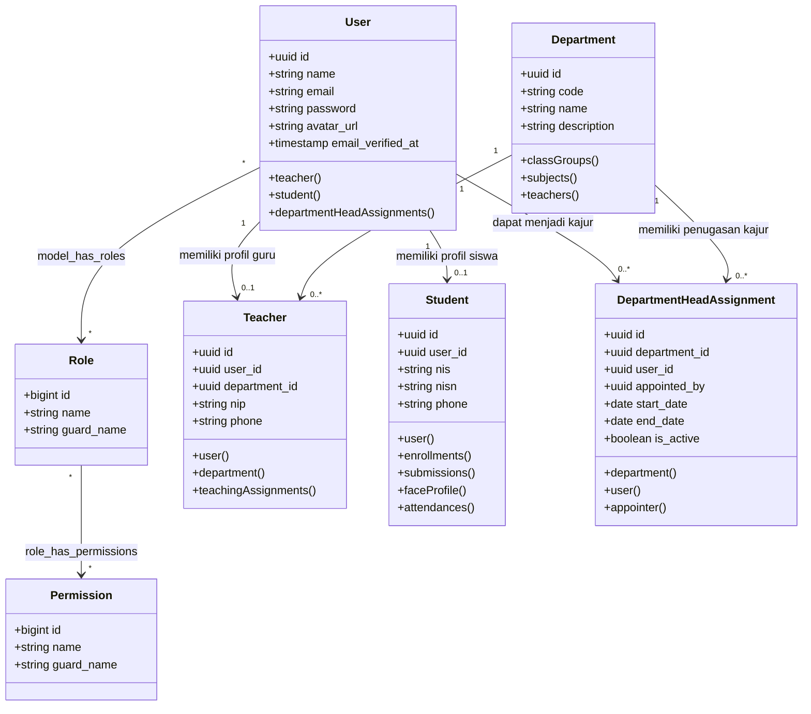
```mermaid
classDiagram
    class User {
        +uuid id
        +string name
        +string email
        +string password
        +string avatar_url
        +timestamp email_verified_at
        +teacher()
        +student()
        +departmentHeadAssignments()
    }

    class Role {
        +bigint id
        +string name
        +string guard_name
    }

    class Permission {
        +bigint id
        +string name
        +string guard_name
    }

    class Teacher {
        +uuid id
        +uuid user_id
        +uuid department_id
        +string nip
        +string phone
        +user()
        +department()
        +teachingAssignments()
    }

    class Student {
        +uuid id
        +uuid user_id
        +string nis
        +string nisn
        +string phone
        +user()
        +enrollments()
        +submissions()
        +faceProfile()
        +attendances()
    }

    class Department {
        +uuid id
        +string code
        +string name
        +string description
        +classGroups()
        +subjects()
        +teachers()
    }

    class DepartmentHeadAssignment {
        +uuid id
        +uuid department_id
        +uuid user_id
        +uuid appointed_by
        +date start_date
        +date end_date
        +boolean is_active
        +department()
        +user()
        +appointer()
    }

    User "1" --> "0..1" Teacher : memiliki profil guru
    User "1" --> "0..1" Student : memiliki profil siswa
    User "1" --> "0..*" DepartmentHeadAssignment : dapat menjadi kajur
    Department "1" --> "0..*" Teacher : menaungi
    Department "1" --> "0..*" DepartmentHeadAssignment : memiliki penugasan kajur
    User "*" --> "*" Role : model_has_roles
    Role "*" --> "*" Permission : role_has_permissions
```

---

## 3.3 Class Diagram Domain Akademik

Diagram ini menggambarkan struktur akademik inti: tahun ajaran, semester, jurusan, kelas, siswa, mata pelajaran, pengampu, dan jadwal.

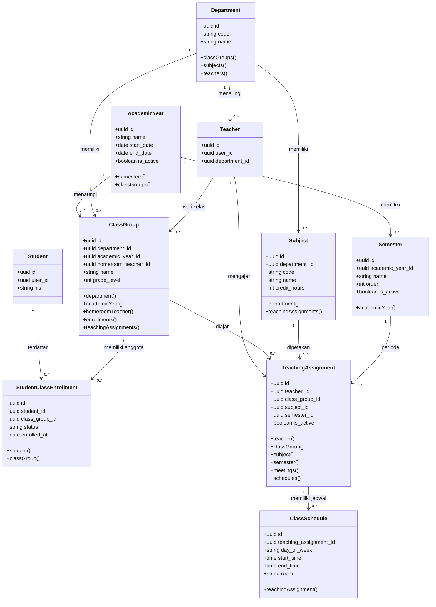
```mermaid
classDiagram
    class AcademicYear {
        +uuid id
        +string name
        +date start_date
        +date end_date
        +boolean is_active
        +semesters()
        +classGroups()
    }

    class Semester {
        +uuid id
        +uuid academic_year_id
        +string name
        +int order
        +boolean is_active
        +academicYear()
    }

    class Department {
        +uuid id
        +string code
        +string name
        +classGroups()
        +subjects()
        +teachers()
    }

    class ClassGroup {
        +uuid id
        +uuid department_id
        +uuid academic_year_id
        +uuid homeroom_teacher_id
        +string name
        +int grade_level
        +department()
        +academicYear()
        +homeroomTeacher()
        +enrollments()
        +teachingAssignments()
    }

    class StudentClassEnrollment {
        +uuid id
        +uuid student_id
        +uuid class_group_id
        +string status
        +date enrolled_at
        +student()
        +classGroup()
    }

    class Subject {
        +uuid id
        +uuid department_id
        +string code
        +string name
        +int credit_hours
        +department()
        +teachingAssignments()
    }

    class TeachingAssignment {
        +uuid id
        +uuid teacher_id
        +uuid class_group_id
        +uuid subject_id
        +uuid semester_id
        +boolean is_active
        +teacher()
        +classGroup()
        +subject()
        +semester()
        +meetings()
        +schedules()
    }

    class ClassSchedule {
        +uuid id
        +uuid teaching_assignment_id
        +string day_of_week
        +time start_time
        +time end_time
        +string room
        +teachingAssignment()
    }

    class Teacher {
        +uuid id
        +uuid user_id
        +uuid department_id
    }

    class Student {
        +uuid id
        +uuid user_id
        +string nis
    }

    AcademicYear "1" --> "0..*" Semester : memiliki
    AcademicYear "1" --> "0..*" ClassGroup : menaungi
    Department "1" --> "0..*" ClassGroup : memiliki
    Department "1" --> "0..*" Subject : memiliki
    Department "1" --> "0..*" Teacher : menaungi
    Teacher "1" --> "0..*" ClassGroup : wali kelas
    Student "1" --> "0..*" StudentClassEnrollment : terdaftar
    ClassGroup "1" --> "0..*" StudentClassEnrollment : memiliki anggota
    Teacher "1" --> "0..*" TeachingAssignment : mengajar
    ClassGroup "1" --> "0..*" TeachingAssignment : diajar
    Subject "1" --> "0..*" TeachingAssignment : dipetakan
    Semester "1" --> "0..*" TeachingAssignment : periode
    TeachingAssignment "1" --> "0..*" ClassSchedule : memiliki jadwal
```

---

## 3.4 Class Diagram Domain Pembelajaran, Tugas, Nilai, dan Absensi

Diagram ini menggambarkan relasi proses belajar, mulai dari pertemuan, materi, tugas, pengumpulan tugas, penilaian, dan absensi.

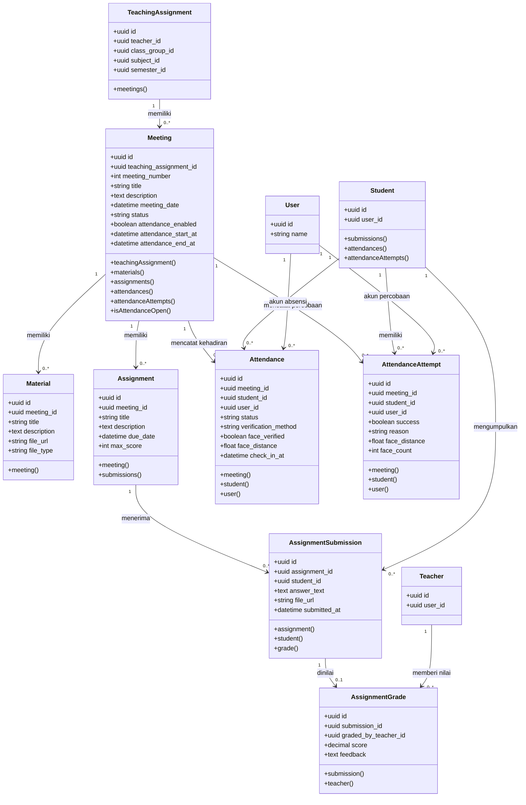
```mermaid
classDiagram
    class TeachingAssignment {
        +uuid id
        +uuid teacher_id
        +uuid class_group_id
        +uuid subject_id
        +uuid semester_id
        +meetings()
    }

    class Meeting {
        +uuid id
        +uuid teaching_assignment_id
        +int meeting_number
        +string title
        +text description
        +datetime meeting_date
        +string status
        +boolean attendance_enabled
        +datetime attendance_start_at
        +datetime attendance_end_at
        +teachingAssignment()
        +materials()
        +assignments()
        +attendances()
        +attendanceAttempts()
        +isAttendanceOpen()
    }

    class Material {
        +uuid id
        +uuid meeting_id
        +string title
        +text description
        +string file_url
        +string file_type
        +meeting()
    }

    class Assignment {
        +uuid id
        +uuid meeting_id
        +string title
        +text description
        +datetime due_date
        +int max_score
        +meeting()
        +submissions()
    }

    class AssignmentSubmission {
        +uuid id
        +uuid assignment_id
        +uuid student_id
        +text answer_text
        +string file_url
        +datetime submitted_at
        +assignment()
        +student()
        +grade()
    }

    class AssignmentGrade {
        +uuid id
        +uuid submission_id
        +uuid graded_by_teacher_id
        +decimal score
        +text feedback
        +submission()
        +teacher()
    }

    class Attendance {
        +uuid id
        +uuid meeting_id
        +uuid student_id
        +uuid user_id
        +string status
        +string verification_method
        +boolean face_verified
        +float face_distance
        +datetime check_in_at
        +meeting()
        +student()
        +user()
    }

    class AttendanceAttempt {
        +uuid id
        +uuid meeting_id
        +uuid student_id
        +uuid user_id
        +boolean success
        +string reason
        +float face_distance
        +int face_count
        +meeting()
        +student()
        +user()
    }

    class Student {
        +uuid id
        +uuid user_id
        +submissions()
        +attendances()
        +attendanceAttempts()
    }

    class Teacher {
        +uuid id
        +uuid user_id
    }

    class User {
        +uuid id
        +string name
    }

    TeachingAssignment "1" --> "0..*" Meeting : memiliki
    Meeting "1" --> "0..*" Material : memiliki
    Meeting "1" --> "0..*" Assignment : memiliki
    Assignment "1" --> "0..*" AssignmentSubmission : menerima
    Student "1" --> "0..*" AssignmentSubmission : mengumpulkan
    AssignmentSubmission "1" --> "0..1" AssignmentGrade : dinilai
    Teacher "1" --> "0..*" AssignmentGrade : memberi nilai
    Meeting "1" --> "0..*" Attendance : mencatat kehadiran
    Meeting "1" --> "0..*" AttendanceAttempt : mencatat percobaan
    Student "1" --> "0..*" Attendance : memiliki
    Student "1" --> "0..*" AttendanceAttempt : memiliki
    User "1" --> "0..*" Attendance : akun absensi
    User "1" --> "0..*" AttendanceAttempt : akun percobaan
```

---

## 3.5 Class Diagram Domain AI Learning Assistant

Diagram ini menggambarkan struktur kelas dan data untuk pemrosesan dokumen, chat berbasis materi, chat bebas, web search, dan output AI.

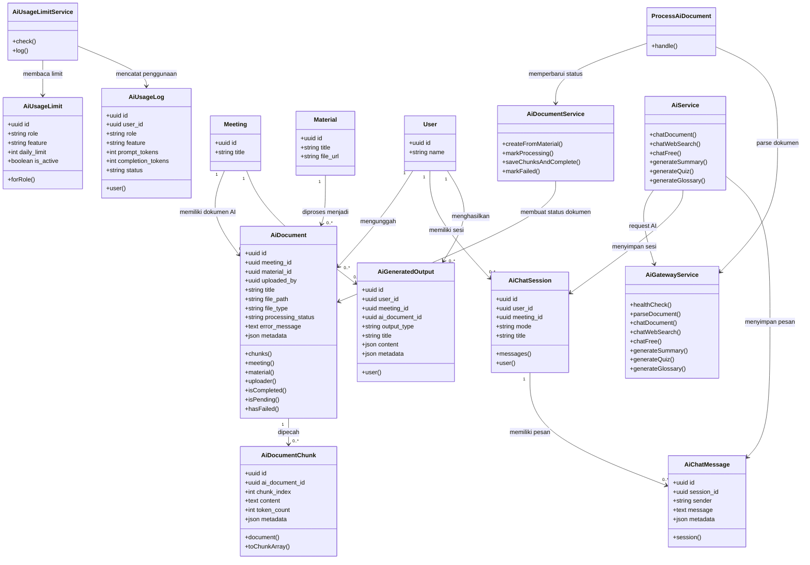
```mermaid
classDiagram
    class AiDocument {
        +uuid id
        +uuid meeting_id
        +uuid material_id
        +uuid uploaded_by
        +string title
        +string file_path
        +string file_type
        +string processing_status
        +text error_message
        +json metadata
        +chunks()
        +meeting()
        +material()
        +uploader()
        +isCompleted()
        +isPending()
        +hasFailed()
    }

    class AiDocumentChunk {
        +uuid id
        +uuid ai_document_id
        +int chunk_index
        +text content
        +int token_count
        +json metadata
        +document()
        +toChunkArray()
    }

    class AiChatSession {
        +uuid id
        +uuid user_id
        +uuid meeting_id
        +string mode
        +string title
        +messages()
        +user()
    }

    class AiChatMessage {
        +uuid id
        +uuid session_id
        +string sender
        +text message
        +json metadata
        +session()
    }

    class AiGeneratedOutput {
        +uuid id
        +uuid user_id
        +uuid meeting_id
        +uuid ai_document_id
        +string output_type
        +string title
        +json content
        +json metadata
        +user()
    }

    class AiUsageLimit {
        +uuid id
        +string role
        +string feature
        +int daily_limit
        +boolean is_active
        +forRole()
    }

    class AiUsageLog {
        +uuid id
        +uuid user_id
        +string role
        +string feature
        +int prompt_tokens
        +int completion_tokens
        +string status
        +user()
    }

    class Meeting {
        +uuid id
        +string title
    }

    class Material {
        +uuid id
        +string title
        +string file_url
    }

    class User {
        +uuid id
        +string name
    }

    class AiDocumentService {
        +createFromMaterial()
        +markProcessing()
        +saveChunksAndComplete()
        +markFailed()
    }

    class AiService {
        +chatDocument()
        +chatWebSearch()
        +chatFree()
        +generateSummary()
        +generateQuiz()
        +generateGlossary()
    }

    class AiGatewayService {
        +healthCheck()
        +parseDocument()
        +chatDocument()
        +chatWebSearch()
        +chatFree()
        +generateSummary()
        +generateQuiz()
        +generateGlossary()
    }

    class AiUsageLimitService {
        +check()
        +log()
    }

    class ProcessAiDocument {
        +handle()
    }

    Meeting "1" --> "0..*" AiDocument : memiliki dokumen AI
    Material "1" --> "0..*" AiDocument : diproses menjadi
    User "1" --> "0..*" AiDocument : mengunggah
    AiDocument "1" --> "0..*" AiDocumentChunk : dipecah
    User "1" --> "0..*" AiChatSession : memiliki sesi
    AiChatSession "1" --> "0..*" AiChatMessage : memiliki pesan
    User "1" --> "0..*" AiGeneratedOutput : menghasilkan
    Meeting "1" --> "0..*" AiGeneratedOutput : konteks output
    AiDocumentService --> AiDocument : membuat status dokumen
    ProcessAiDocument --> AiDocumentService : memperbarui status
    ProcessAiDocument --> AiGatewayService : parse dokumen
    AiService --> AiGatewayService : request AI
    AiService --> AiChatSession : menyimpan sesi
    AiService --> AiChatMessage : menyimpan pesan
    AiUsageLimitService --> AiUsageLimit : membaca limit
    AiUsageLimitService --> AiUsageLog : mencatat penggunaan
```

---

## 3.6 Class Diagram Domain Face Recognition

Diagram ini menunjukkan hubungan data wajah siswa, absensi, percobaan absensi, dan service pengenalan wajah.

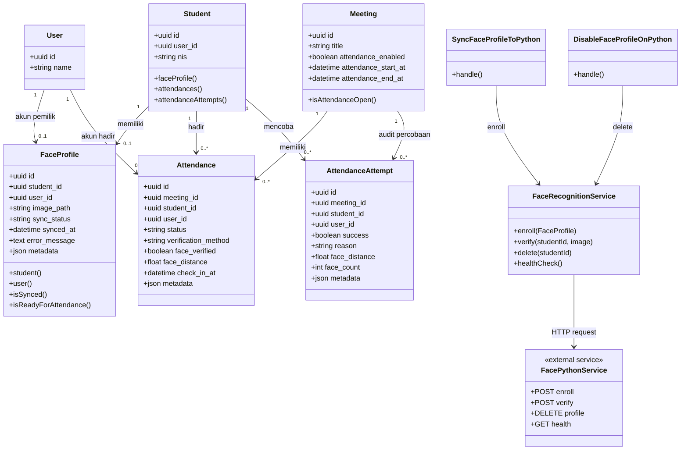
```mermaid
classDiagram
    class FaceProfile {
        +uuid id
        +uuid student_id
        +uuid user_id
        +string image_path
        +string sync_status
        +datetime synced_at
        +text error_message
        +json metadata
        +student()
        +user()
        +isSynced()
        +isReadyForAttendance()
    }

    class Attendance {
        +uuid id
        +uuid meeting_id
        +uuid student_id
        +uuid user_id
        +string status
        +string verification_method
        +boolean face_verified
        +float face_distance
        +datetime check_in_at
        +json metadata
    }

    class AttendanceAttempt {
        +uuid id
        +uuid meeting_id
        +uuid student_id
        +uuid user_id
        +boolean success
        +string reason
        +float face_distance
        +int face_count
        +json metadata
    }

    class Student {
        +uuid id
        +uuid user_id
        +string nis
        +faceProfile()
        +attendances()
        +attendanceAttempts()
    }

    class User {
        +uuid id
        +string name
    }

    class Meeting {
        +uuid id
        +string title
        +boolean attendance_enabled
        +datetime attendance_start_at
        +datetime attendance_end_at
        +isAttendanceOpen()
    }

    class FaceRecognitionService {
        +enroll(FaceProfile)
        +verify(studentId, image)
        +delete(studentId)
        +healthCheck()
    }

    class SyncFaceProfileToPython {
        +handle()
    }

    class DisableFaceProfileOnPython {
        +handle()
    }

    class FacePythonService {
        <<external service>>
        +POST enroll
        +POST verify
        +DELETE profile
        +GET health
    }

    Student "1" --> "0..1" FaceProfile : memiliki
    User "1" --> "0..1" FaceProfile : akun pemilik
    Meeting "1" --> "0..*" Attendance : memiliki
    Student "1" --> "0..*" Attendance : hadir
    User "1" --> "0..*" Attendance : akun hadir
    Meeting "1" --> "0..*" AttendanceAttempt : audit percobaan
    Student "1" --> "0..*" AttendanceAttempt : mencoba
    FaceRecognitionService --> FacePythonService : HTTP request
    SyncFaceProfileToPython --> FaceRecognitionService : enroll
    DisableFaceProfileOnPython --> FaceRecognitionService : delete
```

---

# 4. Sequence Diagram

## 4.1 Sequence Diagram Login dan Redirect Role

Diagram ini menggambarkan proses login, validasi kredensial, pembacaan role, dan redirect ke dashboard sesuai role.

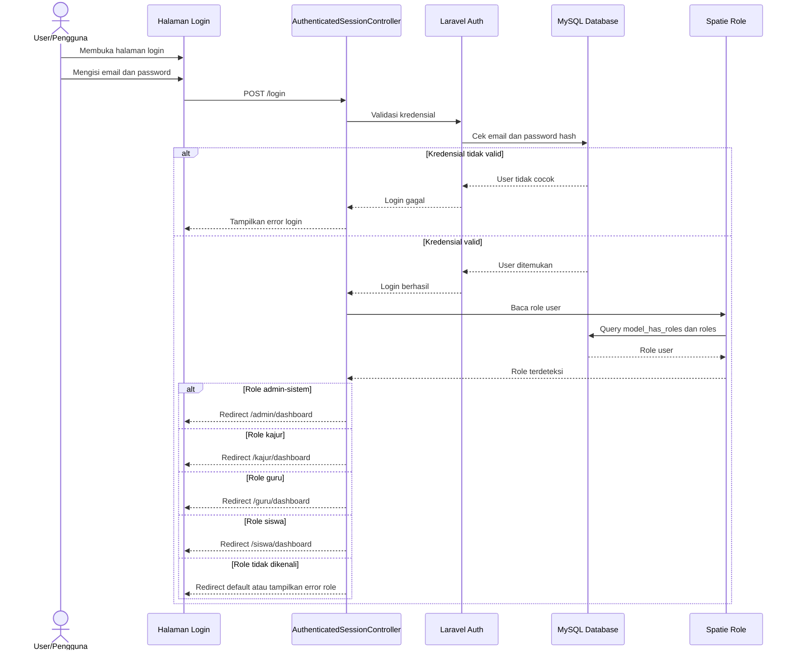
```mermaid
sequenceDiagram
    actor User as User/Pengguna
    participant UI as Halaman Login
    participant AuthController as AuthenticatedSessionController
    participant Auth as Laravel Auth
    participant DB as MySQL Database
    participant Role as Spatie Role

    User->>UI: Membuka halaman login
    User->>UI: Mengisi email dan password
    UI->>AuthController: POST /login
    AuthController->>Auth: Validasi kredensial
    Auth->>DB: Cek email dan password hash

    alt Kredensial tidak valid
        DB-->>Auth: User tidak cocok
        Auth-->>AuthController: Login gagal
        AuthController-->>UI: Tampilkan error login
    else Kredensial valid
        DB-->>Auth: User ditemukan
        Auth-->>AuthController: Login berhasil
        AuthController->>Role: Baca role user
        Role->>DB: Query model_has_roles dan roles
        DB-->>Role: Role user
        Role-->>AuthController: Role terdeteksi

        alt Role admin-sistem
            AuthController-->>UI: Redirect /admin/dashboard
        else Role kajur
            AuthController-->>UI: Redirect /kajur/dashboard
        else Role guru
            AuthController-->>UI: Redirect /guru/dashboard
        else Role siswa
            AuthController-->>UI: Redirect /siswa/dashboard
        else Role tidak dikenali
            AuthController-->>UI: Redirect default atau tampilkan error role
        end
    end
```

---

## 4.2 Sequence Diagram Admin Membuat User Baru

Diagram ini menggambarkan pembuatan user oleh Admin Sistem, termasuk pembuatan profil guru/siswa atau penugasan kajur apabila role membutuhkan profil turunan.

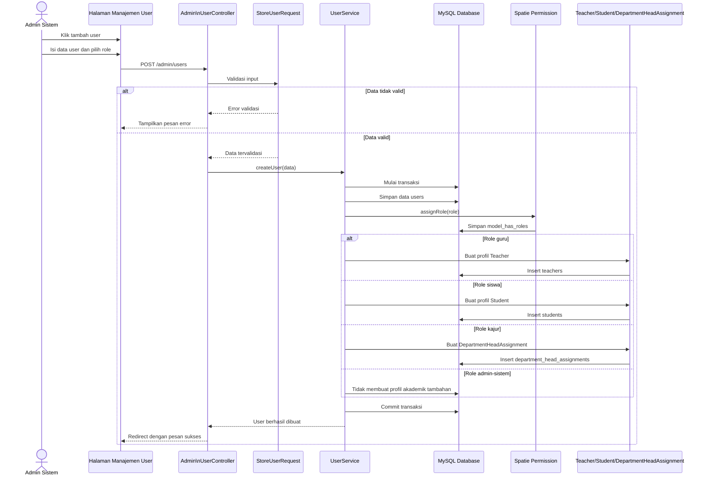
```mermaid
sequenceDiagram
    actor Admin as Admin Sistem
    participant UI as Halaman Manajemen User
    participant Controller as Admin\nUserController
    participant Request as StoreUserRequest
    participant Service as UserService
    participant DB as MySQL Database
    participant Role as Spatie Permission
    participant Profile as Teacher/Student/DepartmentHeadAssignment

    Admin->>UI: Klik tambah user
    Admin->>UI: Isi data user dan pilih role
    UI->>Controller: POST /admin/users
    Controller->>Request: Validasi input

    alt Data tidak valid
        Request-->>Controller: Error validasi
        Controller-->>UI: Tampilkan pesan error
    else Data valid
        Request-->>Controller: Data tervalidasi
        Controller->>Service: createUser(data)
        Service->>DB: Mulai transaksi
        Service->>DB: Simpan data users
        Service->>Role: assignRole(role)
        Role->>DB: Simpan model_has_roles

        alt Role guru
            Service->>Profile: Buat profil Teacher
            Profile->>DB: Insert teachers
        else Role siswa
            Service->>Profile: Buat profil Student
            Profile->>DB: Insert students
        else Role kajur
            Service->>Profile: Buat DepartmentHeadAssignment
            Profile->>DB: Insert department_head_assignments
        else Role admin-sistem
            Service->>DB: Tidak membuat profil akademik tambahan
        end

        Service->>DB: Commit transaksi
        Service-->>Controller: User berhasil dibuat
        Controller-->>UI: Redirect dengan pesan sukses
    end
```

---

## 4.3 Sequence Diagram Admin Mengelola Data Akademik

Diagram ini mewakili pola umum CRUD untuk data akademik seperti jurusan, tahun ajaran, semester, kelas, mata pelajaran, pengampu, dan jadwal.

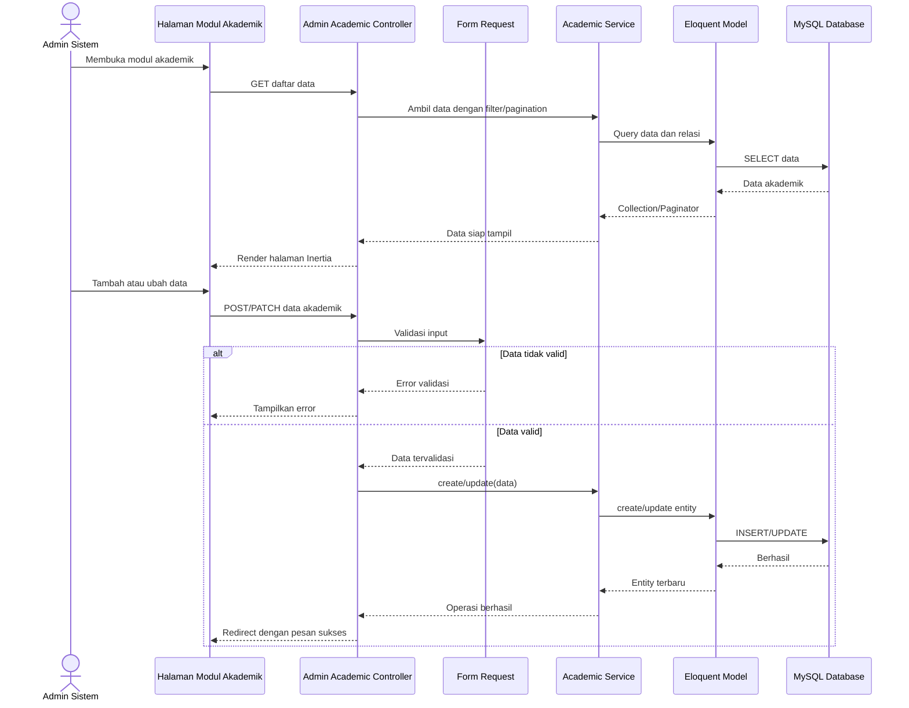
```mermaid
sequenceDiagram
    actor Admin as Admin Sistem
    participant UI as Halaman Modul Akademik
    participant Controller as Admin Academic Controller
    participant Request as Form Request
    participant Service as Academic Service
    participant Model as Eloquent Model
    participant DB as MySQL Database

    Admin->>UI: Membuka modul akademik
    UI->>Controller: GET daftar data
    Controller->>Service: Ambil data dengan filter/pagination
    Service->>Model: Query data dan relasi
    Model->>DB: SELECT data
    DB-->>Model: Data akademik
    Model-->>Service: Collection/Paginator
    Service-->>Controller: Data siap tampil
    Controller-->>UI: Render halaman Inertia

    Admin->>UI: Tambah atau ubah data
    UI->>Controller: POST/PATCH data akademik
    Controller->>Request: Validasi input

    alt Data tidak valid
        Request-->>Controller: Error validasi
        Controller-->>UI: Tampilkan error
    else Data valid
        Request-->>Controller: Data tervalidasi
        Controller->>Service: create/update(data)
        Service->>Model: create/update entity
        Model->>DB: INSERT/UPDATE
        DB-->>Model: Berhasil
        Model-->>Service: Entity terbaru
        Service-->>Controller: Operasi berhasil
        Controller-->>UI: Redirect dengan pesan sukses
    end
```

---

## 4.4 Sequence Diagram Guru Membuat Pertemuan

Diagram ini menggambarkan proses guru membuat pertemuan pada mata pelajaran yang sedang diampu.

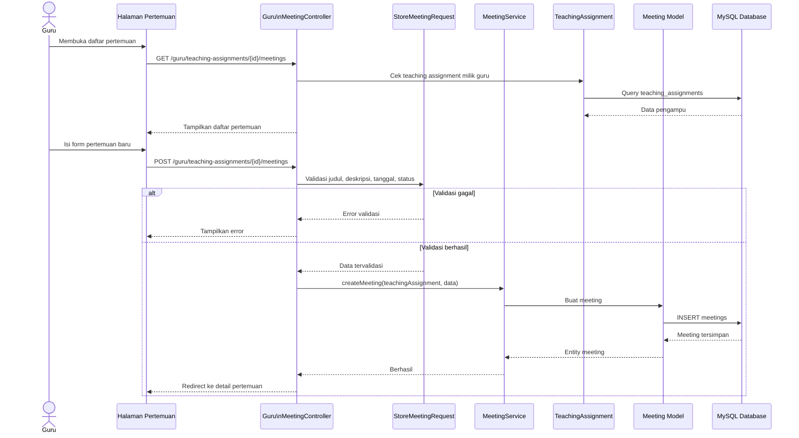
```mermaid
sequenceDiagram
    actor Guru as Guru
    participant UI as Halaman Pertemuan
    participant Controller as Guru\nMeetingController
    participant Request as StoreMeetingRequest
    participant Service as MeetingService
    participant TA as TeachingAssignment
    participant Meeting as Meeting Model
    participant DB as MySQL Database

    Guru->>UI: Membuka daftar pertemuan
    UI->>Controller: GET /guru/teaching-assignments/{id}/meetings
    Controller->>TA: Cek teaching assignment milik guru
    TA->>DB: Query teaching_assignments
    DB-->>TA: Data pengampu
    Controller-->>UI: Tampilkan daftar pertemuan

    Guru->>UI: Isi form pertemuan baru
    UI->>Controller: POST /guru/teaching-assignments/{id}/meetings
    Controller->>Request: Validasi judul, deskripsi, tanggal, status

    alt Validasi gagal
        Request-->>Controller: Error validasi
        Controller-->>UI: Tampilkan error
    else Validasi berhasil
        Request-->>Controller: Data tervalidasi
        Controller->>Service: createMeeting(teachingAssignment, data)
        Service->>Meeting: Buat meeting
        Meeting->>DB: INSERT meetings
        DB-->>Meeting: Meeting tersimpan
        Meeting-->>Service: Entity meeting
        Service-->>Controller: Berhasil
        Controller-->>UI: Redirect ke detail pertemuan
    end
```

---

## 4.5 Sequence Diagram Guru Upload Materi dan Proses AI

Diagram ini menggambarkan alur lengkap guru mengunggah materi, lalu memproses dokumen ke service AI. Proses AI berjalan melalui job agar tidak membebani request utama.

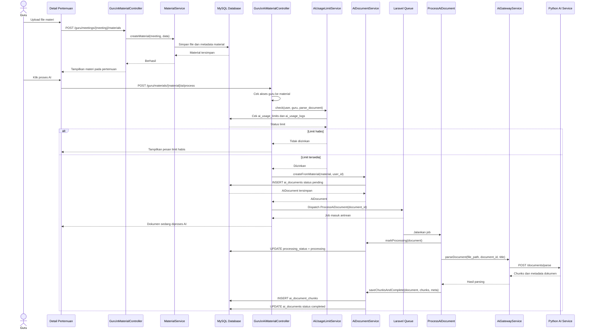
```mermaid
sequenceDiagram
    actor Guru as Guru
    participant UI as Detail Pertemuan
    participant MaterialController as Guru\nMaterialController
    participant MaterialService as MaterialService
    participant DB as MySQL Database
    participant AiController as Guru\nAiMaterialController
    participant Limit as AiUsageLimitService
    participant DocService as AiDocumentService
    participant Queue as Laravel Queue
    participant Job as ProcessAiDocument
    participant Gateway as AiGatewayService
    participant PythonAI as Python AI Service

    Guru->>UI: Upload file materi
    UI->>MaterialController: POST /guru/meetings/{meeting}/materials
    MaterialController->>MaterialService: createMaterial(meeting, data)
    MaterialService->>DB: Simpan file dan metadata material
    DB-->>MaterialService: Material tersimpan
    MaterialService-->>MaterialController: Berhasil
    MaterialController-->>UI: Tampilkan materi pada pertemuan

    Guru->>UI: Klik proses AI
    UI->>AiController: POST /guru/materials/{material}/ai/process
    AiController->>AiController: Cek akses guru ke material
    AiController->>Limit: check(user, guru, parse_document)
    Limit->>DB: Cek ai_usage_limits dan ai_usage_logs
    DB-->>Limit: Status limit

    alt Limit habis
        Limit-->>AiController: Tidak diizinkan
        AiController-->>UI: Tampilkan pesan limit habis
    else Limit tersedia
        Limit-->>AiController: Diizinkan
        AiController->>DocService: createFromMaterial(material, user_id)
        DocService->>DB: INSERT ai_documents status pending
        DB-->>DocService: AiDocument tersimpan
        DocService-->>AiController: AiDocument
        AiController->>Queue: Dispatch ProcessAiDocument(document_id)
        Queue-->>AiController: Job masuk antrean
        AiController-->>UI: Dokumen sedang diproses AI

        Queue->>Job: Jalankan job
        Job->>DocService: markProcessing(document)
        DocService->>DB: UPDATE processing_status = processing
        Job->>Gateway: parseDocument(file_path, document_id, title)
        Gateway->>PythonAI: POST /documents/parse
        PythonAI-->>Gateway: Chunks dan metadata dokumen
        Gateway-->>Job: Hasil parsing
        Job->>DocService: saveChunksAndComplete(document, chunks, meta)
        DocService->>DB: INSERT ai_document_chunks
        DocService->>DB: UPDATE ai_documents status completed
    end
```

---

## 4.6 Sequence Diagram Guru Generate Ringkasan, Kuis, atau Glosarium

Diagram ini mewakili proses guru meminta output AI berbasis dokumen yang telah selesai diproses.

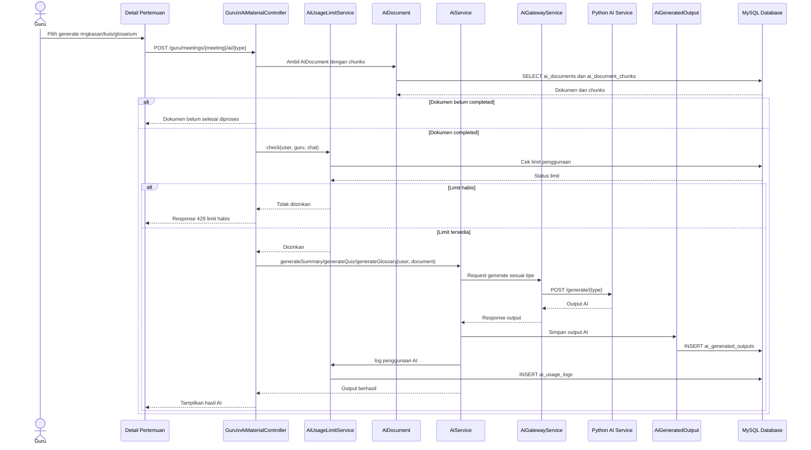
```mermaid
sequenceDiagram
    actor Guru as Guru
    participant UI as Detail Pertemuan
    participant Controller as Guru\nAiMaterialController
    participant Limit as AiUsageLimitService
    participant Doc as AiDocument
    participant Service as AiService
    participant Gateway as AiGatewayService
    participant PythonAI as Python AI Service
    participant Output as AiGeneratedOutput
    participant DB as MySQL Database

    Guru->>UI: Pilih generate ringkasan/kuis/glosarium
    UI->>Controller: POST /guru/meetings/{meeting}/ai/{type}
    Controller->>Doc: Ambil AiDocument dengan chunks
    Doc->>DB: SELECT ai_documents dan ai_document_chunks
    DB-->>Doc: Dokumen dan chunks

    alt Dokumen belum completed
        Controller-->>UI: Dokumen belum selesai diproses
    else Dokumen completed
        Controller->>Limit: check(user, guru, chat)
        Limit->>DB: Cek limit penggunaan
        DB-->>Limit: Status limit

        alt Limit habis
            Limit-->>Controller: Tidak diizinkan
            Controller-->>UI: Response 429 limit habis
        else Limit tersedia
            Limit-->>Controller: Diizinkan
            Controller->>Service: generateSummary/generateQuiz/generateGlossary(user, document)
            Service->>Gateway: Request generate sesuai tipe
            Gateway->>PythonAI: POST /generate/{type}
            PythonAI-->>Gateway: Output AI
            Gateway-->>Service: Response output
            Service->>Output: Simpan output AI
            Output->>DB: INSERT ai_generated_outputs
            Service->>Limit: log penggunaan AI
            Limit->>DB: INSERT ai_usage_logs
            Service-->>Controller: Output berhasil
            Controller-->>UI: Tampilkan hasil AI
        end
    end
```

---

## 4.7 Sequence Diagram Siswa Mengakses Materi Pembelajaran

Diagram ini menggambarkan siswa membuka daftar mata pelajaran, memilih pertemuan, lalu membaca materi yang tersedia.

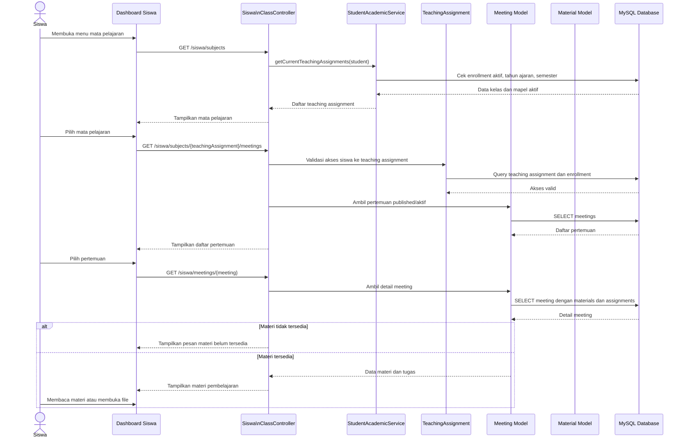
```mermaid
sequenceDiagram
    actor Siswa as Siswa
    participant UI as Dashboard Siswa
    participant Controller as Siswa\nClassController
    participant Academic as StudentAcademicService
    participant TA as TeachingAssignment
    participant Meeting as Meeting Model
    participant Material as Material Model
    participant DB as MySQL Database

    Siswa->>UI: Membuka menu mata pelajaran
    UI->>Controller: GET /siswa/subjects
    Controller->>Academic: getCurrentTeachingAssignments(student)
    Academic->>DB: Cek enrollment aktif, tahun ajaran, semester
    DB-->>Academic: Data kelas dan mapel aktif
    Academic-->>Controller: Daftar teaching assignment
    Controller-->>UI: Tampilkan mata pelajaran

    Siswa->>UI: Pilih mata pelajaran
    UI->>Controller: GET /siswa/subjects/{teachingAssignment}/meetings
    Controller->>TA: Validasi akses siswa ke teaching assignment
    TA->>DB: Query teaching assignment dan enrollment
    DB-->>TA: Akses valid
    Controller->>Meeting: Ambil pertemuan published/aktif
    Meeting->>DB: SELECT meetings
    DB-->>Meeting: Daftar pertemuan
    Controller-->>UI: Tampilkan daftar pertemuan

    Siswa->>UI: Pilih pertemuan
    UI->>Controller: GET /siswa/meetings/{meeting}
    Controller->>Meeting: Ambil detail meeting
    Meeting->>DB: SELECT meeting dengan materials dan assignments
    DB-->>Meeting: Detail meeting

    alt Materi tidak tersedia
        Controller-->>UI: Tampilkan pesan materi belum tersedia
    else Materi tersedia
        Meeting-->>Controller: Data materi dan tugas
        Controller-->>UI: Tampilkan materi pembelajaran
        Siswa->>UI: Membaca materi atau membuka file
    end
```

---

## 4.8 Sequence Diagram Siswa Mengumpulkan Tugas

Diagram ini menggambarkan siswa mengirim jawaban teks atau file pada tugas yang tersedia.

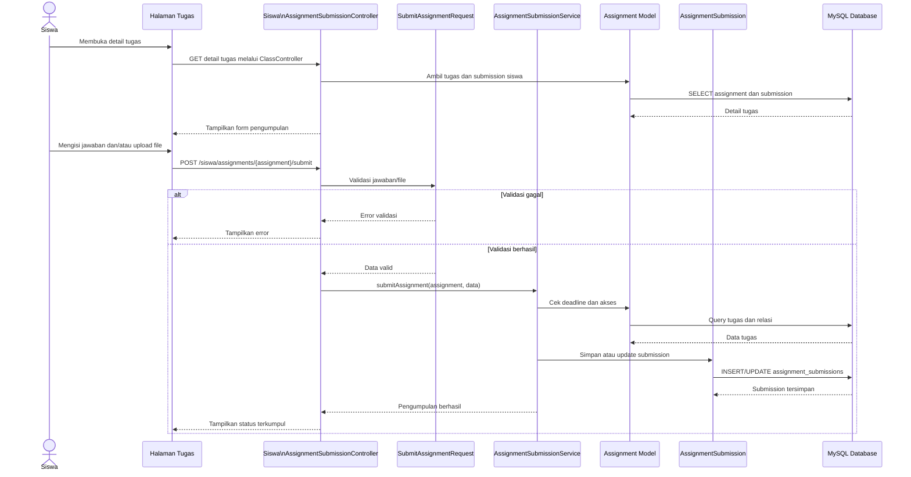
```mermaid
sequenceDiagram
    actor Siswa as Siswa
    participant UI as Halaman Tugas
    participant Controller as Siswa\nAssignmentSubmissionController
    participant Request as SubmitAssignmentRequest
    participant Service as AssignmentSubmissionService
    participant Assignment as Assignment Model
    participant Submission as AssignmentSubmission
    participant DB as MySQL Database

    Siswa->>UI: Membuka detail tugas
    UI->>Controller: GET detail tugas melalui ClassController
    Controller->>Assignment: Ambil tugas dan submission siswa
    Assignment->>DB: SELECT assignment dan submission
    DB-->>Assignment: Detail tugas
    Controller-->>UI: Tampilkan form pengumpulan

    Siswa->>UI: Mengisi jawaban dan/atau upload file
    UI->>Controller: POST /siswa/assignments/{assignment}/submit
    Controller->>Request: Validasi jawaban/file

    alt Validasi gagal
        Request-->>Controller: Error validasi
        Controller-->>UI: Tampilkan error
    else Validasi berhasil
        Request-->>Controller: Data valid
        Controller->>Service: submitAssignment(assignment, data)
        Service->>Assignment: Cek deadline dan akses
        Assignment->>DB: Query tugas dan relasi
        DB-->>Assignment: Data tugas
        Service->>Submission: Simpan atau update submission
        Submission->>DB: INSERT/UPDATE assignment_submissions
        DB-->>Submission: Submission tersimpan
        Service-->>Controller: Pengumpulan berhasil
        Controller-->>UI: Tampilkan status terkumpul
    end
```

---

## 4.9 Sequence Diagram Guru Menilai Tugas

Diagram ini menggambarkan guru membuka daftar submission, memberi nilai, dan sistem menyimpan feedback.

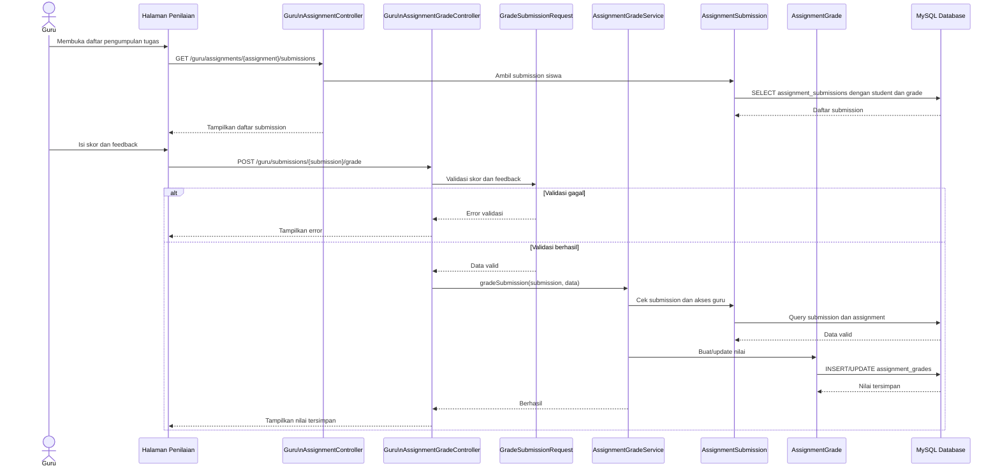
```mermaid
sequenceDiagram
    actor Guru as Guru
    participant UI as Halaman Penilaian
    participant AssignmentController as Guru\nAssignmentController
    participant GradeController as Guru\nAssignmentGradeController
    participant Request as GradeSubmissionRequest
    participant Service as AssignmentGradeService
    participant Submission as AssignmentSubmission
    participant Grade as AssignmentGrade
    participant DB as MySQL Database

    Guru->>UI: Membuka daftar pengumpulan tugas
    UI->>AssignmentController: GET /guru/assignments/{assignment}/submissions
    AssignmentController->>Submission: Ambil submission siswa
    Submission->>DB: SELECT assignment_submissions dengan student dan grade
    DB-->>Submission: Daftar submission
    AssignmentController-->>UI: Tampilkan daftar submission

    Guru->>UI: Isi skor dan feedback
    UI->>GradeController: POST /guru/submissions/{submission}/grade
    GradeController->>Request: Validasi skor dan feedback

    alt Validasi gagal
        Request-->>GradeController: Error validasi
        GradeController-->>UI: Tampilkan error
    else Validasi berhasil
        Request-->>GradeController: Data valid
        GradeController->>Service: gradeSubmission(submission, data)
        Service->>Submission: Cek submission dan akses guru
        Submission->>DB: Query submission dan assignment
        DB-->>Submission: Data valid
        Service->>Grade: Buat/update nilai
        Grade->>DB: INSERT/UPDATE assignment_grades
        DB-->>Grade: Nilai tersimpan
        Service-->>GradeController: Berhasil
        GradeController-->>UI: Tampilkan nilai tersimpan
    end
```

---

## 4.10 Sequence Diagram Absensi Face Recognition Siswa

Diagram ini menggambarkan alur absensi wajah. Laravel melakukan validasi berlapis terlebih dahulu sebelum memanggil service Python.

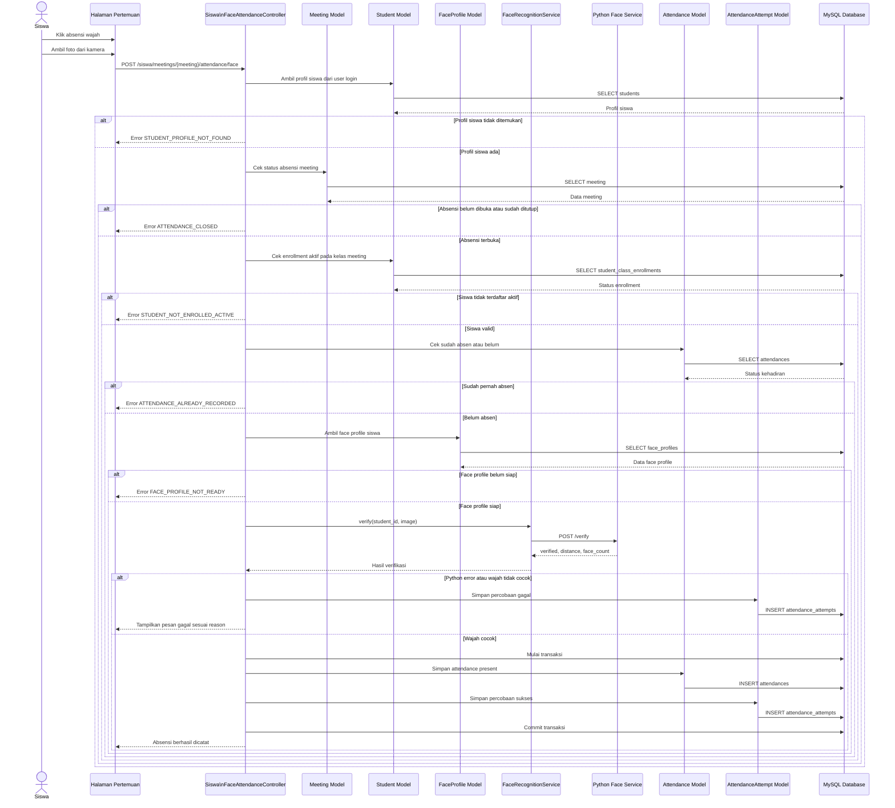
```mermaid
sequenceDiagram
    actor Siswa as Siswa
    participant UI as Halaman Pertemuan
    participant Controller as Siswa\nFaceAttendanceController
    participant Meeting as Meeting Model
    participant Student as Student Model
    participant FaceProfile as FaceProfile Model
    participant FaceService as FaceRecognitionService
    participant PythonFace as Python Face Service
    participant Attendance as Attendance Model
    participant Attempt as AttendanceAttempt Model
    participant DB as MySQL Database

    Siswa->>UI: Klik absensi wajah
    Siswa->>UI: Ambil foto dari kamera
    UI->>Controller: POST /siswa/meetings/{meeting}/attendance/face
    Controller->>Student: Ambil profil siswa dari user login
    Student->>DB: SELECT students
    DB-->>Student: Profil siswa

    alt Profil siswa tidak ditemukan
        Controller-->>UI: Error STUDENT_PROFILE_NOT_FOUND
    else Profil siswa ada
        Controller->>Meeting: Cek status absensi meeting
        Meeting->>DB: SELECT meeting
        DB-->>Meeting: Data meeting

        alt Absensi belum dibuka atau sudah ditutup
            Controller-->>UI: Error ATTENDANCE_CLOSED
        else Absensi terbuka
            Controller->>Student: Cek enrollment aktif pada kelas meeting
            Student->>DB: SELECT student_class_enrollments
            DB-->>Student: Status enrollment

            alt Siswa tidak terdaftar aktif
                Controller-->>UI: Error STUDENT_NOT_ENROLLED_ACTIVE
            else Siswa valid
                Controller->>Attendance: Cek sudah absen atau belum
                Attendance->>DB: SELECT attendances
                DB-->>Attendance: Status kehadiran

                alt Sudah pernah absen
                    Controller-->>UI: Error ATTENDANCE_ALREADY_RECORDED
                else Belum absen
                    Controller->>FaceProfile: Ambil face profile siswa
                    FaceProfile->>DB: SELECT face_profiles
                    DB-->>FaceProfile: Data face profile

                    alt Face profile belum siap
                        Controller-->>UI: Error FACE_PROFILE_NOT_READY
                    else Face profile siap
                        Controller->>FaceService: verify(student_id, image)
                        FaceService->>PythonFace: POST /verify
                        PythonFace-->>FaceService: verified, distance, face_count
                        FaceService-->>Controller: Hasil verifikasi

                        alt Python error atau wajah tidak cocok
                            Controller->>Attempt: Simpan percobaan gagal
                            Attempt->>DB: INSERT attendance_attempts
                            Controller-->>UI: Tampilkan pesan gagal sesuai reason
                        else Wajah cocok
                            Controller->>DB: Mulai transaksi
                            Controller->>Attendance: Simpan attendance present
                            Attendance->>DB: INSERT attendances
                            Controller->>Attempt: Simpan percobaan sukses
                            Attempt->>DB: INSERT attendance_attempts
                            Controller->>DB: Commit transaksi
                            Controller-->>UI: Absensi berhasil dicatat
                        end
                    end
                end
            end
        end
    end
```

---

## 4.11 Sequence Diagram Sinkronisasi Face Profile ke Python

Diagram ini menggambarkan admin/guru melakukan *resync* profil wajah siswa ke service Python.

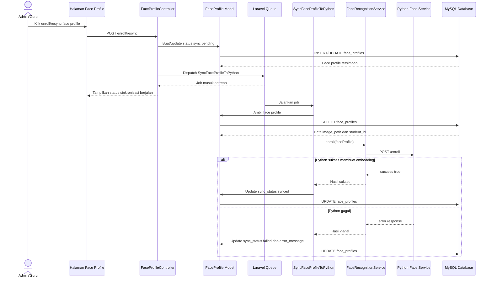
```mermaid
sequenceDiagram
    actor Pengelola as Admin/Guru
    participant UI as Halaman Face Profile
    participant Controller as FaceProfileController
    participant FaceProfile as FaceProfile Model
    participant Queue as Laravel Queue
    participant Job as SyncFaceProfileToPython
    participant FaceService as FaceRecognitionService
    participant PythonFace as Python Face Service
    participant DB as MySQL Database

    Pengelola->>UI: Klik enroll/resync face profile
    UI->>Controller: POST enroll/resync
    Controller->>FaceProfile: Buat/update status sync pending
    FaceProfile->>DB: INSERT/UPDATE face_profiles
    DB-->>FaceProfile: Face profile tersimpan
    Controller->>Queue: Dispatch SyncFaceProfileToPython
    Queue-->>Controller: Job masuk antrean
    Controller-->>UI: Tampilkan status sinkronisasi berjalan

    Queue->>Job: Jalankan job
    Job->>FaceProfile: Ambil face profile
    FaceProfile->>DB: SELECT face_profiles
    DB-->>FaceProfile: Data image_path dan student_id
    Job->>FaceService: enroll(faceProfile)
    FaceService->>PythonFace: POST /enroll

    alt Python sukses membuat embedding
        PythonFace-->>FaceService: success true
        FaceService-->>Job: Hasil sukses
        Job->>FaceProfile: Update sync_status synced
        FaceProfile->>DB: UPDATE face_profiles
    else Python gagal
        PythonFace-->>FaceService: error response
        FaceService-->>Job: Hasil gagal
        Job->>FaceProfile: Update sync_status failed dan error_message
        FaceProfile->>DB: UPDATE face_profiles
    end
```

---

## 4.12 Sequence Diagram AI Tutor Berbasis Dokumen

Diagram ini menggambarkan siswa bertanya kepada AI berdasarkan materi yang sudah diproses menjadi *chunk*.

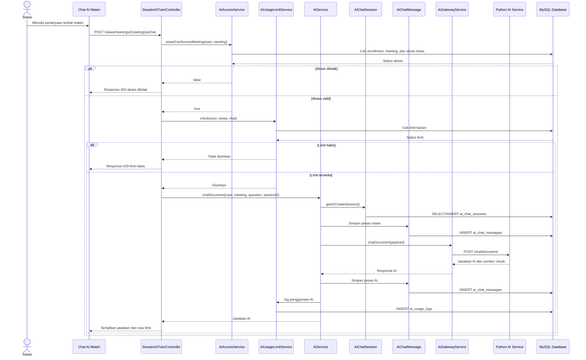
```mermaid
sequenceDiagram
    actor Siswa as Siswa
    participant UI as Chat AI Materi
    participant Controller as Siswa\nAiTutorController
    participant Access as AiAccessService
    participant Limit as AiUsageLimitService
    participant Service as AiService
    participant Session as AiChatSession
    participant Message as AiChatMessage
    participant Gateway as AiGatewayService
    participant PythonAI as Python AI Service
    participant DB as MySQL Database

    Siswa->>UI: Menulis pertanyaan terkait materi
    UI->>Controller: POST /siswa/meetings/{meeting}/ai/chat
    Controller->>Access: siswaCanAccessMeeting(user, meeting)
    Access->>DB: Cek enrollment, meeting, dan akses kelas
    DB-->>Access: Status akses

    alt Akses ditolak
        Access-->>Controller: false
        Controller-->>UI: Response 403 akses ditolak
    else Akses valid
        Access-->>Controller: true
        Controller->>Limit: check(user, siswa, chat)
        Limit->>DB: Cek limit harian
        DB-->>Limit: Status limit

        alt Limit habis
            Limit-->>Controller: Tidak diizinkan
            Controller-->>UI: Response 429 limit habis
        else Limit tersedia
            Limit-->>Controller: Diizinkan
            Controller->>Service: chatDocument(user, meeting, question, sessionId)
            Service->>Session: getOrCreateSession()
            Session->>DB: SELECT/INSERT ai_chat_sessions
            Service->>Message: Simpan pesan siswa
            Message->>DB: INSERT ai_chat_messages
            Service->>Gateway: chatDocument(payload)
            Gateway->>PythonAI: POST /chat/document
            PythonAI-->>Gateway: Jawaban AI dan sumber chunk
            Gateway-->>Service: Response AI
            Service->>Message: Simpan pesan AI
            Message->>DB: INSERT ai_chat_messages
            Service->>Limit: log penggunaan AI
            Limit->>DB: INSERT ai_usage_logs
            Service-->>Controller: Jawaban AI
            Controller-->>UI: Tampilkan jawaban dan sisa limit
        end
    end
```

---

## 4.13 Sequence Diagram AI Web Search

Diagram ini menggambarkan siswa memakai AI untuk pencarian web. Proses tetap melewati validasi akses meeting dan limit penggunaan.

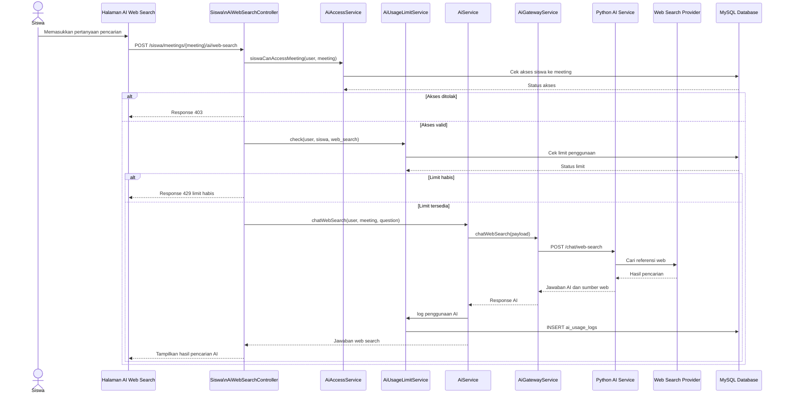
```mermaid
sequenceDiagram
    actor Siswa as Siswa
    participant UI as Halaman AI Web Search
    participant Controller as Siswa\nAiWebSearchController
    participant Access as AiAccessService
    participant Limit as AiUsageLimitService
    participant Service as AiService
    participant Gateway as AiGatewayService
    participant PythonAI as Python AI Service
    participant WebSearch as Web Search Provider
    participant DB as MySQL Database

    Siswa->>UI: Memasukkan pertanyaan pencarian
    UI->>Controller: POST /siswa/meetings/{meeting}/ai/web-search
    Controller->>Access: siswaCanAccessMeeting(user, meeting)
    Access->>DB: Cek akses siswa ke meeting
    DB-->>Access: Status akses

    alt Akses ditolak
        Controller-->>UI: Response 403
    else Akses valid
        Controller->>Limit: check(user, siswa, web_search)
        Limit->>DB: Cek limit penggunaan
        DB-->>Limit: Status limit

        alt Limit habis
            Controller-->>UI: Response 429 limit habis
        else Limit tersedia
            Controller->>Service: chatWebSearch(user, meeting, question)
            Service->>Gateway: chatWebSearch(payload)
            Gateway->>PythonAI: POST /chat/web-search
            PythonAI->>WebSearch: Cari referensi web
            WebSearch-->>PythonAI: Hasil pencarian
            PythonAI-->>Gateway: Jawaban AI dan sumber web
            Gateway-->>Service: Response AI
            Service->>Limit: log penggunaan AI
            Limit->>DB: INSERT ai_usage_logs
            Service-->>Controller: Jawaban web search
            Controller-->>UI: Tampilkan hasil pencarian AI
        end
    end
```

---

## 4.14 Sequence Diagram Kajur Monitoring Progress Kelas

Diagram ini menggambarkan kajur membuka monitoring progress kelas, melihat pertemuan, tugas, submission, nilai, dan perkembangan pembelajaran.

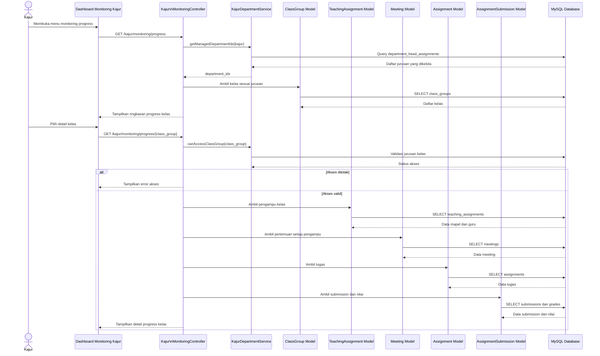
```mermaid
sequenceDiagram
    actor Kajur as Kajur
    participant UI as Dashboard Monitoring Kajur
    participant Controller as Kajur\nMonitoringController
    participant DeptService as KajurDepartmentService
    participant ClassGroup as ClassGroup Model
    participant TA as TeachingAssignment Model
    participant Meeting as Meeting Model
    participant Assignment as Assignment Model
    participant Submission as AssignmentSubmission Model
    participant DB as MySQL Database

    Kajur->>UI: Membuka menu monitoring progress
    UI->>Controller: GET /kajur/monitoring/progress
    Controller->>DeptService: getManagedDepartmentIds(kajur)
    DeptService->>DB: Query department_head_assignments
    DB-->>DeptService: Daftar jurusan yang dikelola
    DeptService-->>Controller: department_ids
    Controller->>ClassGroup: Ambil kelas sesuai jurusan
    ClassGroup->>DB: SELECT class_groups
    DB-->>ClassGroup: Daftar kelas
    Controller-->>UI: Tampilkan ringkasan progress kelas

    Kajur->>UI: Pilih detail kelas
    UI->>Controller: GET /kajur/monitoring/progress/{class_group}
    Controller->>DeptService: canAccessClassGroup(class_group)
    DeptService->>DB: Validasi jurusan kelas
    DB-->>DeptService: Status akses

    alt Akses ditolak
        Controller-->>UI: Tampilkan error akses
    else Akses valid
        Controller->>TA: Ambil pengampu kelas
        TA->>DB: SELECT teaching_assignments
        DB-->>TA: Data mapel dan guru
        Controller->>Meeting: Ambil pertemuan setiap pengampu
        Meeting->>DB: SELECT meetings
        DB-->>Meeting: Data meeting
        Controller->>Assignment: Ambil tugas
        Assignment->>DB: SELECT assignments
        DB-->>Assignment: Data tugas
        Controller->>Submission: Ambil submission dan nilai
        Submission->>DB: SELECT submissions dan grades
        DB-->>Submission: Data submission dan nilai
        Controller-->>UI: Tampilkan detail progress kelas
    end
```

---

## 4.15 Sequence Diagram Kajur Monitoring Penggunaan AI

Diagram ini menggambarkan kajur memantau penggunaan fitur AI oleh pengguna.

```mermaid
sequenceDiagram
    actor Kajur as Kajur
    participant UI as Halaman AI Monitoring
    participant Controller as Kajur\nAiMonitoringController
    participant UsageLog as AiUsageLog Model
    participant UsageLimit as AiUsageLimit Model
    participant DB as MySQL Database

    Kajur->>UI: Membuka monitoring AI
    UI->>Controller: GET /kajur/ai/monitoring
    Controller->>UsageLog: Ambil ringkasan penggunaan AI
    UsageLog->>DB: SELECT ai_usage_logs dengan filter tanggal/role/feature
    DB-->>UsageLog: Data penggunaan AI
    Controller->>UsageLimit: Ambil konfigurasi limit
    UsageLimit->>DB: SELECT ai_usage_limits
    DB-->>UsageLimit: Data limit
    Controller-->>UI: Tampilkan statistik penggunaan AI

    Kajur->>UI: Filter berdasarkan role atau fitur
    UI->>Controller: GET /kajur/ai/monitoring?filter=...
    Controller->>UsageLog: Query ulang sesuai filter
    UsageLog->>DB: SELECT ai_usage_logs filtered
    DB-->>UsageLog: Data hasil filter
    Controller-->>UI: Tampilkan hasil filter
```

---

# 5. Ringkasan Sequence Diagram yang Sudah Tercakup

| No | Diagram | Aktor Utama | Modul |
|---|---|---|---|
| 1 | Login dan Redirect Role | Semua user | Autentikasi |
| 2 | Admin Membuat User Baru | Admin Sistem | User dan Role |
| 3 | Admin Mengelola Data Akademik | Admin Sistem | Akademik |
| 4 | Guru Membuat Pertemuan | Guru | Pembelajaran |
| 5 | Guru Upload Materi dan Proses AI | Guru | Materi dan AI |
| 6 | Guru Generate Ringkasan/Kuis/Glosarium | Guru | AI Output |
| 7 | Siswa Mengakses Materi | Siswa | Pembelajaran |
| 8 | Siswa Mengumpulkan Tugas | Siswa | Tugas |
| 9 | Guru Menilai Tugas | Guru | Penilaian |
| 10 | Absensi Face Recognition | Siswa | Absensi Wajah |
| 11 | Sinkronisasi Face Profile | Admin/Guru | Face Profile |
| 12 | AI Tutor Berbasis Dokumen | Siswa | AI Chat |
| 13 | AI Web Search | Siswa | AI Web Search |
| 14 | Kajur Monitoring Progress Kelas | Kajur | Monitoring Akademik |
| 15 | Kajur Monitoring Penggunaan AI | Kajur | AI Monitoring |

---

# 6. Catatan Integrasi untuk PRD Final

Class diagram dan sequence diagram pada Part 5 ini perlu diintegrasikan ke PRD final pada bagian berikut:

1. **Class Diagram** masuk ke bagian UML dan desain domain sistem.
2. **Sequence Diagram** masuk ke bagian alur teknis fitur prioritas.
3. **Sequence Absensi Wajah** perlu ditempatkan berdekatan dengan kebutuhan keamanan, audit trail, dan validasi siswa.
4. **Sequence AI** perlu ditempatkan berdekatan dengan kebutuhan pembatasan penggunaan, pemrosesan dokumen, dan integrasi service eksternal.
5. **Class Diagram AI dan Face Recognition** perlu dirujuk saat menjelaskan arsitektur microservice Python.

---

# 7. Rekomendasi Revisi Teknis Berdasarkan Diagram

| Area | Rekomendasi |
|---|---|
| Sequence AI | Tambahkan status UI real-time atau polling untuk dokumen yang sedang diproses AI. |
| Face Recognition | Pertahankan penyimpanan `attendance_attempts` karena penting untuk audit trail. |
| User dan Role | Dokumentasikan role final secara konsisten: `admin-sistem`, `kajur`, `guru`, `siswa`. |
| Monitoring Kajur | Batasi data berdasarkan jurusan yang dikelola agar tidak terjadi akses lintas jurusan. |
| Service Eksternal | Tambahkan fallback message jika AI service atau Face service tidak tersedia. |
| Queue | Pastikan job AI dan job face profile memiliki mekanisme retry dan pencatatan error. |
| File Materi | Pastikan jenis file yang didukung AI tertulis eksplisit di PRD final. |

---

# 8. Output Part 5

Part 5 menghasilkan dua komponen utama:

1. **Class Diagram**
   - class diagram layer sistem
   - class diagram user dan role
   - class diagram akademik
   - class diagram pembelajaran, tugas, nilai, dan absensi
   - class diagram AI learning assistant
   - class diagram face recognition

2. **Sequence Diagram**
   - 15 sequence diagram untuk proses inti sistem
   - mencakup Admin, Kajur, Guru, Siswa, AI service, Face service, queue, database, dan model utama

---

# 9. Rencana Part 6

Part 6 paling tepat dilanjutkan dengan **penyusunan PRD final gabungan**. Pada tahap tersebut, seluruh hasil sebelumnya akan disatukan menjadi satu dokumen besar:

1. Part 1: analisis awal project
2. Part 2: PRD awal
3. Part 3: ERD lengkap
4. Part 4: Use Case dan Activity Diagram
5. Part 5: Sequence Diagram dan Class Diagram

Setelah Part 6 selesai, dokumen final sudah dapat dipakai sebagai PRD utama untuk presentasi, dokumentasi pengembangan, atau bahan pengembangan sistem lebih lanjut.
