# Part 4 — Use Case Diagram dan Activity Diagram

**Project:** E-Learning Berbasis AI dan Absensi *Face Recognition*  
**Versi Dokumen:** 0.1  
**Format:** Markdown + Mermaid Diagram  
**Fokus Part 4:** Use case diagram dan activity diagram berdasarkan struktur route, controller, model, migration, serta dokumen perencanaan project.

---

## 1. Tujuan Part 4

Dokumen ini menyusun rancangan UML tahap awal untuk menggambarkan interaksi pengguna dengan sistem serta alur aktivitas utama pada aplikasi e-learning berbasis AI dan absensi *face recognition*. Diagram pada dokumen ini disusun agar dapat menjadi bagian dari PRD final dan dapat dikembangkan lagi menjadi dokumentasi teknis, dokumen skripsi, proposal pengembangan, maupun bahan presentasi tim.

Part 4 berfokus pada dua jenis UML:

1. **Use Case Diagram**  
   Diagram ini menggambarkan aktor sistem dan fitur utama yang dapat digunakan oleh setiap aktor.

2. **Activity Diagram**  
   Diagram ini menggambarkan alur kerja utama sistem dari awal sampai akhir, termasuk alur login, pembelajaran, tugas, absensi wajah, AI, dan monitoring.

---

## 2. Aktor Sistem

Berdasarkan struktur project, sistem memiliki empat aktor utama.

| Aktor | Deskripsi Peran |
|---|---|
| **Admin Sistem** | Pengelola utama sistem, data pengguna, data akademik, konfigurasi AI, serta profil wajah siswa. |
| **Kajur** | Kepala jurusan yang mengelola pengumuman dan melakukan monitoring pembelajaran, nilai, progress kelas, dan penggunaan AI. |
| **Guru** | Pengelola proses pembelajaran, pertemuan, materi, tugas, nilai, rekap kehadiran, profil wajah kelas, dan fitur AI materi. |
| **Siswa** | Pengguna pembelajaran yang mengakses materi, mengikuti pertemuan, mengumpulkan tugas, melihat nilai, melakukan absensi wajah, dan menggunakan AI tutor. |

---

## 3. Batas Sistem

Sistem utama berbasis Laravel menjadi pusat interaksi pengguna. Sistem juga terhubung dengan dua layanan eksternal internal:

1. **AI Service Python/FastAPI**  
   Digunakan untuk memproses dokumen, membuat ringkasan, membuat kuis, membuat glosarium, menjawab pertanyaan siswa, dan melakukan pencarian web berbasis AI.

2. **Face Recognition Service Python/Flask**  
   Digunakan untuk sinkronisasi profil wajah, pembuatan *face embedding*, dan verifikasi wajah saat absensi.

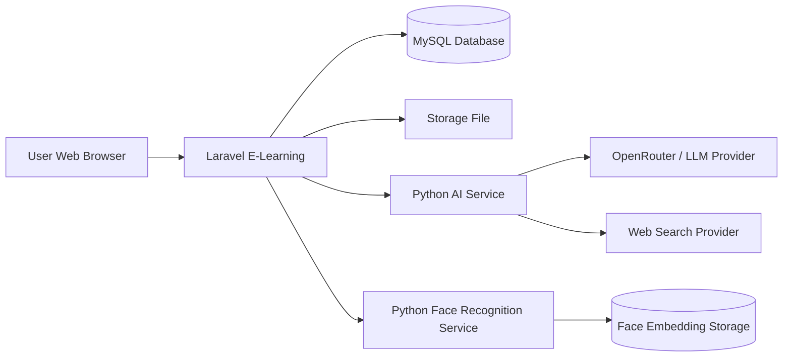

---

# 4. Use Case Diagram

## 4.1 Use Case Diagram Global

Diagram berikut menggambarkan relasi aktor utama dengan fitur besar dalam sistem.

```mermaid
flowchart TB
    Admin([Admin Sistem])
    Kajur([Kajur])
    Guru([Guru])
    Siswa([Siswa])

    subgraph Sistem[E-Learning Berbasis AI dan Face Recognition]
        UC1((Login dan Logout))
        UC2((Kelola Profil))
        UC3((Kelola User dan Role))
        UC4((Kelola Data Akademik))
        UC5((Kelola Plotting Pengampu))
        UC6((Kelola Jadwal Kelas))
        UC7((Kelola Face Profile))
        UC8((Kelola Konfigurasi AI))
        UC9((Kelola Pengumuman))
        UC10((Monitoring Akademik))
        UC11((Monitoring AI))
        UC12((Kelola Pertemuan))
        UC13((Kelola Materi))
        UC14((Kelola Tugas))
        UC15((Nilai Submission))
        UC16((Rekap Kehadiran))
        UC17((Generate Konten AI))
        UC18((Akses Materi))
        UC19((Kumpulkan Tugas))
        UC20((Lihat Nilai))
        UC21((Absensi Wajah))
        UC22((Chat AI Tutor))
        UC23((AI Web Search))
    end

    Admin --> UC1
    Admin --> UC2
    Admin --> UC3
    Admin --> UC4
    Admin --> UC5
    Admin --> UC6
    Admin --> UC7
    Admin --> UC8

    Kajur --> UC1
    Kajur --> UC2
    Kajur --> UC9
    Kajur --> UC10
    Kajur --> UC11

    Guru --> UC1
    Guru --> UC2
    Guru --> UC12
    Guru --> UC13
    Guru --> UC14
    Guru --> UC15
    Guru --> UC16
    Guru --> UC7
    Guru --> UC17

    Siswa --> UC1
    Siswa --> UC2
    Siswa --> UC18
    Siswa --> UC19
    Siswa --> UC20
    Siswa --> UC21
    Siswa --> UC22
    Siswa --> UC23
```

---

## 4.2 Use Case Diagram Admin Sistem

```mermaid
flowchart TB
    Admin([Admin Sistem])

    subgraph AdminModule[Modul Admin Sistem]
        A1((Login))
        A2((Melihat Dashboard Admin))
        A3((Kelola User))
        A4((Kelola Jurusan))
        A5((Kelola Tahun Ajaran))
        A6((Kelola Semester))
        A7((Kelola Mata Pelajaran))
        A8((Kelola Kelas))
        A9((Kelola Guru))
        A10((Kelola Siswa))
        A11((Kelola Anggota Kelas))
        A12((Kelola Pengampu))
        A13((Kelola Jadwal Kelas))
        A14((Kelola Face Profile Siswa))
        A15((Resync Semua Face Profile))
        A16((Kelola AI Setting))
        A17((Cek AI Health))
        A18((Kelola Profil Pribadi))
        A19((Logout))
    end

    Admin --> A1
    Admin --> A2
    Admin --> A3
    Admin --> A4
    Admin --> A5
    Admin --> A6
    Admin --> A7
    Admin --> A8
    Admin --> A9
    Admin --> A10
    Admin --> A11
    Admin --> A12
    Admin --> A13
    Admin --> A14
    Admin --> A15
    Admin --> A16
    Admin --> A17
    Admin --> A18
    Admin --> A19
```

### Catatan Use Case Admin

Admin menjadi aktor dengan hak akses paling luas. Dalam versi kode aktual, Admin bertanggung jawab pada hampir seluruh data master akademik. Kajur tidak lagi menjadi pengelola utama kelas dan mata pelajaran, tetapi lebih kuat sebagai aktor monitoring dan pengumuman.

---

## 4.3 Use Case Diagram Kajur

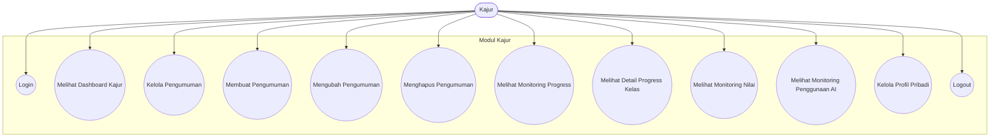

### Catatan Use Case Kajur

Kajur berperan sebagai pengawas pembelajaran pada level jurusan. Kajur dapat mengelola pengumuman dan membaca data monitoring, tetapi tidak menjadi aktor utama yang mengubah struktur akademik inti.

---

## 4.4 Use Case Diagram Guru

```mermaid
flowchart TB
    Guru([Guru])

    subgraph GuruModule[Modul Guru]
        G1((Login))
        G2((Melihat Dashboard Guru))
        G3((Melihat Kelas/Mata Pelajaran Ajar))
        G4((Kelola Pertemuan))
        G5((Publish Pertemuan))
        G6((Aktifkan Pertemuan))
        G7((Tutup Pertemuan))
        G8((Upload Materi))
        G9((Hapus Materi))
        G10((Buat Tugas))
        G11((Lihat Submission))
        G12((Nilai Submission))
        G13((Lihat Rekap Nilai))
        G14((Lihat Rekap Kehadiran))
        G15((Kelola Face Profile Kelas))
        G16((Resync Face Profile Kelas))
        G17((Proses Materi dengan AI))
        G18((Generate Ringkasan AI))
        G19((Generate Kuis AI))
        G20((Generate Glosarium AI))
        G21((Lihat Output AI))
        G22((Hapus Output AI))
        G23((Kelola Profil Pribadi))
        G24((Logout))
    end

    Guru --> G1
    Guru --> G2
    Guru --> G3
    Guru --> G4
    Guru --> G5
    Guru --> G6
    Guru --> G7
    Guru --> G8
    Guru --> G9
    Guru --> G10
    Guru --> G11
    Guru --> G12
    Guru --> G13
    Guru --> G14
    Guru --> G15
    Guru --> G16
    Guru --> G17
    Guru --> G18
    Guru --> G19
    Guru --> G20
    Guru --> G21
    Guru --> G22
    Guru --> G23
    Guru --> G24
```

### Catatan Use Case Guru

Guru adalah aktor utama pada proses pembelajaran. Guru tidak mengatur data master akademik secara global, tetapi mengelola aktivitas pembelajaran berdasarkan *teaching assignment* yang sudah ditentukan oleh Admin.

---

## 4.5 Use Case Diagram Siswa

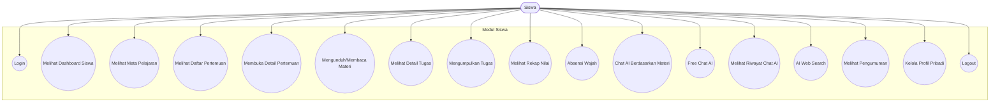

### Catatan Use Case Siswa

Siswa adalah aktor penerima layanan pembelajaran. Aktivitas siswa dibatasi pada kelas aktif, mata pelajaran yang diikuti, pertemuan yang dapat diakses, tugas yang tersedia, absensi wajah, nilai pribadi, dan fitur AI sesuai batas penggunaan.

---

# 5. Activity Diagram

## 5.1 Activity Diagram Login dan Redirect Berdasarkan Role

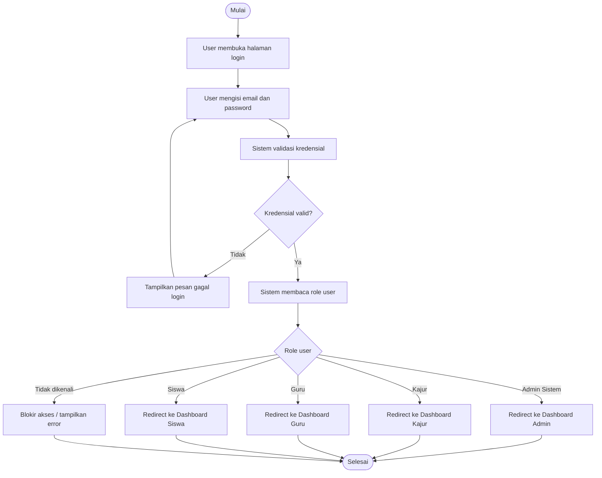

### Penjelasan Alur

User melakukan login melalui halaman autentikasi. Setelah kredensial valid, sistem membaca role dari mekanisme otorisasi. Setiap role diarahkan ke dashboard masing-masing agar hak akses tetap terpisah.

---

## 5.2 Activity Diagram Admin Mengelola Data Akademik

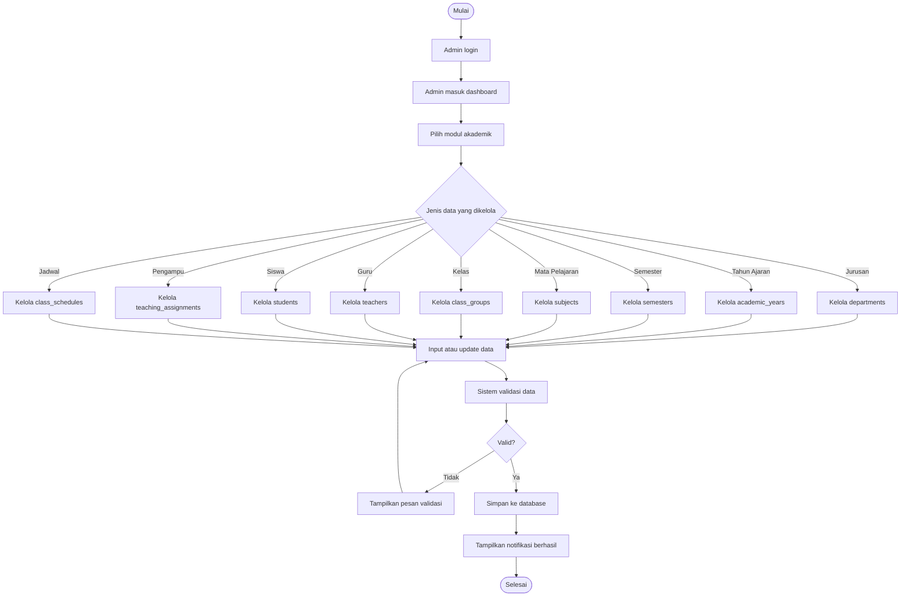

### Penjelasan Alur

Admin mengelola data akademik melalui modul CRUD. Setiap data harus melalui proses validasi sebelum disimpan. Data akademik ini menjadi dasar untuk kelas, pengampu, jadwal, pertemuan, materi, tugas, absensi, dan monitoring.

---

## 5.3 Activity Diagram Admin Mengelola User dan Role

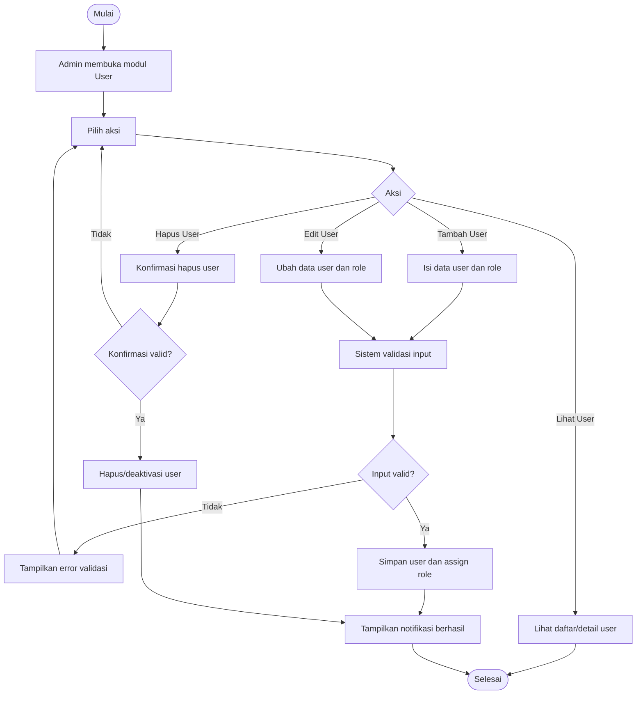

### Penjelasan Alur

Admin dapat membuat user baru dan memberi role sesuai kebutuhan sistem. Role menentukan akses ke route Admin, Kajur, Guru, atau Siswa.

---

## 5.4 Activity Diagram Kajur Mengelola Pengumuman

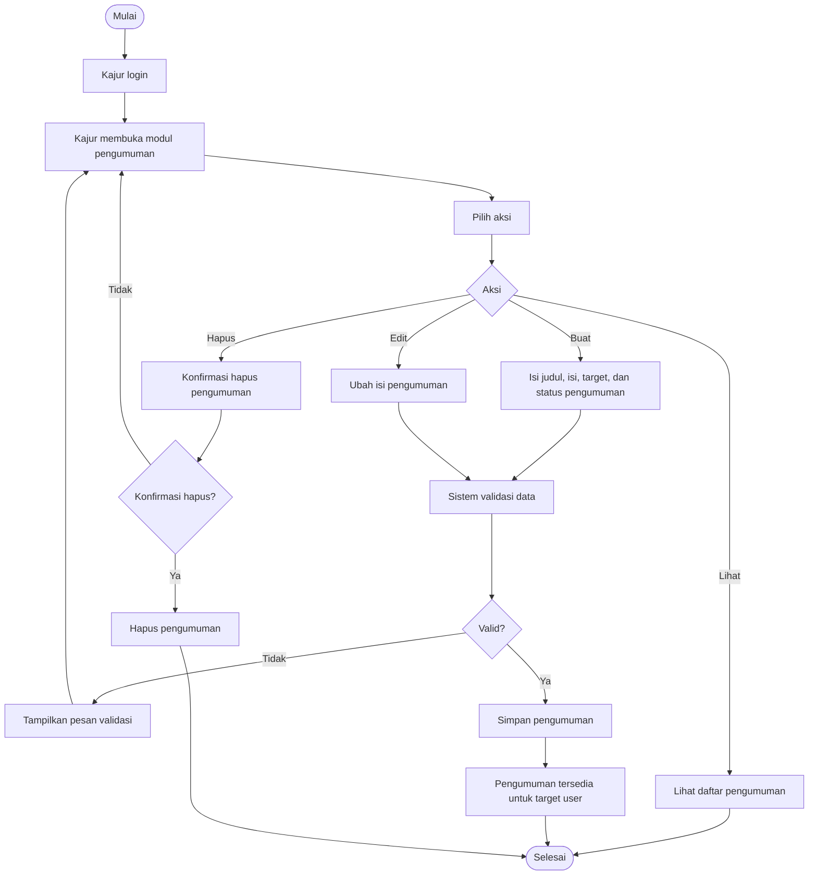

### Penjelasan Alur

Kajur mengelola pengumuman sebagai sarana komunikasi akademik. Pengumuman dapat ditargetkan berdasarkan kebutuhan sistem, kemudian dapat dibaca oleh user yang sesuai.

---

## 5.5 Activity Diagram Kajur Monitoring Progress Kelas

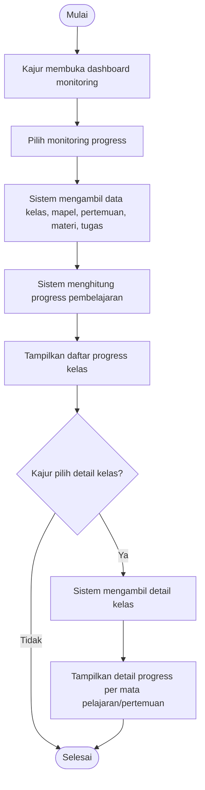

### Penjelasan Alur

Kajur membaca progress kelas tanpa mengubah data pembelajaran. Data monitoring berasal dari aktivitas guru dan siswa pada modul pertemuan, materi, tugas, nilai, dan kehadiran.

---

## 5.6 Activity Diagram Guru Mengelola Pertemuan

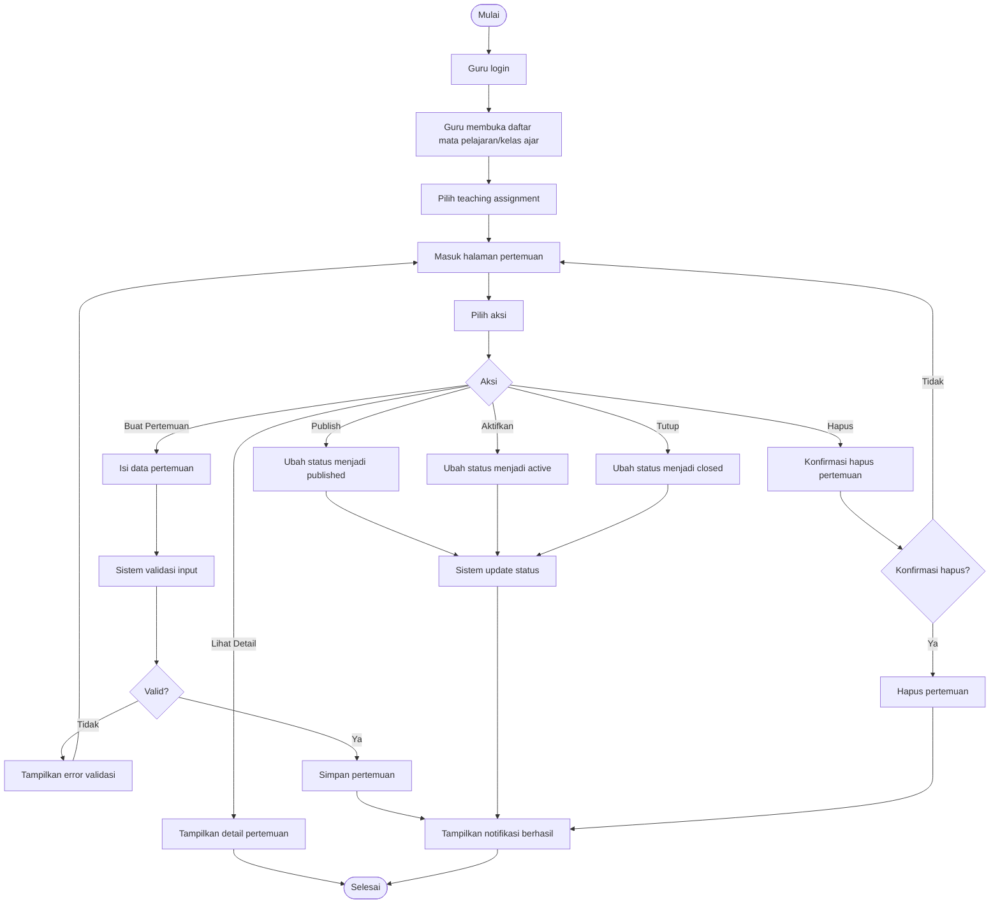

### Penjelasan Alur

Guru membuat pertemuan berdasarkan kelas dan mata pelajaran yang diampu. Status pertemuan dapat dikendalikan melalui publish, aktivasi, dan penutupan agar akses siswa sesuai jadwal pembelajaran.

---

## 5.7 Activity Diagram Guru Upload Materi

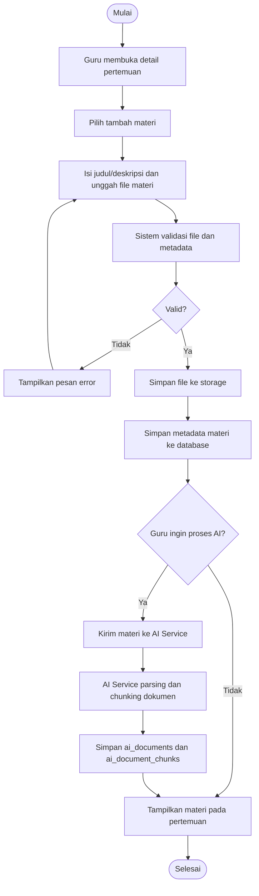

### Penjelasan Alur

Guru dapat mengunggah materi ke pertemuan. Jika fitur AI digunakan, materi diproses oleh AI Service sehingga dapat menjadi sumber untuk ringkasan, kuis, glosarium, dan chat siswa.

---

## 5.8 Activity Diagram Guru Membuat Tugas

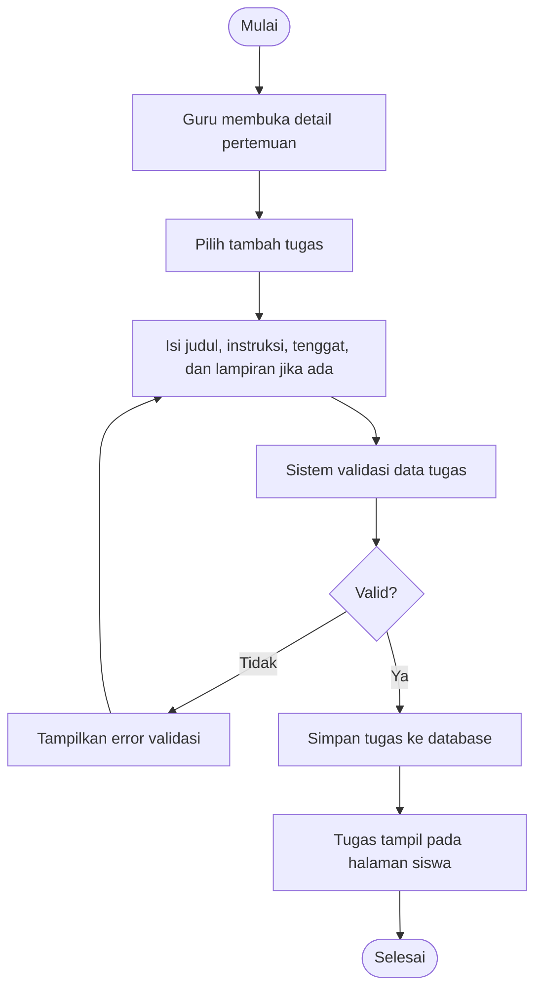

### Penjelasan Alur

Guru membuat tugas pada pertemuan tertentu. Tugas yang tersimpan dapat dilihat dan dikumpulkan oleh siswa sesuai akses kelasnya.

---

## 5.9 Activity Diagram Siswa Mengakses Pembelajaran

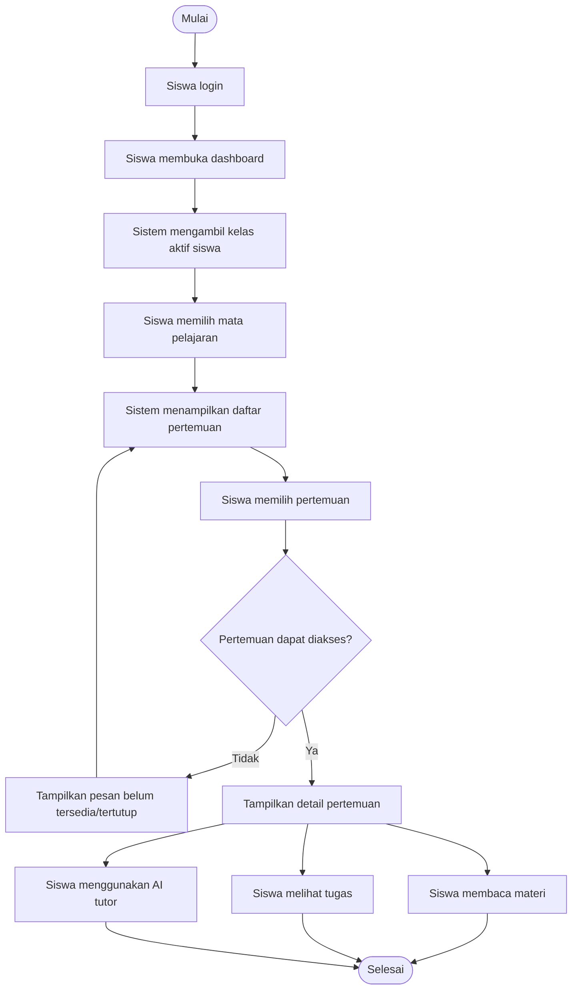

### Penjelasan Alur

Siswa hanya dapat mengakses mata pelajaran dan pertemuan sesuai kelas aktifnya. Sistem memfilter akses berdasarkan data enrollment, teaching assignment, dan status pertemuan.

---

## 5.10 Activity Diagram Siswa Mengumpulkan Tugas

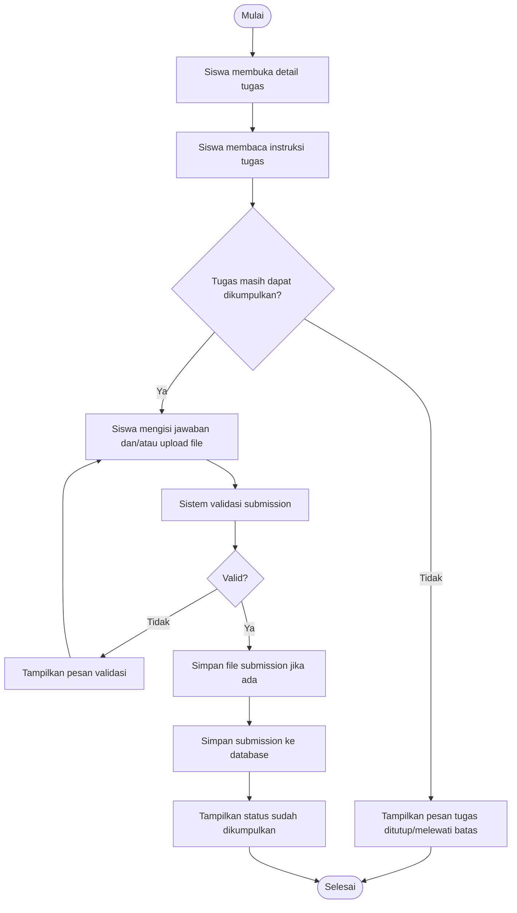

### Penjelasan Alur

Siswa mengumpulkan tugas melalui halaman tugas. Sistem memvalidasi status tugas, data input, dan file sebelum menyimpan submission.

---

## 5.11 Activity Diagram Guru Menilai Submission

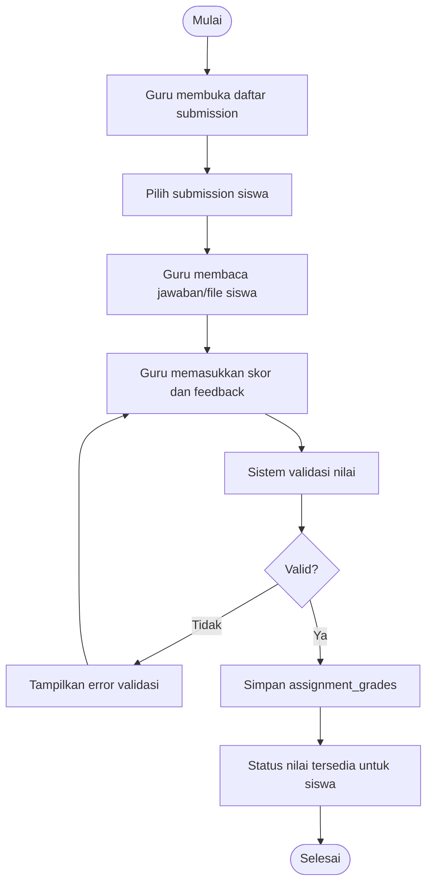

### Penjelasan Alur

Guru memberi nilai terhadap submission siswa. Nilai yang disimpan dapat ditampilkan pada rekap nilai guru dan halaman nilai siswa.

---

## 5.12 Activity Diagram Absensi Wajah oleh Siswa

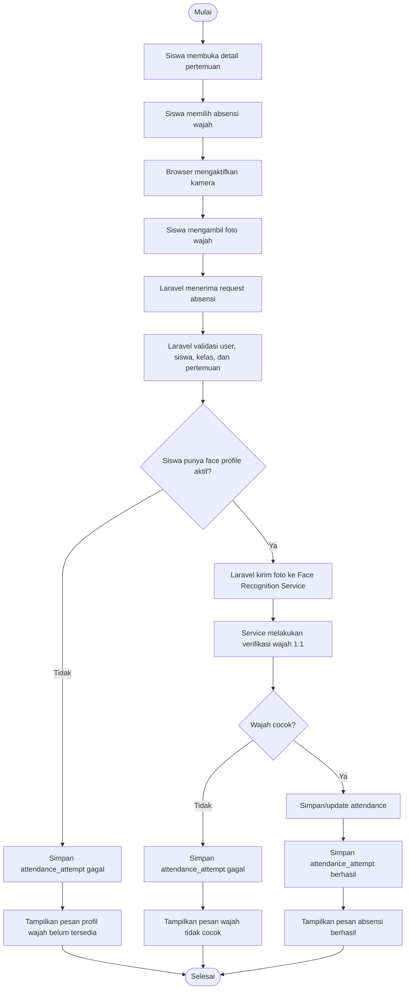

### Penjelasan Alur

Absensi wajah dilakukan oleh siswa melalui pertemuan. Sistem tidak menerima `student_id` dari request body, tetapi mengambil identitas siswa dari akun yang sedang login. Pendekatan ini lebih aman karena mencegah siswa mengirim identitas siswa lain saat melakukan absensi.

---

## 5.13 Activity Diagram Admin/Guru Sinkronisasi Face Profile

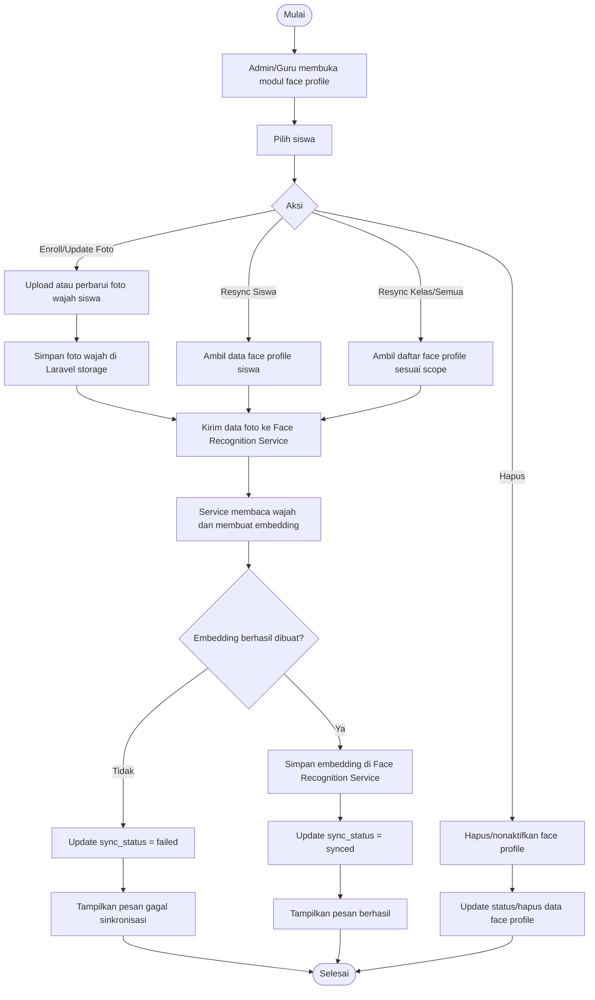

### Penjelasan Alur

Face profile menjadi prasyarat absensi wajah. Admin dapat mengelola semua siswa, sedangkan Guru dapat melakukan sinkronisasi pada siswa dalam kelas yang diajar.

---

## 5.14 Activity Diagram Guru Generate Ringkasan/Kuis/Glosarium AI

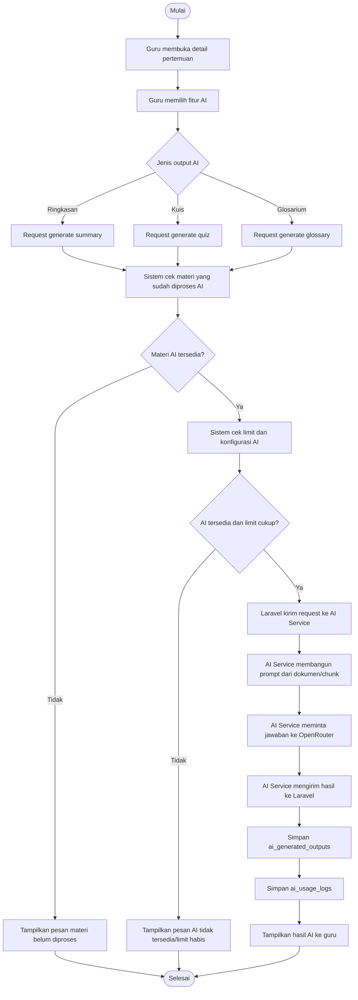

### Penjelasan Alur

Guru dapat menghasilkan konten pendukung pembelajaran dari materi yang sudah diproses. Sistem harus memastikan materi telah di-*chunk*, AI service aktif, serta limit penggunaan masih tersedia.

---

## 5.15 Activity Diagram Siswa Chat AI Tutor Berdasarkan Materi

```mermaid
flowchart TD
    A([Mulai]) --> B[Siswa membuka detail pertemuan]
    B --> C[Siswa membuka AI tutor]
    C --> D[Siswa menulis pertanyaan]
    D --> E[Sistem validasi pertanyaan]
    E --> F{Valid?}
    F -- Tidak --> G[Tampilkan pesan validasi]
    G --> D
    F -- Ya --> H[Sistem cek akses siswa ke pertemuan]
    H --> I{Akses valid?}
    I -- Tidak --> J[Tolak request]
    J --> Z([Selesai])

    I -- Ya --> K[Sistem cek limit penggunaan AI]
    K --> L{Limit cukup?}
    L -- Tidak --> M[Tampilkan pesan limit habis]
    M --> Z

    L -- Ya --> N[Laravel kirim pertanyaan dan konteks meeting ke AI Service]
    N --> O[AI Service mencari chunk materi relevan]
    O --> P[AI Service membangun prompt tutor]
    P --> Q[AI Service meminta jawaban ke OpenRouter]
    Q --> R[Laravel menerima jawaban]
    R --> S[Simpan ai_chat_session dan ai_chat_messages]
    S --> T[Simpan ai_usage_logs]
    T --> U[Tampilkan jawaban ke siswa]
    U --> Z
```

### Penjelasan Alur

AI tutor menjawab pertanyaan siswa berdasarkan materi pada pertemuan. Jika dokumen materi tersedia, jawaban diprioritaskan dari konteks materi. Jika sistem menyediakan *free chat*, maka siswa tetap dapat bertanya secara umum sesuai batasan yang berlaku.

---

## 5.16 Activity Diagram Siswa AI Web Search

```mermaid
flowchart TD
    A([Mulai]) --> B[Siswa membuka pertemuan]
    B --> C[Siswa memilih AI Web Search]
    C --> D[Siswa memasukkan query]
    D --> E[Sistem validasi query]
    E --> F{Query valid?}
    F -- Tidak --> G[Tampilkan pesan validasi]
    G --> D
    F -- Ya --> H[Sistem cek akses dan limit AI]
    H --> I{Akses dan limit valid?}
    I -- Tidak --> J[Tampilkan pesan ditolak/limit habis]
    J --> Z([Selesai])

    I -- Ya --> K[Laravel kirim query ke AI Service]
    K --> L[AI Service melakukan web search]
    L --> M[AI Service merangkum hasil pencarian]
    M --> N[Laravel menerima hasil]
    N --> O[Simpan ai_usage_logs]
    O --> P[Tampilkan hasil ke siswa]
    P --> Z
```

### Penjelasan Alur

Fitur AI Web Search digunakan siswa untuk mencari informasi tambahan. Fitur ini perlu dibatasi agar tidak menggantikan proses belajar utama dan tetap berada dalam kontrol penggunaan AI.

---

## 5.17 Activity Diagram Monitoring AI oleh Kajur

```mermaid
flowchart TD
    A([Mulai]) --> B[Kajur membuka menu AI Monitoring]
    B --> C[Sistem mengambil ai_usage_logs]
    C --> D[Sistem mengelompokkan penggunaan berdasarkan user, role, fitur, dan periode]
    D --> E[Sistem menghitung total request/token/aktivitas]
    E --> F[Tampilkan dashboard monitoring AI]
    F --> G{Kajur memilih filter?}
    G -- Tidak --> H([Selesai])
    G -- Ya --> I[Pilih filter user/role/tanggal/fitur]
    I --> C
```

### Penjelasan Alur

Kajur dapat melihat penggunaan AI sebagai bahan monitoring akademik. Data ini berguna untuk melihat intensitas penggunaan AI oleh guru dan siswa serta mendeteksi penggunaan yang tidak wajar.

---

## 5.18 Activity Diagram Shared Profile Management

```mermaid
flowchart TD
    A([Mulai]) --> B[User login]
    B --> C[User membuka halaman profil]
    C --> D[Pilih aksi]
    D --> E{Aksi}
    E -- Update Profil --> F[Ubah data profil]
    E -- Update Password --> G[Isi password lama dan password baru]
    E -- Update Avatar --> H[Upload avatar]

    F --> I[Sistem validasi data]
    G --> I
    H --> I
    I --> J{Valid?}
    J -- Tidak --> K[Tampilkan pesan validasi]
    K --> C
    J -- Ya --> L[Simpan perubahan]
    L --> M[Tampilkan notifikasi berhasil]
    M --> N([Selesai])
```

### Penjelasan Alur

Modul profil bersifat shared karena dapat digunakan oleh semua user yang sudah login.

---

# 6. Ringkasan Use Case per Aktor

## 6.1 Admin Sistem

| Kode | Use Case | Prioritas |
|---|---|---|
| ADM-01 | Login dan melihat dashboard | Tinggi |
| ADM-02 | Mengelola user dan role | Tinggi |
| ADM-03 | Mengelola jurusan | Tinggi |
| ADM-04 | Mengelola tahun ajaran dan semester | Tinggi |
| ADM-05 | Mengelola guru dan siswa | Tinggi |
| ADM-06 | Mengelola mata pelajaran dan kelas | Tinggi |
| ADM-07 | Mengelola anggota kelas | Tinggi |
| ADM-08 | Mengelola pengampu dan jadwal | Tinggi |
| ADM-09 | Mengelola face profile siswa | Tinggi |
| ADM-10 | Mengelola AI setting dan health check | Sedang |

---

## 6.2 Kajur

| Kode | Use Case | Prioritas |
|---|---|---|
| KJR-01 | Login dan melihat dashboard | Tinggi |
| KJR-02 | Mengelola pengumuman | Tinggi |
| KJR-03 | Melihat monitoring progress kelas | Tinggi |
| KJR-04 | Melihat detail progress kelas | Tinggi |
| KJR-05 | Melihat monitoring nilai | Tinggi |
| KJR-06 | Melihat monitoring penggunaan AI | Sedang |

---

## 6.3 Guru

| Kode | Use Case | Prioritas |
|---|---|---|
| GRU-01 | Login dan melihat dashboard | Tinggi |
| GRU-02 | Melihat kelas/mata pelajaran ajar | Tinggi |
| GRU-03 | Mengelola pertemuan | Tinggi |
| GRU-04 | Mengelola materi | Tinggi |
| GRU-05 | Mengelola tugas | Tinggi |
| GRU-06 | Melihat dan menilai submission | Tinggi |
| GRU-07 | Melihat rekap nilai | Tinggi |
| GRU-08 | Melihat rekap kehadiran | Tinggi |
| GRU-09 | Sinkronisasi face profile kelas | Sedang |
| GRU-10 | Generate ringkasan, kuis, dan glosarium AI | Sedang |

---

## 6.4 Siswa

| Kode | Use Case | Prioritas |
|---|---|---|
| SIS-01 | Login dan melihat dashboard | Tinggi |
| SIS-02 | Melihat mata pelajaran | Tinggi |
| SIS-03 | Mengakses pertemuan dan materi | Tinggi |
| SIS-04 | Melihat dan mengumpulkan tugas | Tinggi |
| SIS-05 | Melihat nilai | Tinggi |
| SIS-06 | Melakukan absensi wajah | Tinggi |
| SIS-07 | Chat AI berdasarkan materi | Sedang |
| SIS-08 | Free Chat AI | Sedang |
| SIS-09 | AI Web Search | Sedang |
| SIS-10 | Melihat pengumuman | Sedang |

---

# 7. Catatan Validasi Desain

## 7.1 Desain Role

Desain role sudah konsisten dengan pemisahan route:

- `/admin/*` hanya untuk `admin-sistem`
- `/kajur/*` hanya untuk `kajur`
- `/guru/*` hanya untuk `guru`
- `/siswa/*` hanya untuk `siswa`
- `/profile` dan `/announcements` dapat diakses user terautentikasi

## 7.2 Desain Pembelajaran

Alur pembelajaran dimulai dari data akademik yang disiapkan Admin. Setelah kelas, siswa, guru, mata pelajaran, pengampu, dan jadwal tersedia, Guru dapat membuat pertemuan. Siswa kemudian dapat mengakses pertemuan, membaca materi, mengerjakan tugas, melakukan absensi, dan menggunakan AI tutor.

## 7.3 Desain Absensi Wajah

Absensi wajah memakai alur aman karena identitas siswa diambil dari sesi login. Hal ini mencegah manipulasi `student_id` dari sisi klien. Sistem menyimpan percobaan absensi berhasil maupun gagal sehingga aktivitas absensi dapat diaudit.

## 7.4 Desain AI

Fitur AI terbagi menjadi dua arah:

1. **AI untuk Guru**  
   Digunakan untuk memproses materi dan menghasilkan konten pembelajaran.

2. **AI untuk Siswa**  
   Digunakan untuk bertanya, mencari penjelasan, dan melakukan pencarian tambahan.

Agar tetap terkendali, sistem perlu mempertahankan limit penggunaan, log aktivitas, dan status health AI service.

---

# 8. Rekomendasi Penyempurnaan UML Berikutnya

Setelah Part 4, tahapan berikutnya adalah **Part 5 — Sequence Diagram dan Class Diagram**. Sequence diagram perlu dibuat untuk alur yang melibatkan banyak komponen, terutama:

1. Login dan redirect role.
2. Guru upload materi dan proses AI.
3. Guru generate ringkasan/kuis/glosarium.
4. Siswa chat AI tutor.
5. Siswa melakukan absensi wajah.
6. Admin/Guru sinkronisasi face profile.
7. Siswa mengumpulkan tugas dan Guru memberi nilai.
8. Kajur membaca monitoring progress dan AI.

Class diagram dapat disusun dari model Laravel utama, yaitu:

- `User`
- `Teacher`
- `Student`
- `Department`
- `AcademicYear`
- `Semester`
- `Subject`
- `ClassGroup`
- `StudentClassEnrollment`
- `TeachingAssignment`
- `ClassSchedule`
- `Meeting`
- `Material`
- `Assignment`
- `AssignmentSubmission`
- `AssignmentGrade`
- `FaceProfile`
- `Attendance`
- `AttendanceAttempt`
- `Announcement`
- `AiDocument`
- `AiDocumentChunk`
- `AiChatSession`
- `AiChatMessage`
- `AiUsageLimit`
- `AiUsageLog`
- `AiGeneratedOutput`

---

# 9. Status Part 4

| Komponen | Status |
|---|---|
| Use Case Diagram Global | Selesai |
| Use Case Diagram Admin | Selesai |
| Use Case Diagram Kajur | Selesai |
| Use Case Diagram Guru | Selesai |
| Use Case Diagram Siswa | Selesai |
| Activity Diagram Login | Selesai |
| Activity Diagram Admin Akademik | Selesai |
| Activity Diagram User dan Role | Selesai |
| Activity Diagram Pengumuman | Selesai |
| Activity Diagram Monitoring | Selesai |
| Activity Diagram Guru Pertemuan | Selesai |
| Activity Diagram Materi dan AI Processing | Selesai |
| Activity Diagram Tugas dan Nilai | Selesai |
| Activity Diagram Pembelajaran Siswa | Selesai |
| Activity Diagram Absensi Wajah | Selesai |
| Activity Diagram Sinkronisasi Face Profile | Selesai |
| Activity Diagram AI Tutor | Selesai |
| Activity Diagram AI Web Search | Selesai |

---

# 10. Penutup Part 4

Part 4 menghasilkan kerangka UML awal untuk kebutuhan PRD final. Diagram yang disusun sudah mencakup seluruh aktor utama dan alur besar sistem. Diagram ini masih dapat disederhanakan atau dibuat lebih teknis pada tahap berikutnya, terutama ketika masuk ke sequence diagram dan class diagram yang membutuhkan hubungan antarkomponen lebih detail.
